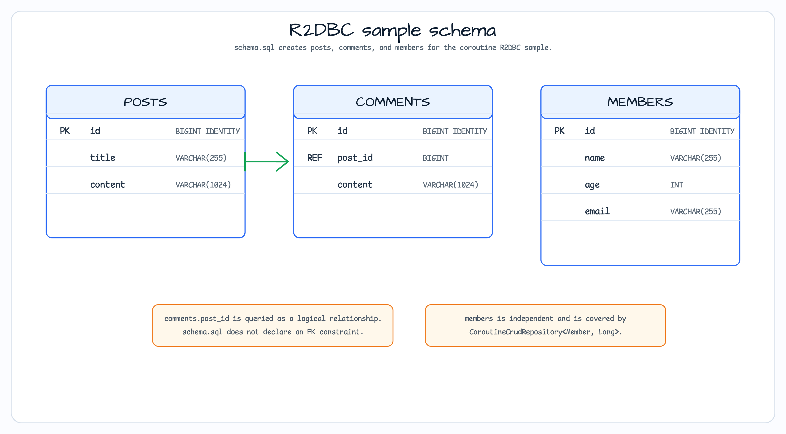

# Spring Data R2DBC Coroutines

[English](README.md) | 한국어

이 모듈은 Spring Data R2DBC와 in-memory H2 database 위에 coroutine REST API를 제공합니다.
`R2dbcEntityOperations`용 bluetape4k `*Suspending` extension을 사용해 repository code가
Reactor publisher를 직접 변환하지 않고 suspend/`Flow` 기반으로 유지되는 방식을 보여 줍니다.

## 이 예제가 보여 주는 것


`PostController`는 `/posts` endpoint를 노출하고, `DatabaseInitializer`는
`ApplicationReadyEvent`에서 post 2개와 comment 4개를 seed합니다. `schema.sql`은 H2 R2DBC
connection에 사용할 `posts`, `comments`, `members` table을 생성합니다.

## Domain ERD



`comments.post_id`는 `CommentRepository`가 사용하는 post 관계를 저장하지만 schema에는 foreign
key가 선언되어 있지 않습니다. `MemberRepository`는 별도 `members` table에 대한 일반
`CoroutineCrudRepository` 예제를 보여 줍니다.

## API and repository paths

| Endpoint or method | Repository path |
|---|---|
| `GET /posts` | `PostRepository.findAll()`이 `Flow<Post>`를 반환합니다. |
| `GET /posts/{id}` | `findOneByIdOrNullSuspending(id)`를 사용하고 없으면 `PostNotFoundException`을 던집니다. |
| `POST /posts` | `insertSuspending(post)`가 inserted entity를 반환합니다. |
| `GET /posts/{postId}/comments` | `selectSuspending<Comment>(Query)`가 `Flow<Comment>`를 반환합니다. |
| `GET /posts/{postId}/comments/count` | `countSuspending<Comment>(Query)`가 matching row count를 반환합니다. |
| `MemberRepository` | direct Spring Data coroutine CRUD를 위한 `CoroutineCrudRepository<Member, Long>`입니다. |

## Build and test

```bash
./gradlew :spring-data:r2dbc-coroutines:test
```

## 참고

- [Spring Data R2DBC reference](https://docs.spring.io/spring-data/relational/reference/r2dbc.html)
- [Kotlin coroutines with Spring](https://docs.spring.io/spring-framework/reference/languages/kotlin/coroutines.html)
