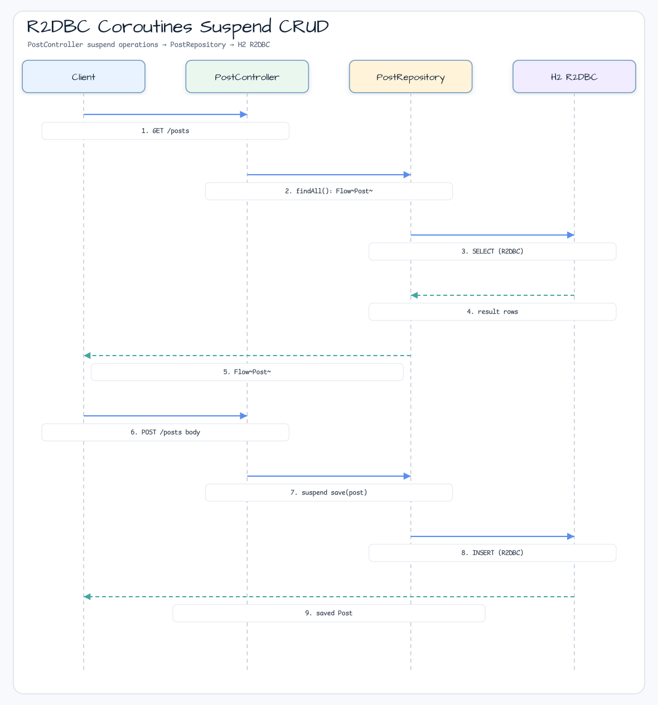
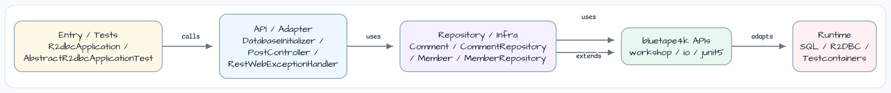
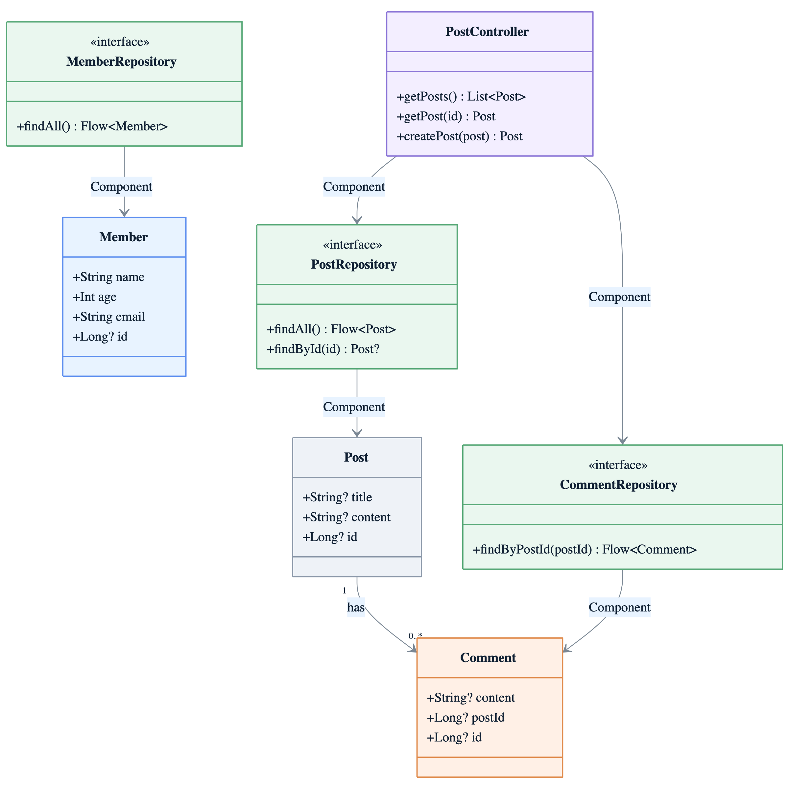

# Spring Data R2DBC + Coroutines

[English](README.md) | 한국어

## 예제 시나리오

이 예제는 **Spring Data R2DBC + Coroutines**를 실행 가능한 Spring Data 영속성 워크샵 조각으로 다룹니다. 개발자가 먼저 확인할 흐름인 모듈 설정, 샘플 또는 테스트 실행, 반복적인 인프라 코드를 줄여 주는 라이브러리와 프레임워크 API 관찰에 초점을 둡니다.

## 흐름 다이어그램

1. `spring-data-r2dbc-coroutines`에 필요한 로컬 런타임을 준비합니다.
2. 예제 시나리오를 담당하는 애플리케이션, 컨트롤러, 서비스 또는 테스트 픽스처를 실행합니다.
3. 반복적인 인프라 작업은 bluetape4k 유틸리티 또는 Spring/Kotlin 통합에 위임합니다.
4. 샘플 출력, HTTP 응답, 저장소 상태, 메트릭, 트레이스 또는 테스트 기대값으로 보이는 결과를 검증합니다.

## 시퀀스 다이어그램

핵심 시퀀스는 호출자 또는 테스트 픽스처 -> 워크샵 어댑터 -> bluetape4k 헬퍼/API -> 외부 런타임 또는 인메모리 백엔드 -> 검증/응답 순서입니다. 전용 시퀀스 에셋이 있는 모듈은 아래 이미지가 상호작용 순서를 보여 주며, 없는 경우 소스 테스트가 실행 가능한 시퀀스의 기준입니다.



Spring Data R2DBC와 Kotlin coroutines를 사용하며, boilerplate 없는 reactive data access를 위해 **bluetape4k `*Suspending` extension functions**를 사용합니다.

## 아키텍처



## 아키텍처 다이어그램



## 사용된 bluetape4k 기능

| 기능 | Artifact | 코드 위치 | 이점 |
|---|---|---|---|
| `*Suspending` extension family | `bluetape4k-spring-boot4-r2dbc` | `PostRepository.kt` | `R2dbcEntityOperations`에 suspend wrapper를 추가합니다 — Flow/Mono 변환 없이 suspend function을 직접 호출합니다 |
| `countAllSuspending<T>()` | `bluetape4k-spring-boot4-r2dbc` | `PostRepository.count()` | `operations.count(...)` + `.awaitSingle()` pattern을 한 줄로 대체합니다 |
| `selectAllSuspending<T>()` | `bluetape4k-spring-boot4-r2dbc` | `PostRepository.findAll()` | `Flux` -> `Flow` 변환을 내부에서 처리합니다 |
| `findOneByIdSuspending(id)` / `findOneByIdOrNullSuspending(id)` | `bluetape4k-spring-boot4-r2dbc` | `PostRepository.findOneById()` | ID로 record 하나를 가져옵니다 — return type으로 nullability를 표현합니다 |
| `findFirstByIdSuspending(id)` / `findFirstByIdOrNullSuspending(id)` | `bluetape4k-spring-boot4-r2dbc` | `PostRepository.findFirstById()` | 첫 번째 matching entity를 가져옵니다 |
| `insertSuspending(entity)` | `bluetape4k-spring-boot4-r2dbc` | `PostRepository.save()` | insert 후 생성된 entity를 반환합니다 — Mono chaining 없이 suspend합니다 |
| `deleteAllSuspending<T>()` | `bluetape4k-spring-boot4-r2dbc` | `PostRepository.deleteAll()` | type parameter로 target entity를 지정하고 삭제된 row count를 반환합니다 |
| `runSuspendIO { }` | `bluetape4k-junit5` | 모든 tests | `runBlocking(Dispatchers.IO)` pattern을 JUnit 5 extension으로 제공합니다 |
| `KLoggingChannel` | `bluetape4k-logging` | 모든 companion object | coroutine context를 포함하는 structured logging |
| `bluetape4k-assertions` | `bluetape4k-core` | 모든 tests | `shouldBeEqualTo`, `shouldNotBeNull` 같은 읽기 쉬운 assertion |

## bluetape4k Before / After

### `R2dbcEntityOperations` Suspend Extension Functions

```kotlin
// Before — Reactor API + manual awaitXxx() conversion
@Repository
class PostRepository(private val operations: R2dbcEntityOperations) {
    suspend fun count(): Long =
        operations.count(Query.empty(), Post::class.java).awaitSingle()

    fun findAll(): Flow<Post> =
        operations.select(Post::class.java).all().asFlow()

    suspend fun findOneById(id: Long): Post =
        operations.selectOne(Query.query(Criteria.where("id").`is`(id)), Post::class.java)
            .awaitSingleOrNull() ?: throw NoSuchElementException("Post not found: $id")

    suspend fun save(post: Post): Post =
        operations.insert(post).awaitSingle()
}

// After — bluetape4k *Suspending extensions (boilerplate removed)
@Repository
class PostRepository(private val operations: R2dbcEntityOperations) {
    suspend fun count(): Long = operations.countAllSuspending<Post>()
    fun findAll(): Flow<Post> = operations.selectAllSuspending<Post>()
    suspend fun findOneById(id: Long): Post = operations.findOneByIdSuspending(id)
    suspend fun findOneByIdOrNull(id: Long): Post? = operations.findOneByIdOrNullSuspending(id)
    suspend fun save(post: Post): Post = operations.insertSuspending(post)
    suspend fun deleteAll(): Long = operations.deleteAllSuspending<Post>()
}
```

### `runSuspendIO { }` Test Pattern

```kotlin
// Before — explicit runBlocking + Dispatchers.IO
@Test
fun `find all posts`() = runBlocking(Dispatchers.IO) {
    val posts = postRepository.findAll().toList()
    posts.shouldNotBeEmpty()
}

// After — bluetape4k runSuspendIO (clearer intent)
@Test
fun `find all posts`() = runSuspendIO {
    val posts = postRepository.findAll().toList()
    posts.shouldNotBeEmpty()
}
```

## 참고

* [Spring Data Examples - r2dbc/example](https://github.com/spring-projects/spring-data-examples/tree/main/r2dbc/example)
* [Spring Data Examples - r2dbc/query-by-example](https://github.com/spring-projects/spring-data-examples/tree/main/r2dbc/query-by-example)

* [Spring Data R2DBC and Kotlin Coroutines](https://xebia.com/blog/spring-data-r2dbc-and-kotlin-coroutines/)
* [Kotlin + Spring Webflux + R2DBC](https://dgahn.tistory.com/8)

이 project는 진행 중인 Spring Data R2DBC support의 sample usage를 보여 줍니다.

### 살펴볼 만한 부분

- `InfrastructureConfiguration` - R2DBC H2 driver(https://github.com/r2dbc/r2dbc-h2[r2dbc-h2]) 기반 `ConnectionFactory`, `DatabaseClient`, 최종적으로 `CustomerRepository`를 생성할 `R2dbcRepositoryFactory`를 설정합니다.
- `CustomerRepository` - 수동으로 정의한 query를 사용하는 query method를 노출하는 표준 Spring Data reactive CRUD repository입니다.
- `CustomerRepositoryIntegrationTests` - setup SQL로 database를 초기화하고 `Customer` instance를 insert/read합니다.
- `TransactionalService` - repository operation에 transactional boundary를 적용하기 위해 declarative transaction을 사용합니다.

이 project는 Spring Data R2DBC의 Query-by-Example sample을 포함합니다.

### Query-by-Example 지원

Query by Example(QBE)은 단순한 interface를 가진 사용자 친화적인 query 기법입니다.
동적 query 생성을 지원하며 field name이 들어간 query를 직접 작성할 필요가 없습니다.
실제로 Query by Example은 SQL을 사용해 query를 작성할 필요가 없습니다.

`Example`은 data object(보통 entity object 또는 그 subtype)와 property matching 방법에 대한 specification을 받습니다.
Repository와 함께 Query by Example을 사용할 수 있습니다.

```java
interface PersonRepository extends ReactiveCrudRepository<Person, Long>, ReactiveQueryByExampleExecutor<Person> {
}
```

```java
Example<Person> example = Example.of(new Person("Jon", "Snow"));
        repo.

findAll(example);

ExampleMatcher matcher = ExampleMatcher.matching().
        .

withMatcher("firstname",endsWith())
        .

withMatcher("lastname",startsWith().

ignoreCase());

Example<Person> example = Example.of(new Person("Jon", "Snow"), matcher);
        repo.

count(example);
```

이 예제는 `PersonRepositoryIntegrationTests`에서 사용 방식을 보여 줍니다.
