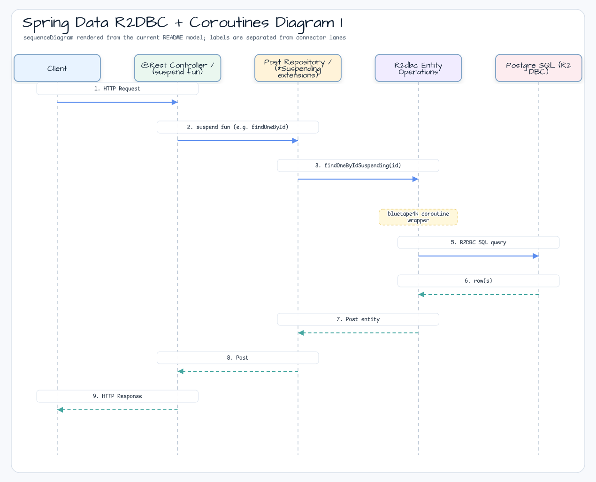

# Spring Data R2DBC + Coroutines

[한국어](README.ko.md) | English

## Example Scenario

This example exercises **Spring Data R2DBC + Coroutines** as a runnable Spring Data persistence workshop slice. It focuses on the path a developer would inspect first: configure the module, run the sample or tests, and observe the library or framework APIs that remove repetitive infrastructure code.

## Flow Diagram

1. Prepare the local runtime required by `spring-data-r2dbc-coroutines`.
2. Execute the application, controller, service, or test fixture that owns the example scenario.
3. Delegate repetitive infrastructure work to bluetape4k utilities or Spring/Kotlin integrations.
4. Assert the visible result through the sample output, HTTP response, repository state, metric, trace, or test expectation.

## Sequence Diagram

The core sequence is: caller or test fixture -> workshop adapter -> bluetape4k helper/API -> external runtime or in-memory backend -> assertion/response. When this module has a dedicated sequence asset, the image below shows that interaction order; otherwise the source tests are the authoritative executable sequence.


Spring Data R2DBC with Kotlin coroutines using **bluetape4k `*Suspending` extension functions**
for zero-boilerplate reactive data access.

## Architecture




## Architecture Diagram


## Used bluetape4k Features

| Feature | Artifact | Code location | Benefit |
|---|---|---|---|
| `*Suspending` extension family | `bluetape4k-spring-boot4-r2dbc` | `PostRepository.kt` | Adds suspend wrappers to `R2dbcEntityOperations` — call suspend functions directly without Flow/Mono conversion |
| `countAllSuspending<T>()` | `bluetape4k-spring-boot4-r2dbc` | `PostRepository.count()` | Replaces the `operations.count(...)` + `.awaitSingle()` pattern with one line |
| `selectAllSuspending<T>()` | `bluetape4k-spring-boot4-r2dbc` | `PostRepository.findAll()` | Handles `Flux` -> `Flow` conversion internally |
| `findOneByIdSuspending(id)` / `findOneByIdOrNullSuspending(id)` | `bluetape4k-spring-boot4-r2dbc` | `PostRepository.findOneById()` | Fetches one record by ID — expresses nullability in the return type |
| `findFirstByIdSuspending(id)` / `findFirstByIdOrNullSuspending(id)` | `bluetape4k-spring-boot4-r2dbc` | `PostRepository.findFirstById()` | Fetches the first matching entity |
| `insertSuspending(entity)` | `bluetape4k-spring-boot4-r2dbc` | `PostRepository.save()` | Returns the generated entity after insert — suspend without Mono chaining |
| `deleteAllSuspending<T>()` | `bluetape4k-spring-boot4-r2dbc` | `PostRepository.deleteAll()` | Specifies the target entity by type parameter and returns the deleted row count |
| `runSuspendIO { }` | `bluetape4k-junit5` | All tests | Provides the `runBlocking(Dispatchers.IO)` pattern as a JUnit 5 extension |
| `KLoggingChannel` | `bluetape4k-logging` | All companion objects | Structured logging that includes coroutine context |
| `bluetape4k-assertions` | `bluetape4k-core` | All tests | Readable assertions such as `shouldBeEqualTo` and `shouldNotBeNull` |

## bluetape4k Before / After

### `R2dbcEntityOperations` Suspend Extension Functions

```kotlin
// Before — Reactor API + manual awaitXxx() conversion
@Repository
class PostRepository(private val operations: R2dbcEntityOperations) {
    suspend fun count(): Long =
        operations.count(Query.empty(), Post::class.java).awaitSingle()

    fun findAll(): Flow<Post> =
        operations.select(Post::class.java).all().asFlow()

    suspend fun findOneById(id: Long): Post =
        operations.selectOne(Query.query(Criteria.where("id").`is`(id)), Post::class.java)
            .awaitSingleOrNull() ?: throw NoSuchElementException("Post not found: $id")

    suspend fun save(post: Post): Post =
        operations.insert(post).awaitSingle()
}

// After — bluetape4k *Suspending extensions (boilerplate removed)
@Repository
class PostRepository(private val operations: R2dbcEntityOperations) {
    suspend fun count(): Long = operations.countAllSuspending<Post>()
    fun findAll(): Flow<Post> = operations.selectAllSuspending<Post>()
    suspend fun findOneById(id: Long): Post = operations.findOneByIdSuspending(id)
    suspend fun findOneByIdOrNull(id: Long): Post? = operations.findOneByIdOrNullSuspending(id)
    suspend fun save(post: Post): Post = operations.insertSuspending(post)
    suspend fun deleteAll(): Long = operations.deleteAllSuspending<Post>()
}
```

### `runSuspendIO { }` Test Pattern

```kotlin
// Before — explicit runBlocking + Dispatchers.IO
@Test
fun `find all posts`() = runBlocking(Dispatchers.IO) {
    val posts = postRepository.findAll().toList()
    posts.shouldNotBeEmpty()
}

// After — bluetape4k runSuspendIO (clearer intent)
@Test
fun `find all posts`() = runSuspendIO {
    val posts = postRepository.findAll().toList()
    posts.shouldNotBeEmpty()
}
```

## References

* [Spring Data Examples - r2dbc/example](https://github.com/spring-projects/spring-data-examples/tree/main/r2dbc/example)
* [Spring Data Examples - r2dbc/query-by-example](https://github.com/spring-projects/spring-data-examples/tree/main/r2dbc/query-by-example)

* [Spring Data R2DBC and Kotlin Coroutines](https://xebia.com/blog/spring-data-r2dbc-and-kotlin-coroutines/)
* [Kotlin + Spring Webflux + R2DBC](https://dgahn.tistory.com/8)

This projects shows some sample usage of the work-in-progress R2DBC support for Spring Data.

### Interesting bits to look at

- `InfrastructureConfiguration` - sets up a R2DBC `ConnectionFactory` based on the R2DBC H2
  driver (https://github.com/r2dbc/r2dbc-h2[r2dbc-h2]), a `DatabaseClient` and a `R2dbcRepositoryFactory` to eventually
  create a `CustomerRepository`.
- `CustomerRepository` - a standard Spring Data reactive CRUD repository exposing query methods using manually defined
  queries
- `CustomerRepositoryIntegrationTests` - to initialize the database with some setup SQL and the inserting and
  reading `Customer` instances.
- `TransactionalService` - uses declarative transaction to apply a transactional boundary to repository operations.

This project contains samples of Query-by-Example of Spring Data R2DBC.

### Support for Query-by-Example

Query by Example (QBE) is a user-friendly querying technique with a simple interface.
It allows dynamic query creation and does not require to write queries containing field names.
In fact, Query by Example does not require to write queries using SQL at all.

An `Example` takes a data object (usually the entity object or a subtype of it) and a specification how to match
properties.
You can use Query by Example with Repositories.

```java
interface PersonRepository extends ReactiveCrudRepository<Person, Long>, ReactiveQueryByExampleExecutor<Person> {
}
```

```java
Example<Person> example = Example.of(new Person("Jon", "Snow"));
        repo.

findAll(example);

ExampleMatcher matcher = ExampleMatcher.matching().
        .

withMatcher("firstname",endsWith())
        .

withMatcher("lastname",startsWith().

ignoreCase());

Example<Person> example = Example.of(new Person("Jon", "Snow"), matcher);
        repo.

count(example);
```

This example contains shows the usage with `PersonRepositoryIntegrationTests`.
