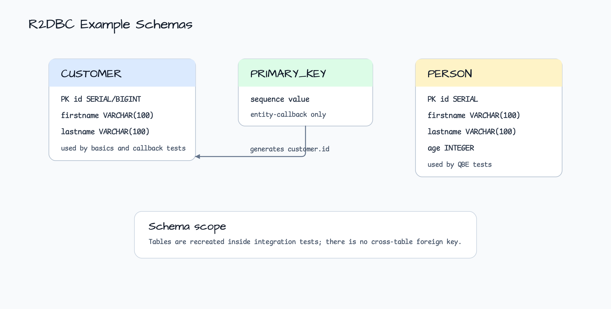

# Spring Data R2DBC Examples

[English](README.md) | 한국어

이 모듈은 Kotlin 기반 Spring Data R2DBC를 테스트로 학습하는 워크샵입니다.
HTTP API를 노출하지 않습니다. 대신 각 패키지가 coroutine repository,
reactive transaction, entity callback, Query-by-Example 같은 영속성 관심사를
하나씩 보여줍니다.

## 아키텍처


예제들은 같은 in-memory H2 R2DBC 런타임을 사용하지만, 패키지마다 별도의
Spring 테스트 설정과 schema 준비 방식을 가집니다.

| 패키지 | 확인할 코드 | 핵심 |
|---|---|---|
| `r2dbc.basics` | `CustomerRepositoryIntegrationTest`, `TransactionalServiceIntegrationTest` | Coroutine CRUD, annotation query method, `@Transactional suspend fun`의 rollback 동작을 확인합니다. |
| `r2dbc.entitycallback` | `ApplicationConfiguration`, `CustomerRepositoryIntegrationTest` | `BeforeConvertCallback`이 insert 전에 H2 sequence 값으로 ID를 채웁니다. |
| `r2dbc.queryexample` | `PersonRepositoryIntegrationTest` | Kotlin 친화적인 `buildExampleMatcher(...)`로 Spring Data Query-by-Example을 구성합니다. |

## 테스트 흐름


중요한 동작은 테스트에서 바로 확인할 수 있습니다.

1. 테스트 설정이 R2DBC repository가 포함된 Spring context를 시작합니다.
2. 각 테스트는 `DatabaseClient` 또는 `ConnectionFactoryInitializer`로 작은 H2
   schema를 준비합니다.
3. Repository 작업은 coroutine `Flow`, suspend function, 또는 coroutine
   adapter로 변환한 Reactor publisher를 통해 실행됩니다.
4. Assertion은 row 조회, QBE match, generated ID, transaction rollback을
   검증합니다.

## Schema



`customer`는 basics 테스트와 entity-callback 테스트가 각각 다시 만듭니다.
entity-callback 예제는 `primary_key` sequence를 사용해 conversion 전에
`Customer.id`를 설정합니다. `person`은 Query-by-Example 테스트에서 사용합니다.

## 사용한 bluetape4k API

| API | 위치 | 이유 |
|---|---|---|
| `connectionFactoryInitializer { }` | `entitycallback/ApplicationConfiguration.kt` | Spring R2DBC initializer 설정 boilerplate를 줄입니다. |
| `asLong()` | `entitycallback/ApplicationConfiguration.kt` | R2DBC row에서 읽은 sequence 값을 `Long`으로 변환합니다. |
| `toUtf8Bytes()` | `entitycallback/ApplicationConfiguration.kt` | schema 초기화용 byte-backed SQL resource를 만듭니다. |
| `Person::class.buildExampleMatcher(...)` | `queryexample/PersonRepositoryIntegrationTest.kt` | QBE matcher field를 Kotlin property name에 맞춥니다. |
| `runSuspendIO` | Integration tests | suspend test block을 의도한 dispatcher에서 실행합니다. |

## 빌드와 테스트

```bash
./gradlew :spring-data:r2dbc-examples:test
```
