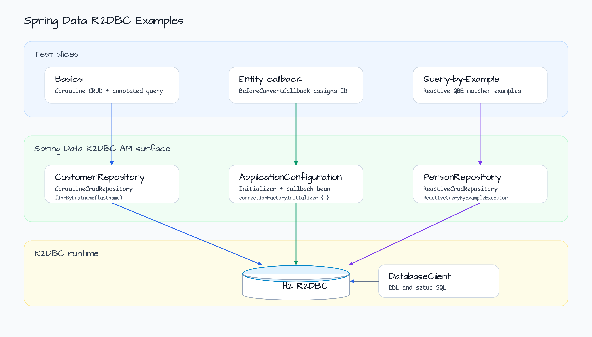
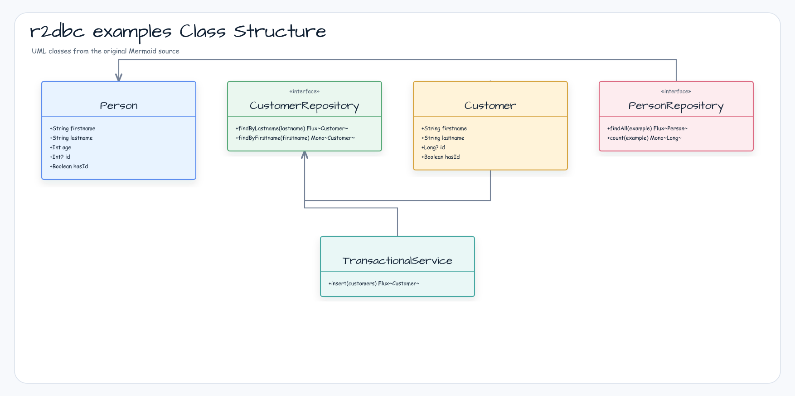
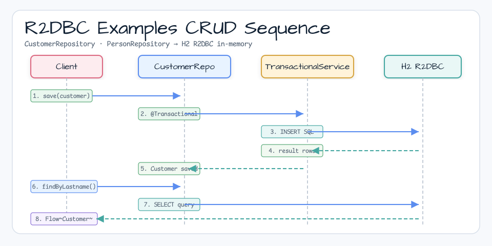
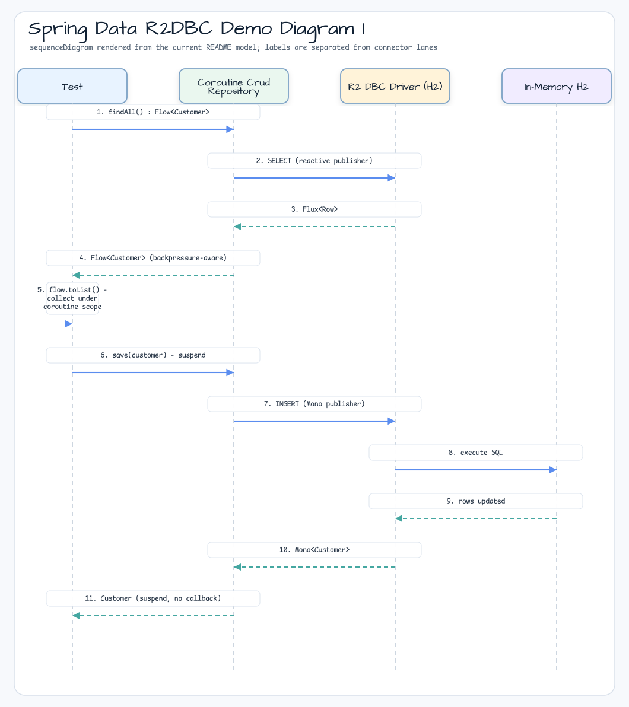

# Spring Data R2DBC Demo

[English](README.md) | 한국어

## 예제 시나리오

이 예제는 **Spring Data R2DBC Demo**를 실행 가능한 Spring Data 영속성 워크샵 조각으로 다룹니다. 개발자가 먼저 확인할 경로인 모듈 설정, 샘플 또는 테스트 실행, 반복적인 인프라 코드를 줄이는 라이브러리 또는 프레임워크 API 관찰에 초점을 맞춥니다.

## 아키텍처 다이어그램



이 모듈은 샘플 진입점 또는 테스트 픽스처, bluetape4k 확장 계층, 예제에서 사용하는 런타임 의존성을 중심으로 구성됩니다. README와 코드를 비교할 때는 `io.bluetape4k.workshop.springdata` 패키지를 기준으로 삼습니다.



## 흐름 다이어그램

1. `spring-data-r2dbc-examples`에 필요한 로컬 런타임을 준비합니다.
2. 예제 시나리오를 담당하는 애플리케이션, 컨트롤러, 서비스 또는 테스트 픽스처를 실행합니다.
3. 반복적인 인프라 작업을 bluetape4k 유틸리티 또는 Spring/Kotlin 통합에 위임합니다.
4. 샘플 출력, HTTP 응답, 저장소 상태, metric, trace 또는 테스트 기대값으로 보이는 결과를 검증합니다.

## 시퀀스 다이어그램

핵심 시퀀스는 호출자 또는 테스트 픽스처 -> 워크샵 어댑터 -> bluetape4k 헬퍼/API -> 외부 런타임 또는 인메모리 백엔드 -> 검증/응답 순서입니다. 전용 시퀀스 자산이 있는 모듈은 아래 이미지가 상호작용 순서를 보여주며, 그렇지 않은 경우 소스 테스트가 실행 가능한 시퀀스의 기준입니다.



## 아키텍처 다이어그램


## 참고 자료

* [Spring Data Examples - r2dbc/example](https://github.com/spring-projects/spring-data-examples/tree/main/r2dbc/example)
* [Spring Data Examples - r2dbc/query-by-example](https://github.com/spring-projects/spring-data-examples/tree/main/r2dbc/query-by-example)

* [Spring Data R2DBC and Kotlin Coroutines](https://xebia.com/blog/spring-data-r2dbc-and-kotlin-coroutines/)
* [Kotlin + Spring Webflux + R2DBC](https://dgahn.tistory.com/8)

이 프로젝트는 Spring Data의 진행 중인 R2DBC 지원을 사용하는 몇 가지 샘플을 보여줍니다.

### 눈여겨볼 부분

- `InfrastructureConfiguration` - R2DBC H2 드라이버(https://github.com/r2dbc/r2dbc-h2[r2dbc-h2]) 기반의 R2DBC `ConnectionFactory`, `DatabaseClient`, 그리고 최종적으로 `CustomerRepository`를 생성하는 `R2dbcRepositoryFactory`를 설정합니다.
- `CustomerRepository` - 수동으로 정의한 쿼리를 사용하는 쿼리 메서드를 노출하는 표준 Spring Data reactive CRUD repository입니다.
- `CustomerRepositoryIntegrationTests` - 설정 SQL로 데이터베이스를 초기화하고 `Customer` 인스턴스를 삽입하고 읽습니다.
- `TransactionalService` - 선언적 트랜잭션으로 repository 작업에 트랜잭션 경계를 적용합니다.

이 프로젝트는 Spring Data R2DBC의 Query-by-Example 샘플을 포함합니다.

### Query-by-Example 지원

Query by Example(QBE)은 단순한 인터페이스를 제공하는 사용자 친화적인 쿼리 기법입니다.
동적 쿼리 생성을 지원하며 필드 이름을 포함한 쿼리를 작성할 필요가 없습니다.
실제로 Query by Example은 SQL 쿼리를 직접 작성하지 않아도 됩니다.

`Example`은 데이터 객체(보통 entity 객체 또는 그 하위 타입)와 속성을 어떻게 매칭할지에 대한 명세를 받습니다.
Repository에서 Query by Example을 사용할 수 있습니다.

```kotlin
interface PersonRepository:
    CoroutineCrudRepository<Person, Long>,
    CoroutineQueryByExampleExecutor<Person>

val example = Example.of(Person("", "Snow", 0))
repository.findAll(example).toList()

val matcher = ExampleMatcher.buildExampleMatcher(Person::lastname.name)
    .withMatcher(Person::lastname.name, GenericPropertyMatchers.exact())
    .withIgnoreNullValues()
val example = Example.of(Person("", "White", 0), matcher)
repository.count(example)
```

## 처리 흐름



## 사용한 bluetape4k 기능

| 기능 | Artifact | 코드 위치 | 이점 |
|---|---|---|---|
| `connectionFactoryInitializer { }` | `bluetape4k-r2dbc` | `ApplicationConfiguration.kt` | `ConnectionFactoryInitializer`를 생성하는 DSL로, 반복적인 설정 코드를 줄입니다 |
| `buildExampleMatcher(vararg props)` | `bluetape4k-spring-boot4-r2dbc` | `PersonRepositoryIntegrationTest` | QBE `ExampleMatcher` DSL로, 문자열 속성명 없이 타입 안전한 matcher를 구성합니다 |
| `asLong()` / `toUtf8Bytes()` | `bluetape4k-core` | `ApplicationConfiguration.kt` | `Row` 컬럼 값 변환과 string -> UTF-8 byte 변환을 위한 확장 함수입니다 |
| `KLoggingChannel` | `bluetape4k-logging` | 모든 companion object | coroutine context를 포함하는 구조화 로깅입니다 |
| `shouldBeEqualTo`, `shouldNotBeNull` | `bluetape4k-core` | 모든 테스트 | `shouldBeEqualTo`, `shouldContainSame` 같은 읽기 쉬운 assertion입니다 |

## bluetape4k Before / After

### `connectionFactoryInitializer { }` vs 수동 Bean 생성

```kotlin
// Before — standard Spring R2DBC style (write bean creation manually)
@Bean
fun initializer(connectionFactory: ConnectionFactory): ConnectionFactoryInitializer {
    val initializer = ConnectionFactoryInitializer()
    initializer.setConnectionFactory(connectionFactory)
    val populator = ResourceDatabasePopulator()
    populator.addScript(ClassPathResource("schema.sql"))
    initializer.setDatabasePopulator(populator)
    return initializer
}

// After — bluetape4k DSL (concise lambda builder)
@Bean
fun initializer(connectionFactory: ConnectionFactory): ConnectionFactoryInitializer =
    connectionFactoryInitializer(connectionFactory) {
        setDatabasePopulator(ResourceDatabasePopulator(ByteArrayResource(sql.toUtf8Bytes())))
    }
```

### `buildExampleMatcher` vs 수동 ExampleMatcher 설정

```kotlin
// Before — standard ExampleMatcher (manual string property names)
val matcher = ExampleMatcher.matching()
    .withIgnorePaths("age")
    .withMatcher("lastname", GenericPropertyMatchers.exact())
    .withIgnoreNullValues()

// After — bluetape4k buildExampleMatcher (type-safe property references)
val matcher = ExampleMatcher.buildExampleMatcher(Person::lastname.name)
    .withMatcher(Person::lastname.name, GenericPropertyMatchers.exact())
    .withIgnoreNullValues()
```

## 취소, 구조화된 동시성, Context 전파

### R2DBC Flow와 Coroutine 취소

`CoroutineCrudRepository`의 `Flow` 반환 메서드는 coroutine 취소 신호를 R2DBC publisher로 전파합니다.
테스트에서 `runTest { }` 블록이 timeout되거나 예외를 던지면 `Flow<Customer>`를 collect하는 subscription이 자동으로 취소되고 connection은 DB connection pool로 반환됩니다.

```kotlin
// Flow cancellation propagation example
runTest {
    val job = launch {
        repository.findAll()        // Flux -> Flow conversion
            .collect { customer ->
                // when job.cancel() is called while this collect lambda is running
                // the R2DBC subscription is cancelled immediately and the connection returns to the pool
            }
    }
    delay(100)
    job.cancel()  // -> the upstream R2DBC Flux is also cancelled
}
```

### `@Transactional` + Coroutine Context 전파

`TransactionalService`는 `@Transactional suspend fun`을 사용합니다.
Spring R2DBC는 Reactor Context를 통해 transaction context를 전파하고, `kotlinx-coroutines-reactor`의 `ReactorContext` 요소가 이를 coroutine context와 연결합니다.

```kotlin
// TransactionalService.kt
@Transactional
suspend fun insert(customer: Customer): Customer =
    repository.save(customer)  // runs in the same transaction context
```

## 빌드와 테스트

```bash
./gradlew :spring-data-r2dbc-examples:test
```
