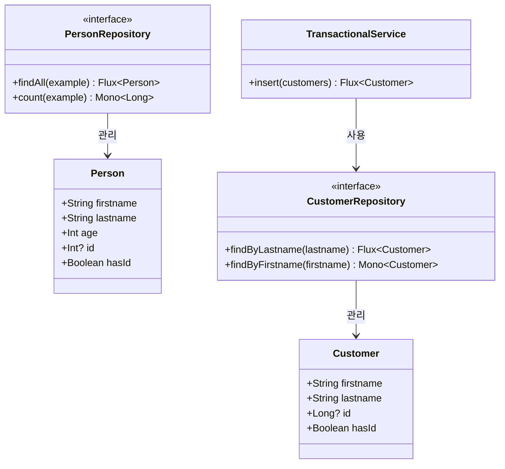
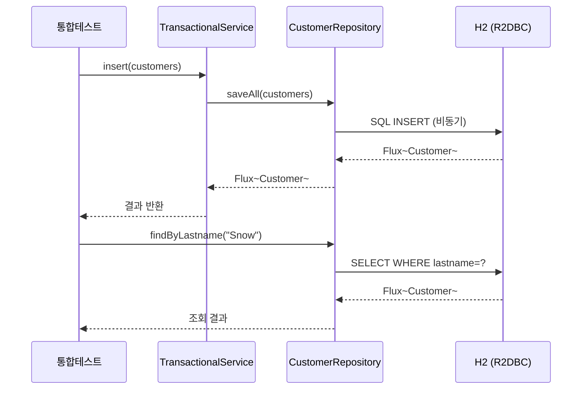

# Spring Data R2DBC Demo

## 아키텍처 다이어그램





## 참고

* [Spring Data Examples - r2dbc/example](https://github.com/spring-projects/spring-data-examples/tree/main/r2dbc/example)
* [Spring Data Examples - r2dbc/query-by-example](https://github.com/spring-projects/spring-data-examples/tree/main/r2dbc/query-by-example)

* [Spring Data R2DBC and Kotlin Coroutines](https://xebia.com/blog/spring-data-r2dbc-and-kotlin-coroutines/)
* [Kotlin + Spring Webflux + R2DBC](https://dgahn.tistory.com/8)

This projects shows some sample usage of the work-in-progress R2DBC support for Spring Data.

### Interesting bits to look at

- `InfrastructureConfiguration` - sets up a R2DBC `ConnectionFactory` based on the R2DBC H2
  driver (https://github.com/r2dbc/r2dbc-h2[r2dbc-h2]), a `DatabaseClient` and a `R2dbcRepositoryFactory` to eventually
  create a `CustomerRepository`.
- `CustomerRepository` - a standard Spring Data reactive CRUD repository exposing query methods using manually defined
  queries
- `CustomerRepositoryIntegrationTests` - to initialize the database with some setup SQL and the inserting and
  reading `Customer` instances.
- `TransactionalService` - uses declarative transaction to apply a transactional boundary to repository operations.

This project contains samples of Query-by-Example of Spring Data R2DBC.

### Support for Query-by-Example

Query by Example (QBE) is a user-friendly querying technique with a simple interface.
It allows dynamic query creation and does not require to write queries containing field names.
In fact, Query by Example does not require to write queries using SQL at all.

An `Example` takes a data object (usually the entity object or a subtype of it) and a specification how to match
properties.
You can use Query by Example with Repositories.

```java
interface PersonRepository extends ReactiveCrudRepository<Person, Long>, ReactiveQueryByExampleExecutor<Person> {
}
```

```java
Example<Person> example = Example.of(new Person("Jon", "Snow"));
        repo.

findAll(example);


ExampleMatcher matcher = ExampleMatcher.matching().
        .

withMatcher("firstname",endsWith())
        .

withMatcher("lastname",startsWith().

ignoreCase());

Example<Person> example = Example.of(new Person("Jon", "Snow"), matcher);
        repo.

count(example);
```

This example contains shows the usage with `PersonRepositoryIntegrationTests`.
