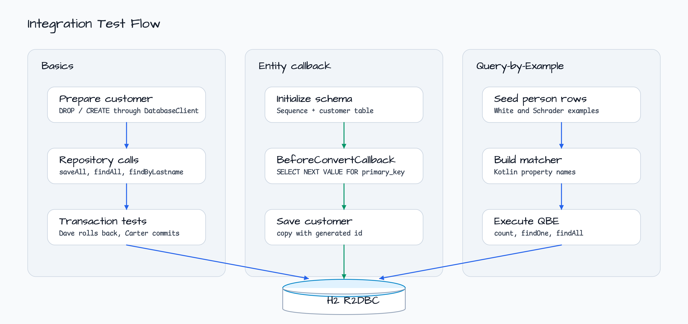

# Spring Data R2DBC Examples

[한국어](README.ko.md) | English

This module is a test-driven workshop for Spring Data R2DBC with Kotlin. It does
not expose an HTTP API. Instead, each package focuses on one persistence concern:
coroutine repositories, declarative reactive transactions, entity callbacks, and
Query-by-Example.

## Architecture


The examples share the same in-memory H2 R2DBC runtime, but each package owns its
own Spring test configuration and schema setup.

| Package | What to inspect | Main point |
|---|---|---|
| `r2dbc.basics` | `CustomerRepositoryIntegrationTest`, `TransactionalServiceIntegrationTest` | Coroutine CRUD operations, annotated query methods, and rollback behavior from `@Transactional suspend fun`. |
| `r2dbc.entitycallback` | `ApplicationConfiguration`, `CustomerRepositoryIntegrationTest` | `BeforeConvertCallback` assigns IDs from an H2 sequence before insert. |
| `r2dbc.queryexample` | `PersonRepositoryIntegrationTest` | Spring Data Query-by-Example with Kotlin-friendly `buildExampleMatcher(...)`. |

## Test Flow



The important behavior is visible in tests:

1. The test configuration starts a Spring context with R2DBC repositories.
2. Each test prepares a small H2 schema through `DatabaseClient` or a
   `ConnectionFactoryInitializer`.
3. Repository operations are exercised through coroutine `Flow`, suspend
   functions, or Reactor publishers converted with coroutine adapters.
4. Assertions verify rows, query matches, generated IDs, and transaction
   rollback.

## Schema


`customer` is recreated by both the basics and entity-callback tests. The
entity-callback slice uses a `primary_key` sequence to set `Customer.id` before
conversion. `person` belongs to the Query-by-Example tests.

## bluetape4k APIs Used

| API | Where | Why it matters |
|---|---|---|
| `connectionFactoryInitializer { }` | `entitycallback/ApplicationConfiguration.kt` | Creates the R2DBC initializer with less Spring boilerplate. |
| `asLong()` | `entitycallback/ApplicationConfiguration.kt` | Converts the sequence value from the R2DBC row. |
| `toUtf8Bytes()` | `entitycallback/ApplicationConfiguration.kt` | Builds a byte-backed SQL resource for schema initialization. |
| `Person::class.buildExampleMatcher(...)` | `queryexample/PersonRepositoryIntegrationTest.kt` | Keeps QBE matcher fields tied to Kotlin property names. |
| `runSuspendIO` | Integration tests | Runs suspend test blocks on the intended dispatcher. |

## Build and Test

```bash
./gradlew :spring-data:r2dbc-examples:test
```
