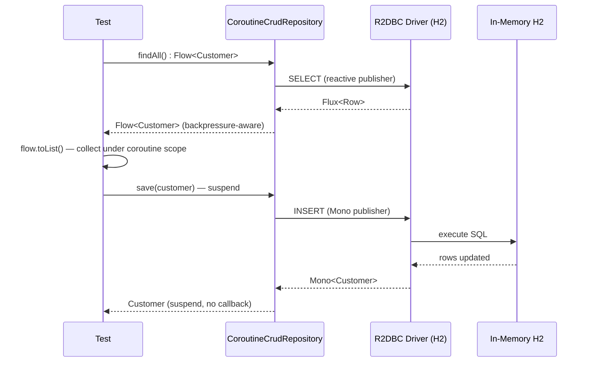

# Spring Data R2DBC Demo

## 아키텍처 다이어그램


## 참고

* [Spring Data Examples - r2dbc/example](https://github.com/spring-projects/spring-data-examples/tree/main/r2dbc/example)
* [Spring Data Examples - r2dbc/query-by-example](https://github.com/spring-projects/spring-data-examples/tree/main/r2dbc/query-by-example)

* [Spring Data R2DBC and Kotlin Coroutines](https://xebia.com/blog/spring-data-r2dbc-and-kotlin-coroutines/)
* [Kotlin + Spring Webflux + R2DBC](https://dgahn.tistory.com/8)

This project shows some sample usage of the work-in-progress R2DBC support for Spring Data.

### Interesting bits to look at

- `InfrastructureConfiguration` - sets up a R2DBC `ConnectionFactory` based on the R2DBC H2
  driver (https://github.com/r2dbc/r2dbc-h2[r2dbc-h2]), a `DatabaseClient` and a `R2dbcRepositoryFactory` to eventually
  create a `CustomerRepository`.
- `CustomerRepository` - a standard Spring Data reactive CRUD repository exposing query methods using manually defined
  queries
- `CustomerRepositoryIntegrationTests` - to initialize the database with some setup SQL and the inserting and
  reading `Customer` instances.
- `TransactionalService` - uses declarative transaction to apply a transactional boundary to repository operations.

This project contains samples of Query-by-Example of Spring Data R2DBC.

### Support for Query-by-Example

Query by Example (QBE) is a user-friendly querying technique with a simple interface.
It allows dynamic query creation and does not require to write queries containing field names.
In fact, Query by Example does not require to write queries using SQL at all.

An `Example` takes a data object (usually the entity object or a subtype of it) and a specification how to match
properties.
You can use Query by Example with Repositories.

```kotlin
interface PersonRepository:
    CoroutineCrudRepository<Person, Long>,
    CoroutineQueryByExampleExecutor<Person>

val example = Example.of(Person("", "Snow", 0))
repository.findAll(example).toList()

val matcher = ExampleMatcher.buildExampleMatcher(Person::lastname.name)
    .withMatcher(Person::lastname.name, GenericPropertyMatchers.exact())
    .withIgnoreNullValues()
val example = Example.of(Person("", "White", 0), matcher)
repository.count(example)
```

## 처리 흐름


```mermaid
sequenceDiagram
    participant Test
    participant CoroutineRepo as CoroutineCrudRepository
    participant R2DBC as R2DBC Driver (H2)
    participant DB as In-Memory H2

    Test->>CoroutineRepo: findAll() : Flow<Customer>
    CoroutineRepo->>R2DBC: SELECT (reactive publisher)
    R2DBC-->>CoroutineRepo: Flux<Row>
    CoroutineRepo-->>Test: Flow<Customer> (backpressure-aware)
    Test->>Test: flow.toList() — collect under coroutine scope

    Test->>CoroutineRepo: save(customer) — suspend
    CoroutineRepo->>R2DBC: INSERT (Mono publisher)
    R2DBC->>DB: execute SQL
    DB-->>R2DBC: rows updated
    R2DBC-->>CoroutineRepo: Mono<Customer>
    CoroutineRepo-->>Test: Customer (suspend, no callback)
```

## 사용된 bluetape4k 기능

| 기능 | 아티팩트 | 코드 위치 | 이점 |
|---|---|---|---|
| `connectionFactoryInitializer { }` | `bluetape4k-r2dbc` | `ApplicationConfiguration.kt` | `ConnectionFactoryInitializer` 생성 DSL — 보일러플레이트 설정 코드 축소 |
| `buildExampleMatcher(vararg props)` | `bluetape4k-spring-boot4-r2dbc` | `PersonRepositoryIntegrationTest` | QBE `ExampleMatcher` DSL — 프로퍼티명 문자열 없이 타입 안전하게 매처 구성 |
| `asLong()` / `toUtf8Bytes()` | `bluetape4k-core` | `ApplicationConfiguration.kt` | `Row` 컬럼 값 변환 / 문자열 → UTF-8 바이트 변환 확장 함수 |
| `KLoggingChannel` | `bluetape4k-logging` | 모든 companion object | 코루틴 컨텍스트 포함 구조적 로깅 |
| `shouldBeEqualTo`, `shouldNotBeNull` | `bluetape4k-core` | 테스트 전체 | 가독성 높은 단언문 (`shouldBeEqualTo`, `shouldContainSame` 등) |

## bluetape4k Before / After

### `connectionFactoryInitializer { }` vs 직접 빈 생성

```kotlin
// Before — 표준 Spring R2DBC 방식 (빈 생성 직접 작성)
@Bean
fun initializer(connectionFactory: ConnectionFactory): ConnectionFactoryInitializer {
    val initializer = ConnectionFactoryInitializer()
    initializer.setConnectionFactory(connectionFactory)
    val populator = ResourceDatabasePopulator()
    populator.addScript(ClassPathResource("schema.sql"))
    initializer.setDatabasePopulator(populator)
    return initializer
}

// After — bluetape4k DSL (간결한 람다 빌더)
@Bean
fun initializer(connectionFactory: ConnectionFactory): ConnectionFactoryInitializer =
    connectionFactoryInitializer(connectionFactory) {
        setDatabasePopulator(ResourceDatabasePopulator(ByteArrayResource(sql.toUtf8Bytes())))
    }
```

### `buildExampleMatcher` vs ExampleMatcher 직접 구성

```kotlin
// Before — 표준 ExampleMatcher (프로퍼티명 문자열 직접 입력)
val matcher = ExampleMatcher.matching()
    .withIgnorePaths("age")
    .withMatcher("lastname", GenericPropertyMatchers.exact())
    .withIgnoreNullValues()

// After — bluetape4k buildExampleMatcher (타입 안전 프로퍼티 참조)
val matcher = ExampleMatcher.buildExampleMatcher(Person::lastname.name)
    .withMatcher(Person::lastname.name, GenericPropertyMatchers.exact())
    .withIgnoreNullValues()
```

## 취소·구조적 동시성·컨텍스트 전파

### R2DBC Flow와 코루틴 취소

`CoroutineCrudRepository`의 `Flow` 반환 메서드는 코루틴 취소 신호를 R2DBC 발행자에 전파합니다.
테스트에서 `runTest { }` 블록이 시간 초과되거나 예외가 발생하면, `Flow<Customer>`를 수집하던 구독이 자동으로 취소되어
DB 커넥션 풀에 커넥션이 반환됩니다.

```kotlin
// Flow 취소 전파 예시
runTest {
    val job = launch {
        repository.findAll()        // Flux → Flow 변환
            .collect { customer ->
                // 이 collect 람다가 실행 중일 때 job.cancel() 호출 시
                // R2DBC 구독이 즉시 취소되고 커넥션이 풀에 반환됨
            }
    }
    delay(100)
    job.cancel()  // → R2DBC upstream Flux도 취소됨
}
```

### `@Transactional` + 코루틴 컨텍스트 전파

`TransactionalService`는 `@Transactional suspend fun` 을 사용합니다.
Spring R2DBC는 Reactor Context를 통해 트랜잭션 컨텍스트를 전파하며,
`kotlinx-coroutines-reactor`의 `ReactorContext` 요소가 이를 코루틴 컨텍스트와 연결합니다.

```kotlin
// TransactionalService.kt
@Transactional
suspend fun insert(customer: Customer): Customer =
    repository.save(customer)  // 동일 트랜잭션 컨텍스트에서 실행
```

## 빌드 및 테스트

```bash
./gradlew :spring-data-r2dbc-examples:test
```
