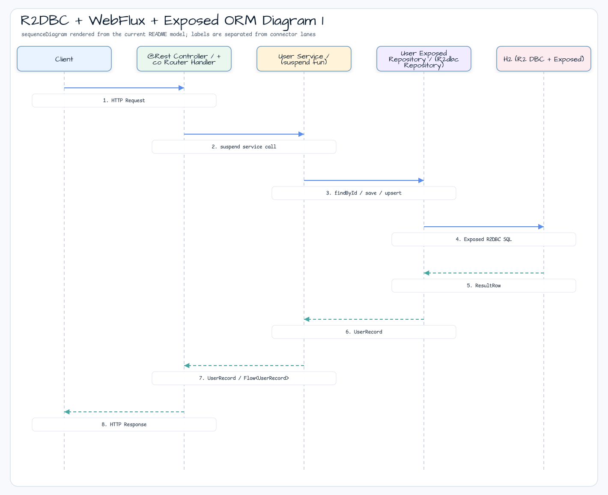
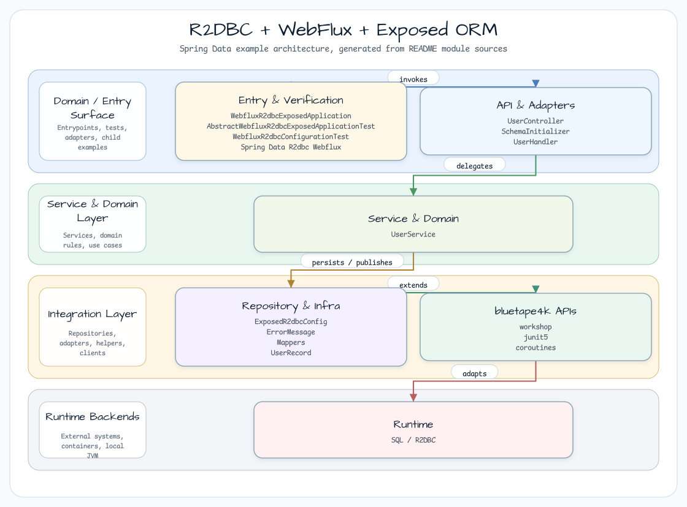

# R2DBC + WebFlux + Exposed ORM

[English](README.md) | 한국어

## 예제 시나리오

이 예제는 **R2DBC + WebFlux + Exposed ORM**을 실행 가능한 Spring Data 영속성 워크샵 조각으로 다룹니다. 개발자가 먼저 확인할 경로인 모듈 설정, 샘플 또는 테스트 실행, 반복적인 인프라 코드를 줄이는 라이브러리 또는 프레임워크 API 관찰에 초점을 맞춥니다.

## 흐름 다이어그램

1. `spring-data-r2dbc-webflux-exposed`에 필요한 로컬 런타임을 준비합니다.
2. 예제 시나리오를 담당하는 애플리케이션, 컨트롤러, 서비스 또는 테스트 픽스처를 실행합니다.
3. 반복적인 인프라 작업을 bluetape4k 유틸리티 또는 Spring/Kotlin 통합에 위임합니다.
4. 샘플 출력, HTTP 응답, 저장소 상태, metric, trace 또는 테스트 기대값으로 보이는 결과를 검증합니다.

## 시퀀스 다이어그램



핵심 시퀀스는 호출자 또는 테스트 픽스처 -> 워크샵 어댑터 -> bluetape4k 헬퍼/API -> 외부 런타임 또는 인메모리 백엔드 -> 검증/응답 순서입니다. 전용 시퀀스 자산이 있는 모듈은 아래 이미지가 상호작용 순서를 보여주며, 그렇지 않은 경우 소스 테스트가 실행 가능한 시퀀스의 기준입니다.

Spring Data R2DBC + Spring WebFlux + JetBrains Exposed ORM 조합이며, coroutine-first 데이터 접근 계층을 위해 **bluetape4k `R2dbcRepository`**를 사용합니다. Exposed table DSL은 schema definition을 처리하고, Spring WebFlux(functional + annotation route)는 HTTP를 처리합니다.

## 아키텍처



## 아키텍처 다이어그램

이 예제는 Spring Data R2DBC, Spring WebFlux, JetBrains Exposed ORM을 함께 사용합니다.
R2DBC 환경에서 Exposed table definition을 적용하기 위해 `exposed-r2dbc` 모듈을 사용합니다.

## 사용한 bluetape4k 기능

| 기능 | Artifact | 코드 위치 | 이점 |
|---------|----------|---------------|---------|
| `R2dbcRepository<ID, Entity>` | `bluetape4k-exposed-r2dbc` | `UserExposedRepository.kt` | Exposed DSL을 통해 `findAll()`, `findById()`, `count()`, `deleteById()`를 제공하는 추상 base입니다 |
| `KLoggingChannel` | `bluetape4k-logging` | `ExposedR2dbcConfig.kt`, `UserService.kt` | Coroutine-aware structured logging입니다 |
| `bluetape4k-coroutines` | `bluetape4k-coroutines` | Service layer | Coroutine scope helper입니다 |
| `Runtimex.availableProcessors` | `bluetape4k-core` | `ExposedR2dbcConfig.kt` | CPU-aware connection pool sizing입니다 |

## bluetape4k Before / After

### `R2dbcRepository`를 사용하는 Exposed R2DBC repository

```kotlin
// Before — manual Exposed R2DBC CRUD (repeated per entity)
class UserRepository {
    suspend fun findAll(): List<UserRecord> = suspendedTransaction {
        UserTable.selectAll().map { it.toUserRecord() }
    }
    suspend fun findById(id: Int): UserRecord? = suspendedTransaction {
        UserTable.selectAll().where { UserTable.id eq id }.singleOrNull()?.toUserRecord()
    }
    suspend fun deleteById(id: Int): Int = suspendedTransaction {
        UserTable.deleteWhere { UserTable.id eq id }
    }
    // count(), existsById(), findPage()... each written manually
}

// After — bluetape4k R2dbcRepository: inherit CRUD, implement only what's custom
@Repository
class UserExposedRepository : R2dbcRepository<Int, UserRecord> {
    override val table: UserTable = UserTable
    override fun extractId(entity: UserRecord): Int = entity.id
    override suspend fun ResultRow.toEntity(): UserRecord = toUserRecord()

    // Custom operations only — all standard CRUD is inherited
    suspend fun upsert(user: UserRecord) {
        table.upsert(where = { table.id eq user.id }) {
            it[table.name] = user.name
            it[table.email] = user.email
        }
    }
}
```

### `Runtimex`를 사용한 R2DBC connection pool

```kotlin
// Before — hardcoded pool size
.maxSize(50)

// After — bluetape4k Runtimex: CPU-adaptive sizing
.maxSize(max(Runtimex.availableProcessors * 8, 100))
```

## 구성 요소

| Class | 역할 |
|---|---|
| `UserSchema` | Exposed table definition(`Users` table) |
| `UserExposedRepository` | Exposed R2DBC DSL로 구현한 repository |
| `UserService` | Business logic(suspend functions) |
| `UserController` | `@RestController` annotation-style REST API |
| `UserHandler` | WebFlux functional-router style handler |
| `ExposedR2dbcConfig` | R2DBC + Exposed integration configuration |
| `SchemaInitializer` | 애플리케이션 시작 시 자동 schema creation |

## Exposed R2DBC 사용 패턴

```kotlin
// Exposed table definition
object Users : LongIdTable("users") {
    val name = varchar("name", 255)
    val email = varchar("email", 255).uniqueIndex()
}

// Use the Exposed DSL inside an R2DBC transaction in the repository
suspend fun findById(id: Long): User? = suspendedTransaction {
    Users.selectAll().where { Users.id eq id }.singleOrNull()?.toUser()
}
```

## REST API

| Method | Path | 설명 |
|---|---|---|
| GET | `/users` | 모든 user 목록 |
| GET | `/users/{id}` | user 조회 |
| POST | `/users` | user 생성 |
| DELETE | `/users/{id}` | user 삭제 |

## 실행

```bash
./gradlew :spring-data-r2dbc-webflux-exposed:bootRun
```

## 참고 자료

- [POC WebFlux-R2DBC H2-Kotlin](https://github.com/razvn/webflux-r2dbc-kotlin)
- [Bluetape4k Exposed R2DBC module](https://github.com/bluetape4k/bluetape4k-projects)
