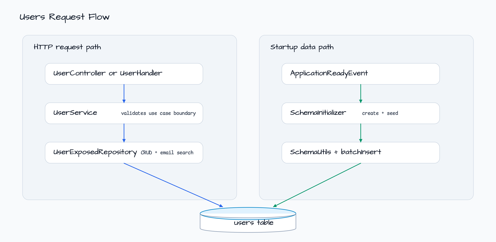
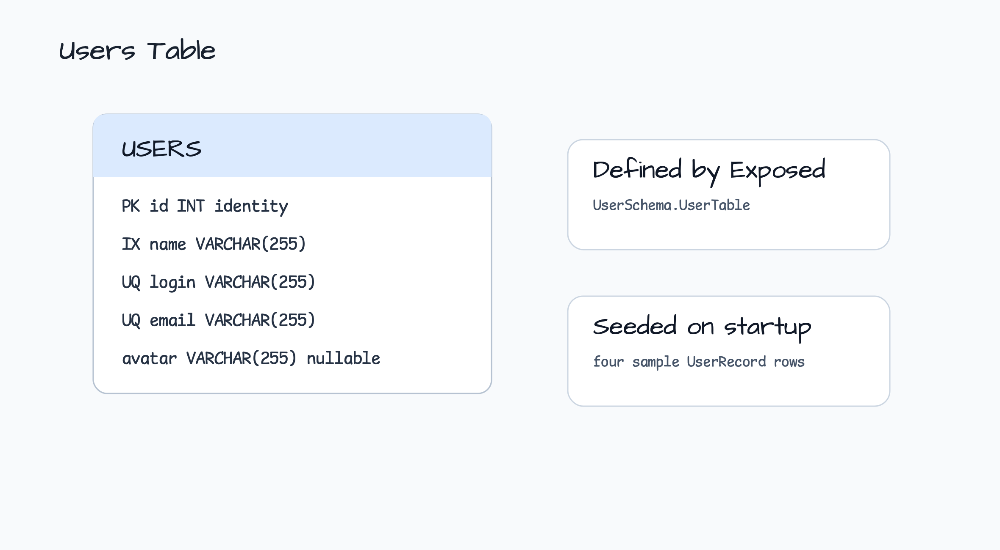

# R2DBC + WebFlux + Exposed ORM

[한국어](README.ko.md) | English

This module shows a coroutine WebFlux API backed by JetBrains Exposed R2DBC. It
contains two HTTP entrypoint styles over the same `UserService`: an annotation
controller under `/api/users` and a functional router under `/users`.

## Architecture


`UserService` owns the transaction boundary with `suspendTransaction(db = ...)`.
`UserExposedRepository` inherits common CRUD from bluetape4k
`R2dbcRepository<Int, UserRecord>` and implements only user-specific operations.

## Request Flow



The application also seeds sample data on startup. `SchemaInitializer` creates
the Exposed table and inserts four users when the table is empty.

## Schema



The Exposed table is `users`. `login` and `email` are unique, `name` is indexed,
and `avatar` is nullable.

## API Surface

| Style | Method | Path | Handler |
|---|---|---|---|
| Annotation | `GET` | `/api/users` | `UserController.findAll()` |
| Annotation | `GET` | `/api/users/search?email=...` | `UserController.search(...)` |
| Annotation | `GET` | `/api/users/{id}` | `UserController.findUserById(...)` |
| Annotation | `POST` | `/api/users` | `UserController.addUser(...)` |
| Annotation | `PUT` | `/api/users/{id}` | `UserController.updateUser(...)` |
| Annotation | `DELETE` | `/api/users/{id}` | `UserController.deleteUser(...)` |
| Functional | `GET` | `/users` | `UserHandler.findAll(...)` |
| Functional | `GET` | `/users/search?email=...` | `UserHandler.search(...)` |
| Functional | `GET` | `/users/{id}` | `UserHandler.findUser(...)` |
| Functional | `POST` | `/users` | `UserHandler.addUser(...)` |
| Functional | `PUT` | `/users/{id}` | `UserHandler.updateUser(...)` |
| Functional | `DELETE` | `/users/{id}` | `UserHandler.deleteUser(...)` |

## bluetape4k APIs Used

| API | Where | Why it matters |
|---|---|---|
| `R2dbcRepository<ID, Entity>` | `UserExposedRepository.kt` | Supplies common Exposed R2DBC CRUD operations. |
| `Runtimex.availableProcessors` | `ExposedR2dbcConfig.kt` | Sizes the R2DBC connection pool from CPU capacity. |
| `asIntOrNull()` | `UserHandler.kt` | Validates functional-route path variables without throwing parser errors. |
| `KLoggingChannel` | Configuration, service, handler, initializer | Keeps coroutine-aware structured logging consistent. |

## Run

```bash
./gradlew :spring-data:r2dbc-webflux-exposed:bootRun
```

## Test

```bash
./gradlew :spring-data:r2dbc-webflux-exposed:test
```
