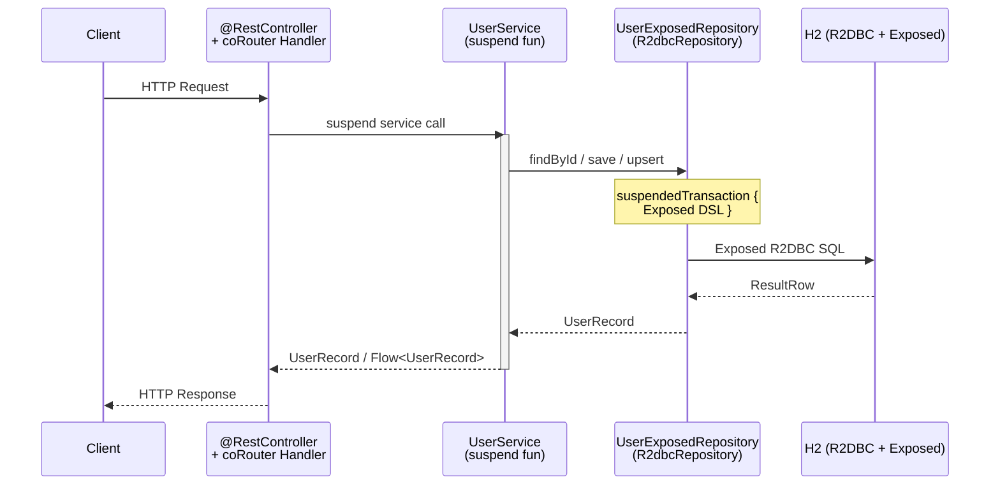
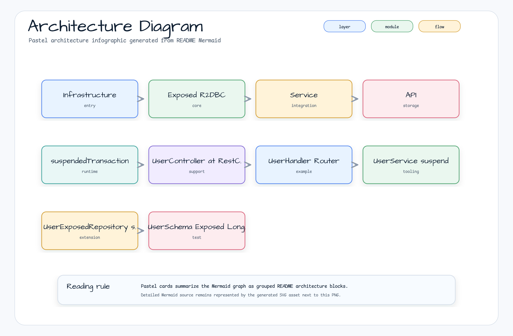

# R2DBC + WebFlux + Exposed ORM

[한국어](README.ko.md) | English

## Example Scenario

This example exercises **R2DBC + WebFlux + Exposed ORM** as a runnable Spring Data persistence workshop slice. It focuses on the path a developer would inspect first: configure the module, run the sample or tests, and observe the library or framework APIs that remove repetitive infrastructure code.

## Flow Diagram

1. Prepare the local runtime required by `spring-data-r2dbc-webflux-exposed`.
2. Execute the application, controller, service, or test fixture that owns the example scenario.
3. Delegate repetitive infrastructure work to bluetape4k utilities or Spring/Kotlin integrations.
4. Assert the visible result through the sample output, HTTP response, repository state, metric, trace, or test expectation.

## Sequence Diagram

The core sequence is: caller or test fixture -> workshop adapter -> bluetape4k helper/API -> external runtime or in-memory backend -> assertion/response. When this module has a dedicated sequence asset, the image below shows that interaction order; otherwise the source tests are the authoritative executable sequence.

Spring Data R2DBC + Spring WebFlux + JetBrains Exposed ORM, using **bluetape4k `R2dbcRepository`**
for a coroutine-first data access layer. Exposed table DSL handles schema definition; Spring WebFlux
(functional + annotation routes) handles HTTP.

## Architecture



## 아키텍처 다이어그램



Spring Data R2DBC와 Spring WebFlux, JetBrains Exposed ORM을 함께 사용하는 예제입니다.
`exposed-r2dbc` 모듈을 활용해 Exposed 테이블 정의를 R2DBC 환경에서 사용합니다.

## Used bluetape4k Features

| Feature | Artifact | Code location | Benefit |
|---------|----------|---------------|---------|
| `R2dbcRepository<ID, Entity>` | `bluetape4k-exposed-r2dbc` | `UserExposedRepository.kt` | Abstract base providing `findAll()`, `findById()`, `count()`, `deleteById()` via Exposed DSL |
| `KLoggingChannel` | `bluetape4k-logging` | `ExposedR2dbcConfig.kt`, `UserService.kt` | Coroutine-aware structured logging |
| `bluetape4k-coroutines` | `bluetape4k-coroutines` | Service layer | Coroutine scope helpers |
| `Runtimex.availableProcessors` | `bluetape4k-core` | `ExposedR2dbcConfig.kt` | CPU-aware connection pool sizing |

## bluetape4k Before / After

### Exposed R2DBC repository with `R2dbcRepository`

```kotlin
// Before — manual Exposed R2DBC CRUD (repeated per entity)
class UserRepository {
    suspend fun findAll(): List<UserRecord> = suspendedTransaction {
        UserTable.selectAll().map { it.toUserRecord() }
    }
    suspend fun findById(id: Int): UserRecord? = suspendedTransaction {
        UserTable.selectAll().where { UserTable.id eq id }.singleOrNull()?.toUserRecord()
    }
    suspend fun deleteById(id: Int): Int = suspendedTransaction {
        UserTable.deleteWhere { UserTable.id eq id }
    }
    // count(), existsById(), findPage()... each written manually
}

// After — bluetape4k R2dbcRepository: inherit CRUD, implement only what's custom
@Repository
class UserExposedRepository : R2dbcRepository<Int, UserRecord> {
    override val table: UserTable = UserTable
    override fun extractId(entity: UserRecord): Int = entity.id
    override suspend fun ResultRow.toEntity(): UserRecord = toUserRecord()

    // Custom operations only — all standard CRUD is inherited
    suspend fun upsert(user: UserRecord) {
        table.upsert(where = { table.id eq user.id }) {
            it[table.name] = user.name
            it[table.email] = user.email
        }
    }
}
```

### R2DBC connection pool with `Runtimex`

```kotlin
// Before — hardcoded pool size
.maxSize(50)

// After — bluetape4k Runtimex: CPU-adaptive sizing
.maxSize(max(Runtimex.availableProcessors * 8, 100))
```

## 구성

| 클래스 | 역할 |
|---|---|
| `UserSchema` | Exposed Table 정의 (`Users` 테이블) |
| `UserExposedRepository` | Exposed R2DBC DSL로 구현한 Repository |
| `UserService` | 비즈니스 로직 (suspend 함수) |
| `UserController` | `@RestController` 어노테이션 방식 REST API |
| `UserHandler` | WebFlux 함수형 라우터 방식 Handler |
| `ExposedR2dbcConfig` | R2DBC + Exposed 연동 설정 |
| `SchemaInitializer` | 애플리케이션 시작 시 스키마 자동 생성 |

## Exposed R2DBC 사용 패턴

```kotlin
// Exposed Table 정의
object Users : LongIdTable("users") {
    val name = varchar("name", 255)
    val email = varchar("email", 255).uniqueIndex()
}

// Repository에서 R2DBC 트랜잭션 안에서 Exposed DSL 사용
suspend fun findById(id: Long): User? = suspendedTransaction {
    Users.selectAll().where { Users.id eq id }.singleOrNull()?.toUser()
}
```

## REST API

| Method | 경로 | 설명 |
|---|---|---|
| GET | `/users` | 전체 사용자 목록 |
| GET | `/users/{id}` | 사용자 조회 |
| POST | `/users` | 사용자 생성 |
| DELETE | `/users/{id}` | 사용자 삭제 |

## 실행

```bash
./gradlew :spring-data-r2dbc-webflux-exposed:bootRun
```

## 참고

- [POC WebFlux-R2DBC H2-Kotlin](https://github.com/razvn/webflux-r2dbc-kotlin)
- [Bluetape4k Exposed R2DBC 모듈](https://github.com/bluetape4k/bluetape4k-projects)
