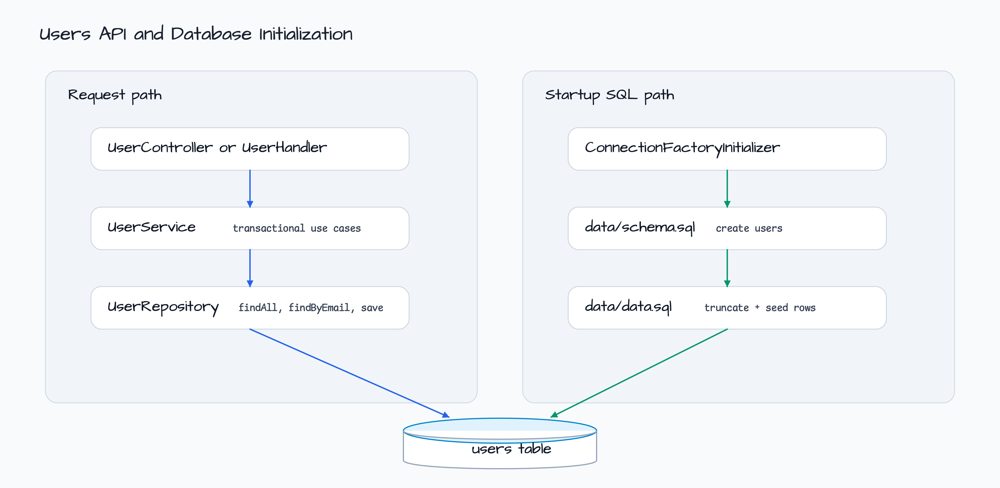

# R2DBC + Spring WebFlux

[English](README.md) | 한국어

이 모듈은 Spring Data R2DBC와 in-memory H2 database를 사용하는 coroutine
Spring WebFlux users API입니다. `/api/users` 아래의 annotation endpoint와
`/users` 아래의 functional route를 모두 포함합니다.

## 아키텍처


`UserService`는 transaction boundary를 유지하고, persistence 작업은 Spring Data
`CoroutineCrudRepository<User, Int>`인 `UserRepository`에 위임합니다. email 조회는
custom query method로 제공합니다.

## 요청 흐름



`WebfluxR2dbcConfiguration`은 database 초기화도 담당합니다.
`ConnectionFactoryInitializer`가 `data/schema.sql`을 먼저 실행하고
`data/data.sql`을 이어서 실행합니다. 이 모듈에서는 R2DBC embedded database
초기화를 명시적으로 처리합니다.

## Schema


테이블은 시작 시 SQL resource로 다시 준비됩니다. H2 URL은
`CASE_INSENSITIVE_IDENTIFIERS=TRUE`를 켜서 Spring Data generated SQL, custom lower
case SQL, unquoted H2 table definition이 일관되게 해석되도록 합니다.

## API Surface

| 방식 | Method | Path | Handler |
|---|---|---|---|
| Annotation | `GET` | `/api/users` | `UserController.findAll()` |
| Annotation | `GET` | `/api/users/search?email=...` | `UserController.search(...)` |
| Annotation | `GET` | `/api/users/{id}` | `UserController.findUserById(...)` |
| Annotation | `POST` | `/api/users` | `UserController.addUser(...)` |
| Annotation | `PUT` | `/api/users/{id}` | `UserController.updateUser(...)` |
| Annotation | `DELETE` | `/api/users/{id}` | `UserController.deleteUser(...)` |
| Functional | `GET` | `/users` | `UserHandler.findAll(...)` |
| Functional | `GET` | `/users/search?email=...` | `UserHandler.search(...)` |
| Functional | `GET` | `/users/{id}` | `UserHandler.findUser(...)` |
| Functional | `POST` | `/users` | `UserHandler.addUser(...)` |
| Functional | `PUT` | `/users/{id}` | `UserHandler.updateUser(...)` |
| Functional | `DELETE` | `/users/{id}` | `UserHandler.deleteUser(...)` |

## Runtime Notes

| Component | 역할 |
|---|---|
| `NettyConfig` | Reactor Netty keep-alive, backlog, timeout, connection provider, event loop을 조정합니다. |
| `ConnectionFactoryInitializer` | schema SQL과 seed SQL을 정해진 순서로 실행합니다. |
| `UserDTO.toModel(...)` | 요청 payload를 저장용 `User` entity로 변환합니다. |
| `asIntOrNull()` | Functional route path variable을 parser 예외 없이 검증합니다. |

## 실행

```bash
./gradlew :spring-data:r2dbc-webflux:bootRun
```

## 테스트

```bash
./gradlew :spring-data:r2dbc-webflux:test
```
