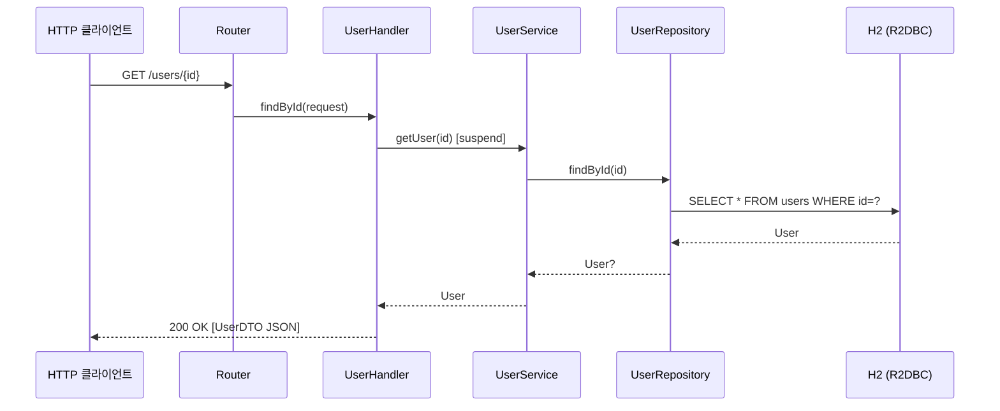

# R2DBC + Spring WebFlux (함수형 라우터)

## 아키텍처 다이어그램

```mermaid
flowchart TB
    subgraph 클라이언트 레이어
        C[HTTP 클라이언트]
    end

    subgraph WebFlux 레이어
        R[Router\ncoRouter 함수형 라우터]
        H[UserHandler\nsuspend 함수]
        UC[UserController\n@RestController]
    end

    subgraph 서비스 레이어
        S[UserService\n비즈니스 로직]
    end

    subgraph 데이터 레이어
        REPO[UserRepository\nReactiveCrudRepository]
        DB[(H2 R2DBC)]
    end

    C -->|GET/POST/DELETE /users| R
    R --> H
    H --> S
    UC --> S
    S --> REPO
    REPO -->|비동기 SQL| DB
```



Spring Data R2DBC와 WebFlux 함수형 라우터(Handler + Router)를 조합한 리액티브 CRUD 예제입니다.
H2 인메모리 데이터베이스를 사용합니다.

## 구성 방식

어노테이션 컨트롤러 대신 **함수형 엔드포인트** 방식을 사용합니다:

```kotlin
// Router: 경로 정의
@Bean
fun routes(handler: UserHandler) = coRouter {
    "/users".nest {
        GET("", handler::findAll)
        GET("/{id}", handler::findById)
        POST("", handler::save)
        DELETE("/{id}", handler::delete)
    }
}

// Handler: 요청 처리 (suspend 함수)
suspend fun findAll(request: ServerRequest): ServerResponse =
    ServerResponse.ok().bodyAndAwait(userRepository.findAll())
```

## 어노테이션 컨트롤러 방식과 비교

| 방식 | 특징 |
|---|---|
| 함수형 (이 모듈) | Router + Handler 분리, 명시적 경로 정의 |
| 어노테이션 (`r2dbc-webflux-exposed`) | `@RestController` + `@GetMapping` |

## 참고

- [Spring WebFlux 함수형 엔드포인트](https://docs.spring.io/spring-framework/reference/web/webflux-functional.html)
- [POC WebFlux-R2DBC H2-Kotlin](https://github.com/razvn/webflux-r2dbc-kotlin)
