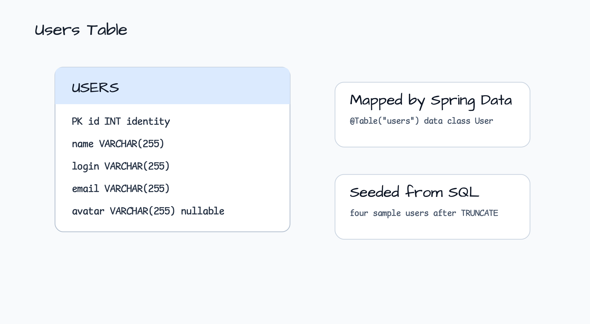

# R2DBC + Spring WebFlux

[한국어](README.ko.md) | English

This module is a coroutine Spring WebFlux users API backed by Spring Data R2DBC
and an in-memory H2 database. It includes both annotation-style endpoints under
`/api/users` and functional routes under `/users`.

## Architecture


`UserService` keeps the transaction boundary and delegates persistence to
`UserRepository`, a Spring Data `CoroutineCrudRepository<User, Int>` with one
custom query for email lookup.

## Request Flow


`WebfluxR2dbcConfiguration` also owns database initialization. It runs
`data/schema.sql` and then `data/data.sql` through a `ConnectionFactoryInitializer`
because R2DBC embedded database initialization is handled explicitly here.

## Schema



The table is recreated from SQL resources at startup. The H2 URL enables
`CASE_INSENSITIVE_IDENTIFIERS=TRUE` so Spring Data generated SQL, custom lower
case SQL, and the unquoted H2 table definition resolve consistently.

## API Surface

| Style | Method | Path | Handler |
|---|---|---|---|
| Annotation | `GET` | `/api/users` | `UserController.findAll()` |
| Annotation | `GET` | `/api/users/search?email=...` | `UserController.search(...)` |
| Annotation | `GET` | `/api/users/{id}` | `UserController.findUserById(...)` |
| Annotation | `POST` | `/api/users` | `UserController.addUser(...)` |
| Annotation | `PUT` | `/api/users/{id}` | `UserController.updateUser(...)` |
| Annotation | `DELETE` | `/api/users/{id}` | `UserController.deleteUser(...)` |
| Functional | `GET` | `/users` | `UserHandler.findAll(...)` |
| Functional | `GET` | `/users/search?email=...` | `UserHandler.search(...)` |
| Functional | `GET` | `/users/{id}` | `UserHandler.findUser(...)` |
| Functional | `POST` | `/users` | `UserHandler.addUser(...)` |
| Functional | `PUT` | `/users/{id}` | `UserHandler.updateUser(...)` |
| Functional | `DELETE` | `/users/{id}` | `UserHandler.deleteUser(...)` |

## Runtime Notes

| Component | Purpose |
|---|---|
| `NettyConfig` | Tunes Reactor Netty keep-alive, backlog, timeouts, connection provider, and event loops. |
| `ConnectionFactoryInitializer` | Runs schema and seed SQL in a deterministic order. |
| `UserDTO.toModel(...)` | Converts request payloads into the persisted `User` entity. |
| `asIntOrNull()` | Validates functional-route path variables without parser exceptions. |

## Run

```bash
./gradlew :spring-data:r2dbc-webflux:bootRun
```

## Test

```bash
./gradlew :spring-data:r2dbc-webflux:test
```
