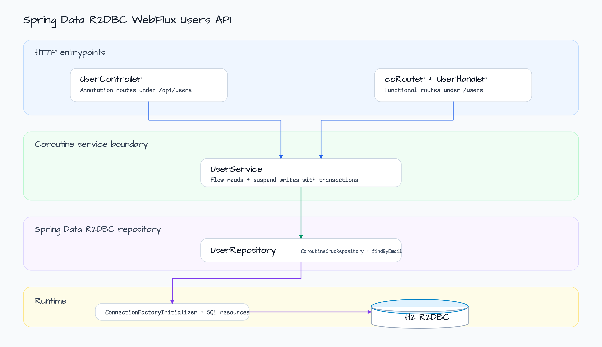
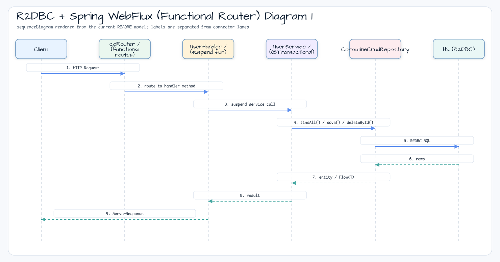

# R2DBC + Spring WebFlux (Functional Router)

[한국어](README.ko.md) | English

## Example Scenario

This example exercises **R2DBC + Spring WebFlux (Functional Router)** as a runnable Spring Data persistence workshop slice. It focuses on the path a developer would inspect first: configure the module, run the sample or tests, and observe the library or framework APIs that remove repetitive infrastructure code.

## Flow Diagram

1. Prepare the local runtime required by `spring-data-r2dbc-webflux`.
2. Execute the application, controller, service, or test fixture that owns the example scenario.
3. Delegate repetitive infrastructure work to bluetape4k utilities or Spring/Kotlin integrations.
4. Assert the visible result through the sample output, HTTP response, repository state, metric, trace, or test expectation.

## Sequence Diagram

The core sequence is: caller or test fixture -> workshop adapter -> bluetape4k helper/API -> external runtime or in-memory backend -> assertion/response. When this module has a dedicated sequence asset, the image below shows that interaction order; otherwise the source tests are the authoritative executable sequence.


Spring Data R2DBC with WebFlux functional endpoints (Handler + Router) and Kotlin coroutines.
Uses H2 in-memory database.

## Architecture





## 아키텍처 다이어그램


Spring Data R2DBC와 WebFlux 함수형 라우터(Handler + Router)를 조합한 리액티브 CRUD 예제입니다.
H2 인메모리 데이터베이스를 사용합니다.

## Used bluetape4k Features

| Feature | Artifact | Code location | Benefit |
|---------|----------|---------------|---------|
| `KLoggingChannel` | `bluetape4k-logging` | `UserService.kt`, `UserHandler.kt` | Coroutine-aware structured logging |
| `bluetape4k-coroutines` | `bluetape4k-coroutines` | Service layer | Coroutine scope and Flow utilities |
| `bluetape4k-r2dbc` | `bluetape4k-r2dbc` | R2DBC configuration | R2DBC connection helpers and extensions |
| `bluetape4k-assertions` | `bluetape4k-core` | All test classes | `shouldBeEqualTo`, `shouldNotBeNull` readable assertions |

## bluetape4k Before / After

### Coroutine-based service with `@Transactional`

```kotlin
// Before — Reactor Mono/Flux API: verbose chain
@Service
class UserService(private val repository: UserRepository) {
    fun findAll(): Flux<User> = repository.findAll()

    fun addUser(user: UserDTO): Mono<User> =
        repository.save(user.toModel())
            .doOnNext { log.info("Saved user: $it") }
}

// After — bluetape4k KLoggingChannel + coroutine-first style
@Service
@Transactional(readOnly = true)
class UserService(private val repository: UserRepository) {
    companion object : KLoggingChannel()

    fun findAll(): Flow<User> = repository.findAll()

    @Transactional
    suspend fun addUser(user: UserDTO): User? {
        log.debug { "Save new user. ${user.toModel()}" }
        return repository.save(user.toModel())
    }
}
```

### Functional routing with `coRouter`

```kotlin
// Before — annotation-based controller
@RestController
@RequestMapping("/users")
class UserController {
    @GetMapping
    fun findAll() = repository.findAll()
}

// After — WebFlux coRouter (functional endpoint, suspend handlers)
@Bean
fun routes(handler: UserHandler) = coRouter {
    "/users".nest {
        GET("", handler::findAll)
        GET("/{id}", handler::findById)
        POST("", handler::save)
        DELETE("/{id}", handler::delete)
    }
}
```

## 구성 방식

어노테이션 컨트롤러 대신 **함수형 엔드포인트** 방식을 사용합니다:

```kotlin
// Router: 경로 정의
@Bean
fun routes(handler: UserHandler) = coRouter {
    "/users".nest {
        GET("", handler::findAll)
        GET("/{id}", handler::findById)
        POST("", handler::save)
        DELETE("/{id}", handler::delete)
    }
}

// Handler: 요청 처리 (suspend 함수)
suspend fun findAll(request: ServerRequest): ServerResponse =
    ServerResponse.ok().bodyAndAwait(userRepository.findAll())
```

## 어노테이션 컨트롤러 방식과 비교

| 방식 | 특징 |
|---|---|
| 함수형 (이 모듈) | Router + Handler 분리, 명시적 경로 정의 |
| 어노테이션 (`r2dbc-webflux-exposed`) | `@RestController` + `@GetMapping` |

## 참고

- [Spring WebFlux 함수형 엔드포인트](https://docs.spring.io/spring-framework/reference/web/webflux-functional.html)
- [POC WebFlux-R2DBC H2-Kotlin](https://github.com/razvn/webflux-r2dbc-kotlin)
