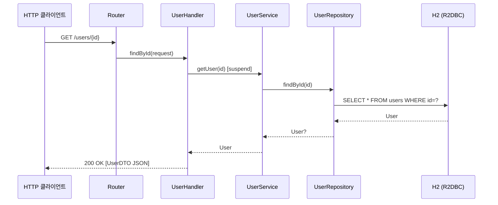

# R2DBC + Spring WebFlux (함수형 라우터)

## 아키텍처 다이어그램




```mermaid
sequenceDiagram
    participant 클라이언트 as HTTP 클라이언트
    participant 라우터 as Router
    participant 핸들러 as UserHandler
    participant 서비스 as UserService
    participant 저장소 as UserRepository
    participant DB as H2 (R2DBC)

    클라이언트->>라우터: GET /users/{id}
    라우터->>핸들러: findById(request)
    핸들러->>서비스: getUser(id) [suspend]
    서비스->>저장소: findById(id)
    저장소->>DB: SELECT * FROM users WHERE id=?
    DB-->>저장소: User
    저장소-->>서비스: User?
    서비스-->>핸들러: User
    핸들러-->>클라이언트: 200 OK [UserDTO JSON]
```

Spring Data R2DBC와 WebFlux 함수형 라우터(Handler + Router)를 조합한 리액티브 CRUD 예제입니다.
H2 인메모리 데이터베이스를 사용합니다.

## 구성 방식

어노테이션 컨트롤러 대신 **함수형 엔드포인트** 방식을 사용합니다:

```kotlin
// Router: 경로 정의
@Bean
fun routes(handler: UserHandler) = coRouter {
    "/users".nest {
        GET("", handler::findAll)
        GET("/{id}", handler::findById)
        POST("", handler::save)
        DELETE("/{id}", handler::delete)
    }
}

// Handler: 요청 처리 (suspend 함수)
suspend fun findAll(request: ServerRequest): ServerResponse =
    ServerResponse.ok().bodyAndAwait(userRepository.findAll())
```

## 어노테이션 컨트롤러 방식과 비교

| 방식 | 특징 |
|---|---|
| 함수형 (이 모듈) | Router + Handler 분리, 명시적 경로 정의 |
| 어노테이션 (`r2dbc-webflux-exposed`) | `@RestController` + `@GetMapping` |

## 참고

- [Spring WebFlux 함수형 엔드포인트](https://docs.spring.io/spring-framework/reference/web/webflux-functional.html)
- [POC WebFlux-R2DBC H2-Kotlin](https://github.com/razvn/webflux-r2dbc-kotlin)
