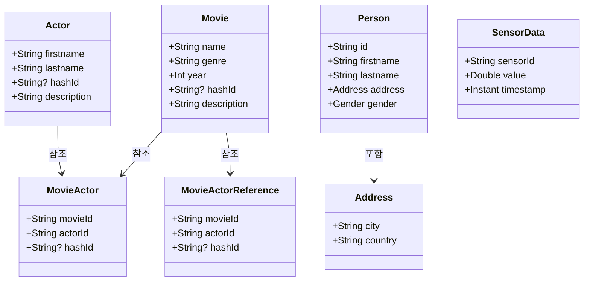
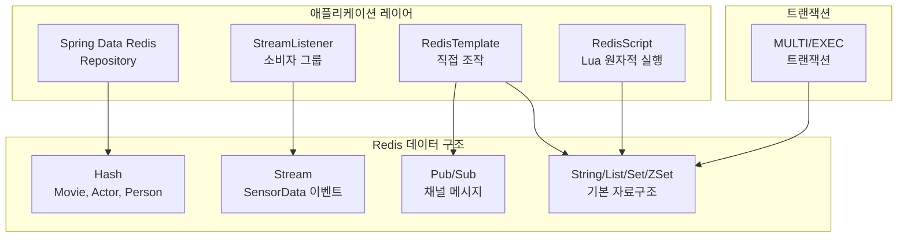

# Redis Examples

## 아키텍처 다이어그램

Spring Data Redis를 활용하는 다양한 데이터 구조 예제 모음입니다.
Testcontainers로 Redis 컨테이너를 자동으로 구동하여 통합 테스트를 수행합니다.

## 예제 범주

- **Redis Stream** (`stream/`) — Consumer Group 기반 메시지 스트림 발행·소비
- **Redis Hash / String / List / Set / ZSet** — 기본 자료구조 CRUD
- **Pub/Sub** — 채널 기반 메시지 발행·구독
- **Transaction** — `MULTI`/`EXEC` 트랜잭션 처리
- **Lua Script** — `RedisScript`를 이용한 원자적 스크립트 실행

## 참고

- [Spring Data Redis 공식 문서](https://docs.spring.io/spring-data/redis/reference/)
- Redisson 기반 예제는 [`redis/redisson-examples`](../../redis/redisson-examples) 모듈 참고
