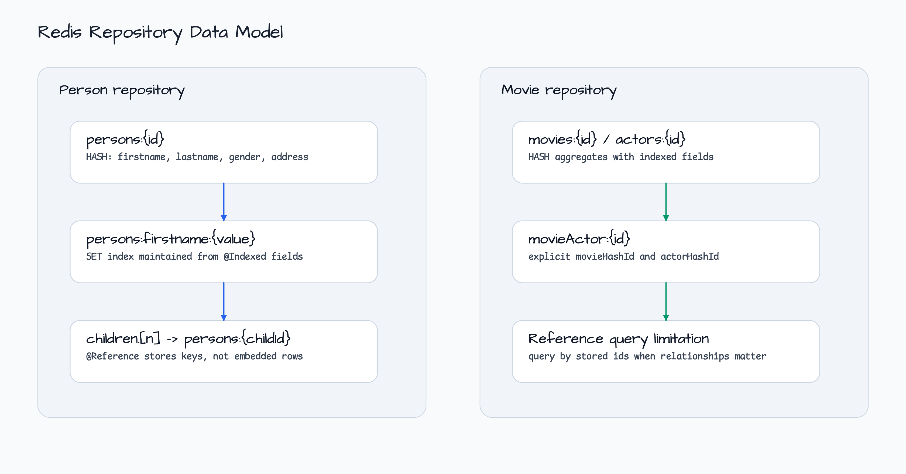

# Redis Examples

[한국어](README.ko.md) | English

This module collects Spring Data Redis examples backed by the Redis
Testcontainers launcher configured through `spring.data.redis.*`. It is a
test-oriented workshop: the behavior is exercised by repository, command,
reactive operation, and stream tests.

## Architecture


The root module covers synchronous repositories, Redis commands, reactive
operations, and stream tests. The stream package has its own README because its
producer, consumer group, and listener flow is more detailed.

## Redis Data Model



Spring Data Redis maps repository aggregates to Redis hashes and maintains
secondary indexes with Redis sets. References are stored by key, so tests that
need relationship queries either use explicit hash-id fields or verify the
limitations around `@Reference`.

## Example Areas

| Area | Source | What it demonstrates |
|---|---|---|
| Person repository | `repositories/*`, `PersonRepositoryTest` | `@RedisHash`, `@Indexed`, embedded address fields, references, query methods, and QBE. |
| Movie repository | `movie/*`, `MovieRepositoryTest` | Movie/actor hashes, secondary indexes, explicit reference records, and relationship lookup tradeoffs. |
| Commands | `commands/*` | Key and geo operations through Redis templates. |
| Reactive operations | `reactive/*` | Reactive Redis configuration, value/list operations, and JSON serialization. |
| Streams | `stream/*` | Sync and reactive Redis Stream API tests. See the stream README for the detailed flow. |

## Runtime Notes

`src/main/resources/application.yml` reads Redis host and port from
`testcontainers.redis.host` and `testcontainers.redis.port`. The examples are
designed to run with the shared Testcontainers Redis launcher used by the test
suite.

## Build and Test

```bash
./gradlew :spring-data:redis-examples:test
```

## Related Modules

- [`redis/redisson-examples`](../../redis/redisson-examples) for Redisson-based examples.
- [`spring-data/redis-examples/src/main/kotlin/io/bluetape4k/workshop/redis/stream`](src/main/kotlin/io/bluetape4k/workshop/redis/stream) for the dedicated Redis Stream walkthrough.
