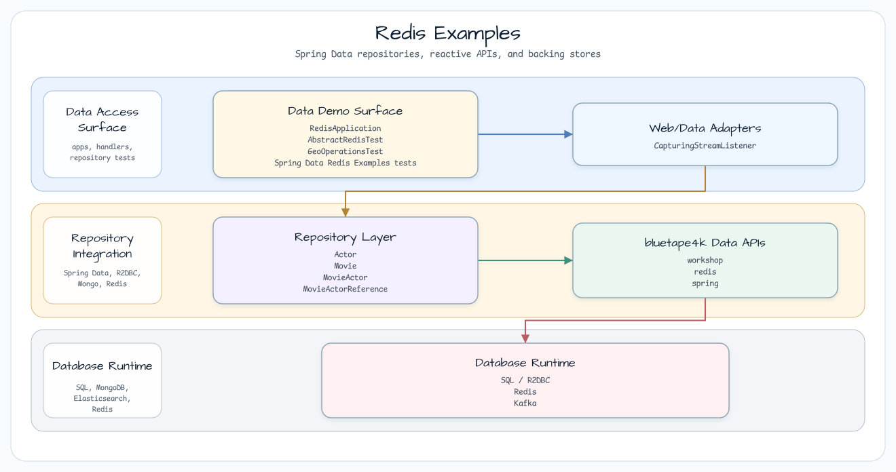

# Redis Examples

[한국어](README.ko.md) | English

## Example Scenario

This example exercises **Redis Examples** as a runnable Spring Data persistence workshop slice. It focuses on the path a developer would inspect first: configure the module, run the sample or tests, and observe the library or framework APIs that remove repetitive infrastructure code.

## Architecture Diagram

The module is organized around the sample entry point or test fixture, the bluetape4k extension layer, and the runtime dependency used by the example. Keep the package under `io.bluetape4k.workshop.springdata` as the source of truth when comparing this README with the code.

## Example Categories

- **Redis Stream** (`stream/`) — Consumer Group-based message stream publishing and consumption
- **Redis Hash / String / List / Set / ZSet** — Basic data-structure CRUD
- **Pub/Sub** — Channel-based message publishing and subscription
- **Transaction** — `MULTI`/`EXEC` transaction handling
- **Lua Script** — Atomic script execution with `RedisScript`

## References

- [Spring Data Redis Reference Documentation](https://docs.spring.io/spring-data/redis/reference/)
- For Redisson-based examples, see the [`redis/redisson-examples`](../../redis/redisson-examples) module
