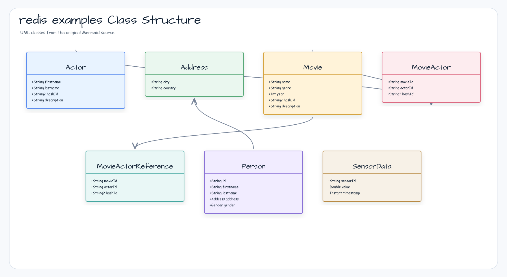
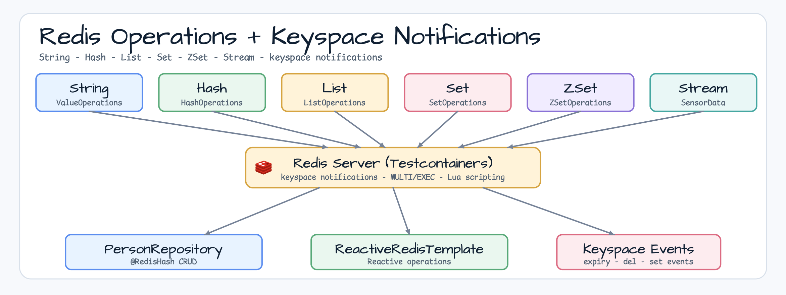

# Redis Examples

[한국어](README.ko.md) | English

## Example Scenario

This example exercises **Redis Examples** as a runnable Spring Data persistence workshop slice. It focuses on the path a developer would inspect first: configure the module, run the sample or tests, and observe the library or framework APIs that remove repetitive infrastructure code.

## Architecture Diagram

The module is organized around the sample entry point or test fixture, the bluetape4k extension layer, and the runtime dependency used by the example. Keep the package under `io.bluetape4k.workshop.springdata` as the source of truth when comparing this README with the code.

## Flow Diagram

1. Prepare the local runtime required by `spring-data-redis-examples`.
2. Execute the application, controller, service, or test fixture that owns the example scenario.
3. Delegate repetitive infrastructure work to bluetape4k utilities or Spring/Kotlin integrations.
4. Assert the visible result through the sample output, HTTP response, repository state, metric, trace, or test expectation.

## Sequence Diagram

The core sequence is: caller or test fixture -> workshop adapter -> bluetape4k helper/API -> external runtime or in-memory backend -> assertion/response. When this module has a dedicated sequence asset, the image below shows that interaction order; otherwise the source tests are the authoritative executable sequence.

## 아키텍처 다이어그램

Spring Data Redis를 활용하는 다양한 데이터 구조 예제 모음입니다.
Testcontainers로 Redis 컨테이너를 자동으로 구동하여 통합 테스트를 수행합니다.

## 예제 범주

- **Redis Stream** (`stream/`) — Consumer Group 기반 메시지 스트림 발행·소비
- **Redis Hash / String / List / Set / ZSet** — 기본 자료구조 CRUD
- **Pub/Sub** — 채널 기반 메시지 발행·구독
- **Transaction** — `MULTI`/`EXEC` 트랜잭션 처리
- **Lua Script** — `RedisScript`를 이용한 원자적 스크립트 실행

## 참고

- [Spring Data Redis 공식 문서](https://docs.spring.io/spring-data/redis/reference/)
- Redisson 기반 예제는 [`redis/redisson-examples`](../../redis/redisson-examples) 모듈 참고
