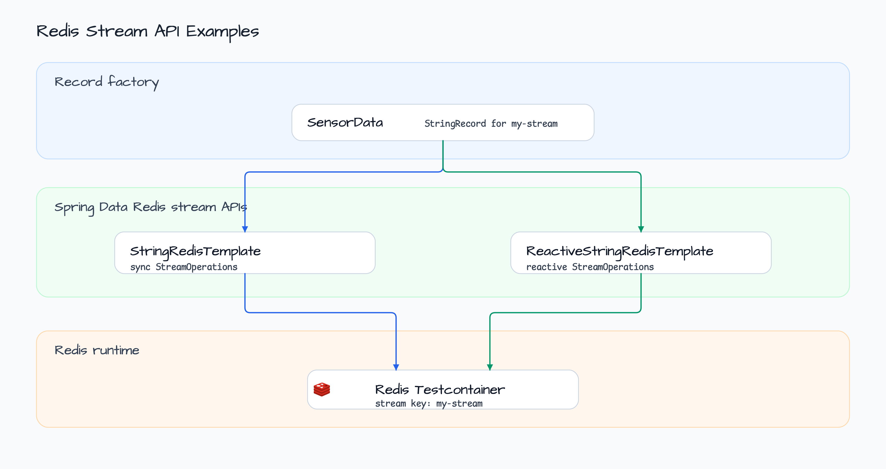
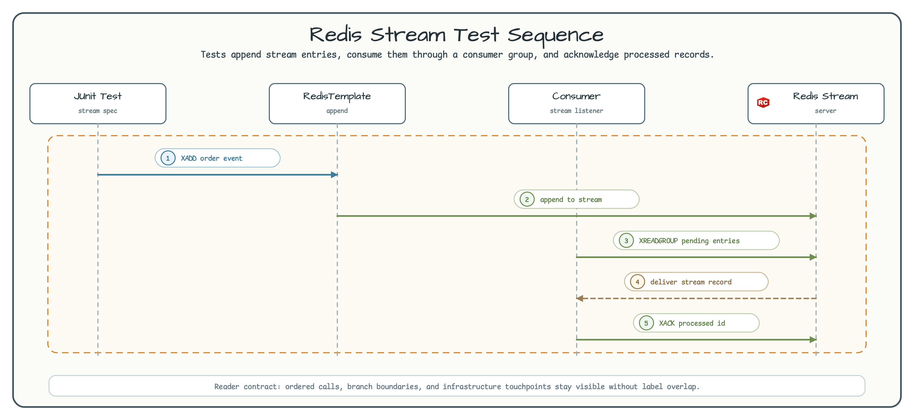

# Spring Data Redis Streams

[한국어](README.ko.md) | English

This package demonstrates Redis Streams through Spring Data Redis sync and
reactive APIs. The examples use a single stream key, `my-stream`, and sensor
records built by `SensorData`.

## Architecture



`RedisStreamConfiguration` creates both a `StreamMessageListenerContainer` for
the imperative API and a `StreamReceiver` for the reactive API. Both connect to
the same Redis Testcontainer.

## Stream Flow



The tests cover the same stream behavior from two API styles:

1. `XADD` writes fixed IDs such as `1234-0` and `1234-1`.
2. Redis rejects a lower timestamp ID after newer records exist.
3. Auto-generated IDs append the next timestamp/sequence value.
4. `XREAD` can read from the start of `my-stream` or resume after a known ID.
5. Continuous reads use either `StreamMessageListenerContainer.receive(...)` or
   `StreamReceiver.receive(...)`.

## Key Classes

| Class | Role |
|---|---|
| `SensorData` | Creates `StringRecord` values with `sensor-id`, `temperature`, and optional `checksum`. |
| `RedisStreamConfiguration` | Provides sync and reactive stream listener infrastructure. |
| `CapturingStreamListener` | Collects sync listener records for assertions. |
| `SyncStreamApiTest` | Exercises `StringRedisTemplate.opsForStream()`. |
| `ReactiveStreamApiTest` | Exercises `ReactiveStringRedisTemplate.opsForStream()` and `StreamReceiver`. |

## Build and Test

```bash
./gradlew :spring-data:redis-examples:test --tests '*StreamApiTest'
```
