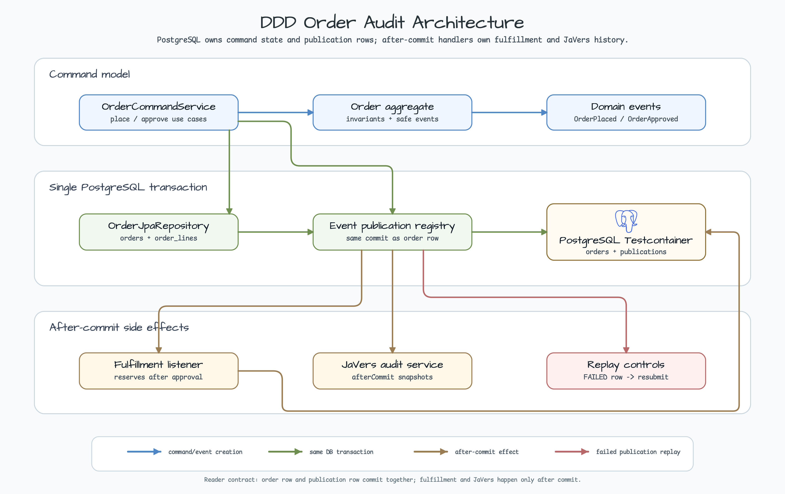
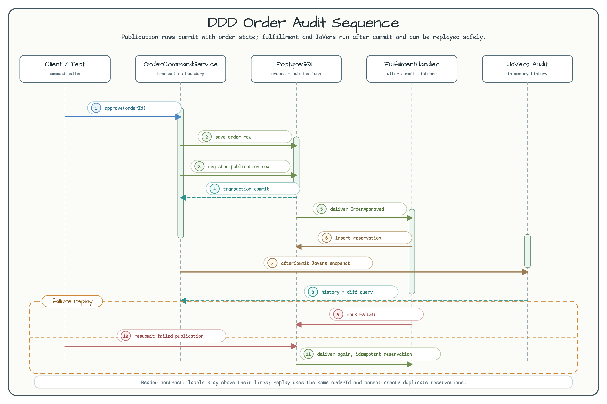

# DDD Order Audit

[English](README.md) | 한국어

이 예제는 DDD aggregate, Spring Modulith event publication, PostgreSQL 트랜잭션, after-commit fulfillment handler, JaVers audit history를 작은 주문 도메인 안에서 함께 보여준다.

핵심 규칙은 단순하다. 주문 row와 Modulith publication row는 PostgreSQL에서 같은 트랜잭션으로 커밋된다. Fulfillment와 JaVers 이력은 그 커밋이 끝난 뒤에만 실행되는 side effect다.



SVG source: [spring-modulith-ddd-order-audit-readme-architecture-01.svg](../../docs/images/readme-diagrams/spring-modulith-ddd-order-audit-readme-architecture-01.svg)

## 무엇을 배우나

| 주제 | 읽을 코드 | 확인할 점 |
|---|---|---|
| Aggregate lifecycle | `orders/OrderDomain.kt` | `Order.place()`와 `Order.approve()`는 새 aggregate 값과 안전한 domain event를 반환한다. |
| Transactional publication | `orders/OrderCommandService.kt` | 주문 저장과 `eventPublisher.publishEvent(...)`가 하나의 command transaction 안에서 실행된다. |
| PostgreSQL integration test | `AbstractDddOrderAuditTest.kt` | 테스트는 H2가 아니라 `bluetape4k-testcontainers`의 `PostgreSQLServer.Launcher.postgres`를 사용한다. |
| After-commit fulfillment | `fulfillment/FulfillmentReservationHandler.kt` | `@ApplicationModuleListener`는 주문 트랜잭션이 커밋된 뒤 fulfillment 예약을 만든다. |
| Failed publication replay | `FulfillmentPublicationTest.kt` | listener 실패는 failed publication row로 남고, replay는 중복 예약을 만들지 않는다. |
| After-commit audit | `orders/OrderAuditService.kt` | JaVers snapshot은 `TransactionSynchronization.afterCommit()`에서 기록된다. |

## Sequence

Sequence diagram은 command transaction과 after-commit 작업을 분리해서 보여준다. label 번호를 실행 순서대로 붙였기 때문에 rollback 안전성이 어디서 생기는지 따라가기 쉽다.



SVG source: [spring-modulith-ddd-order-audit-readme-sequence-01.svg](../../docs/images/readme-diagrams/spring-modulith-ddd-order-audit-readme-sequence-01.svg)

## 예제 테스트 실행

이 모듈 테스트는 PostgreSQL Testcontainer와 Spring Modulith publication table을 공유하므로 직렬로 실행한다.

```bash
./gradlew :spring-modulith-ddd-order-audit:test --console=plain --max-workers=1
```

테스트는 다음을 검증한다.

- 주문 생성 시 PostgreSQL에 주문 row와 line row가 저장된다.
- 주문 승인 시 Modulith publication row가 같은 command transaction 안에서 생성된다.
- rollback 시 주문 row, publication row, fulfillment reservation, JaVers snapshot이 남지 않는다.
- fulfillment listener가 실패해도 publication replay로 복구할 수 있고, 중복 예약은 생기지 않는다.
- 승인 뒤 JaVers audit trail과 status diff를 조회할 수 있다.

## 설계 메모

`Order`가 aggregate root다. command 입력을 검증하고, 반복 승인을 거부하며, event를 값 데이터로 기록한다. `OrderCommandService`는 JPA로 aggregate를 저장하고, 트랜잭션이 열린 상태에서 aggregate event를 publish한다.

Spring Modulith는 event publication 상태를 PostgreSQL에 저장한다. 그래서 broker를 추가하지 않아도 transactional outbox에 가까운 안전 경계를 볼 수 있다. `FulfillmentReservationHandler`는 커밋 이후에 실행되며, 주문 id를 예약 id로 사용하므로 같은 `OrderApproved` event를 replay해도 idempotent하다.

`OrderAuditService`는 JaVers 경계를 명시적으로 둔다. 이 예제는 audit snapshot을 트랜잭션 커밋 뒤에만 기록한다. rollback된 주문이 audit history에 새어 나오면 안 되기 때문이다.

## 안전 규칙

Domain event와 audit entry는 오래 남는 데이터다. password, token, payment secret, 원문 PII를 event payload, publication row, exception message, JaVers property에 넣지 말자. 안정적인 id와 독자가 봐도 되는 business field만 남기는 편이 안전하다.
