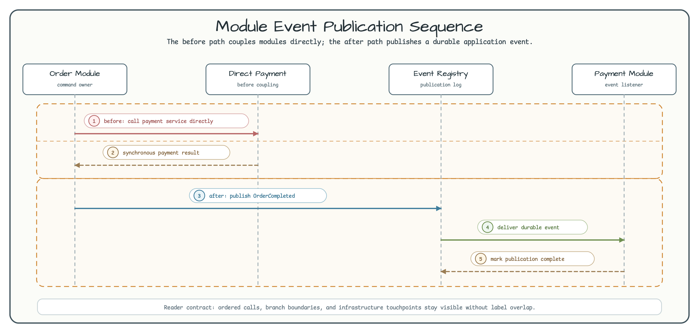

# Spring Modulith Events Deep Dive

[English](README.md) | 한국어

이 모듈은 Spring Modulith event를 단계별로 학습하는 워크샵입니다. Plain Spring
application event에서 시작해 aggregate event, transactional listener를 거치고,
마지막에는 직접 module call 방식과 event 기반 module boundary 방식을 before/after로
비교합니다.

## 아키텍처


각 패키지는 테스트가 하나의 event 관심사만 보여줄 수 있도록 작게 나뉘어 있습니다.

| 패키지 | 보여주는 내용 |
|---|---|
| `a/fundamentals/quickstart` | `ApplicationEventPublisher`, `ApplicationListener`, `@EventListener`. |
| `a/fundamentals/springdata` | Spring Data repository가 aggregate를 저장할 때 발행되는 `StringAggregate.registerEvent(...)`. |
| `b/transactions` | `@Transactional` order completion, plain `@EventListener`, `@TransactionalEventListener` 동작. |
| `c/architecture/before` | Order service가 inventory에 직접 의존하고 completion flow 안에서 호출합니다. |
| `d/architecture/after` | Order가 `OrderCompleted`를 발행하고 inventory는 event listener로 반응합니다. |

## Event Flow



After architecture에서는 order module이 inventory dependency를 갖지 않습니다. Module
test는 이 경계를 검증하고, integration test는 event delivery 동작을 검증합니다.

## Test Map

| Test | 목적 |
|---|---|
| `OrderEventPublicationTests` | Quickstart, Spring Data aggregate, transaction 예제의 event publication을 검증합니다. |
| `OrderManagementTest` | Before architecture의 직접 의존성과 failure coupling을 보여줍니다. |
| `OrderModuleTest` | Modulith module structure를 검증합니다. |
| `OrderIntegrationTest` | After architecture의 event-driven inventory 처리를 검증합니다. |

## 빌드와 테스트

```bash
./gradlew :spring-modulith:events-deep-dive:test
```
