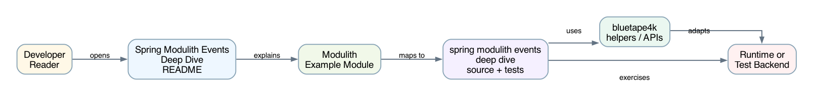
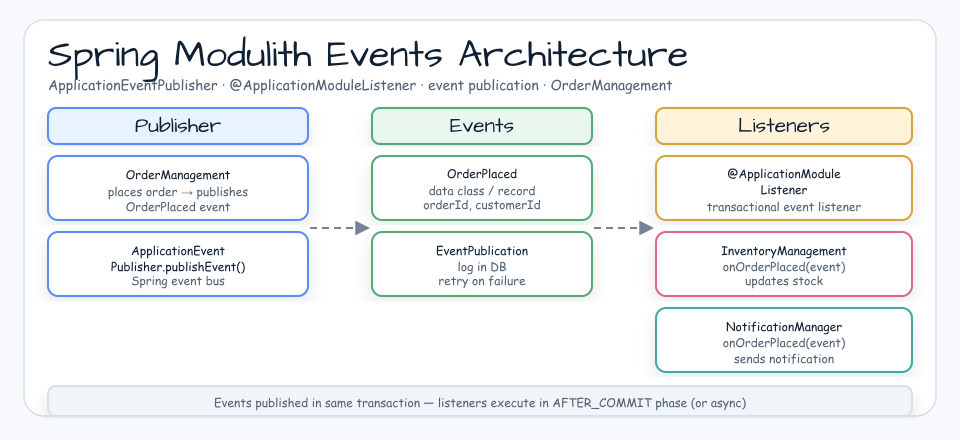
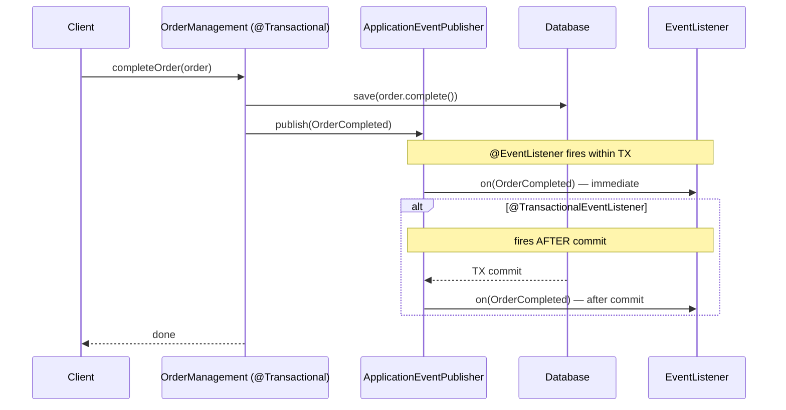

# Spring Modulith Events Deep Dive

[한국어](README.ko.md) | English

## Example Scenario

This example exercises **Spring Modulith Events Deep Dive** as a runnable Spring Modulith event boundary workshop slice. It focuses on the path a developer would inspect first: configure the module, run the sample or tests, and observe the library or framework APIs that remove repetitive infrastructure code.

## Sequence Diagram

The core sequence is: caller or test fixture -> workshop adapter -> bluetape4k helper/API -> external runtime or in-memory backend -> assertion/response. When this module has a dedicated sequence asset, the image below shows that interaction order; otherwise the source tests are the authoritative executable sequence.

Spring Modulith event publication examples that move from basic application events to transactional publication and module-boundary verification.

## Architecture





## What This Module Shows

- Quickstart publication with `ApplicationEventPublisher` and `OrderCompleted`.
- Spring Data repository-based completion flow.
- Transactional publication behavior around order completion.
- A before/after architecture comparison for direct inventory calls versus module events.
- Modulith tests that verify module structure and integration behavior.

## Running

```bash
./gradlew :spring-modulith-events-deep-dive:test
```

## Used bluetape4k Features

| Module | Feature | Usage |
|---|---|---|
| `bluetape4k-logging` | `KLogging()` | Lazy-lambda structured logging in `OrderManagement` and all event listeners |
| `bluetape4k-junit5` | JUnit 5 extensions | Test base support, `@ApplicationModuleTest` integration |

## bluetape4k Before / After

### `KLogging()` in event-driven components

```kotlin
// Before — SLF4J directly
private val log = LoggerFactory.getLogger(OrderManagement::class.java)
log.info("Completing order. order=" + order)

// After — KLogging() companion object (lazy, zero-cost interpolation)
companion object : KLogging()
log.info { "Completing order. order=$order" }
```

### Event listener patterns — Spring vs Modulith

```kotlin
// Before — plain Spring @EventListener (no transactional guarantee)
@EventListener
fun on(event: Order.OrderCompleted) {
    log.info { "Received event: $event" }
}

// After — @TransactionalEventListener (executes after TX commit)
@TransactionalEventListener
fun on(event: Order.OrderCompleted) {
    log.info { "Received event: $event" }
}
```

## Event Publication Flow



## Architecture: Before vs After Module Boundary

```mermaid
graph TD
    subgraph Before [c/architecture/before — tight coupling]
        OM1[OrderManagement] -->|direct call| IS1[InventoryService]
    end

    subgraph After [d/architecture/after — module boundary]
        OM2[OrderManagement] -->|publish event| EP2[ApplicationEventPublisher]
        EP2 -->|@ApplicationModuleListener| IS2[InventoryService]
    end
```

## Operational Notes

- `@TransactionalEventListener` runs after the outer transaction commits; if the listener fails, the original transaction is **not** rolled back.
- Use `@ApplicationModuleListener` (Spring Modulith) instead of plain `@EventListener` to enforce module-boundary semantics.
- `ApplicationModuleTest` verifies that no module depends on internal types of another module.

## Source Map

- `a/fundamentals/quickstart` publishes events directly from `OrderManagement`.
- `a/fundamentals/springdata` persists completed orders through Spring Data.
- `b/transactions` demonstrates transactional event publication.
- `c/architecture/before` couples order completion directly to inventory updates.
- `d/architecture/after` separates order and inventory behavior through a module boundary.
- `src/test/kotlin/.../events` contains the Modulith verification and integration tests.
