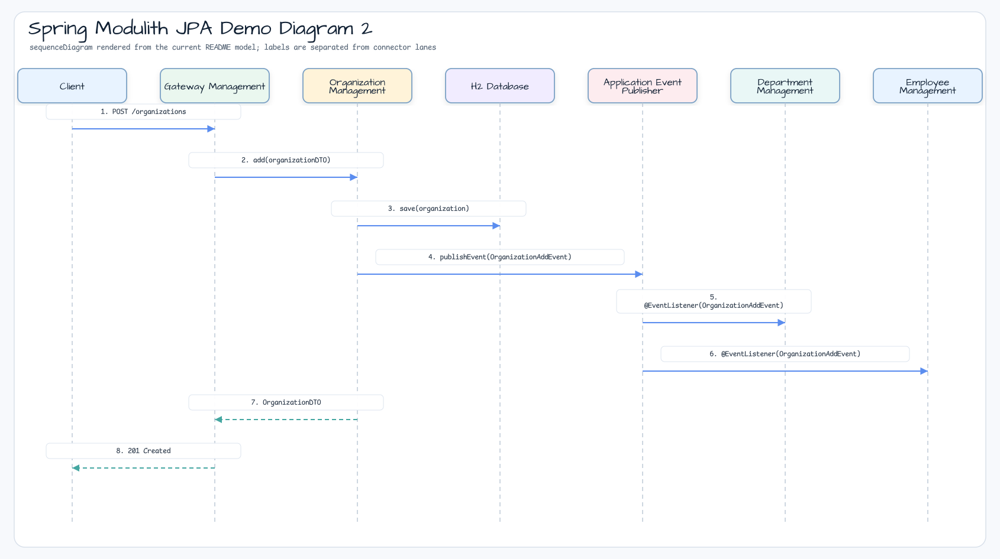

# Spring Modulith JPA Demo

[English](README.md) | 한국어

## 예제 시나리오

이 예제는 **Spring Modulith JPA Demo** 모듈을 실행 가능한 Spring Modulith 이벤트 경계 예제로 보여줍니다. 개발자가 먼저 확인할 경로인 모듈 설정, 샘플 또는 테스트 실행, 반복적인 인프라 코드를 줄이는 라이브러리 또는 프레임워크 API 사용 방식을 중심으로 설명합니다.

## 시퀀스 다이어그램



핵심 시퀀스는 호출자 또는 테스트 픽스처 -> 워크샵 어댑터 -> bluetape4k 헬퍼/API -> 외부 런타임 또는 인메모리 백엔드 -> 검증/응답 순서입니다. 전용 시퀀스 이미지가 있는 모듈은 아래 이미지가 상호작용 순서를 보여주며, 없는 경우 소스 테스트가 실행 가능한 시퀀스의 기준입니다.

이 Spring Modulith 애플리케이션은 `organization`, `department`, `employee`, `gateway` 네 개의 논리 모듈로 구성됩니다. 각 모듈은 내부 모듈 API와 Spring 애플리케이션 이벤트로 연결되며, Modulith 구조 테스트로 검증됩니다.

[sample-spring-modulith](https://github.com/piomin/sample-spring-modulith)를 기반으로 합니다.

## 모듈 의존성 구조


## 아키텍처


애플리케이션은 네 개의 논리 모듈로 나뉩니다.

| 모듈 | 책임 |
|---|---|
| `organization` | `Organization` 엔티티를 관리하고 `OrganizationAddEvent` / `OrganizationRemoveEvent`를 발행합니다. |
| `department` | `Department` 엔티티를 관리하고 내부 API를 통해 `organization`에 의존합니다. |
| `employee` | `Employee` 엔티티를 관리하고 내부 API를 통해 `organization`에 의존합니다. |
| `gateway` | 단일 REST API(`/organizations/**`)로 모든 모듈을 노출합니다. |


## 사용한 bluetape4k 기능

| 모듈 | 기능 | 사용 방식 |
|---|---|---|
| `bluetape4k-logging` | `KLogging()` | 모든 관리 서비스에서 lazy-lambda 구조적 로깅을 사용합니다. |
| `bluetape4k-hibernate` | Hibernate 확장 | JPA 엔티티 매핑 헬퍼와 타입 변환기를 사용합니다. |
| `bluetape4k-idgenerators` | ID 생성 | Snowflake / TSID 기반 엔티티 ID를 생성합니다. |
| `bluetape4k-spring-boot4-core` | Spring Boot 4 auto-config | 테스트 유틸리티와 애플리케이션 컨텍스트 헬퍼를 사용합니다. |
| `bluetape4k-testcontainers` | Testcontainers launcher | 통합 테스트에서 인프라(Zipkin) 컨테이너를 관리합니다. |

## bluetape4k 적용 전 / 후

### 서비스 계층의 `KLogging()`

```kotlin
// Before — SLF4J directly
private val log = LoggerFactory.getLogger(OrganizationManagement::class.java)
log.info("Adding organization: " + organizationDTO)

// After — KLogging() companion (lazy, zero-cost when info is disabled)
companion object : KLogging()
log.info { "Adding organization: $organizationDTO" }
```

### bluetape4k ID 생성기를 사용한 이벤트 발행

```kotlin
// Before — manual UUID or database-sequence ID
data class OrganizationAddEvent(val id: Long, val source: Any? = null)

@Transactional
fun add(dto: OrganizationDTO): OrganizationDTO {
    val saved = repository.save(mapper.toEntity(dto))
    events.publishEvent(OrganizationAddEvent(saved.id!!, saved))
    return mapper.toDTO(saved)
}

// After — same pattern, but entity ID generated by bluetape4k-idgenerators (Snowflake)
// No manual sequence management; IDs are time-sortable and unique across nodes
```

### 모듈 API 경계 - External vs Internal

```kotlin
// Before — direct service injection across module boundary (tightly coupled)
@Service
class GatewayManagement(
    private val organizationManagement: OrganizationManagement,  // internal class
)

// After — inject only the ExternalAPI interface (module contract)
@Service
class GatewayManagement(
    private val organizationAPI: OrganizationExternalAPI,  // public contract only
)
```

## 이벤트 흐름


## 관측성

`jpa-demo` 모듈은 Micrometer tracing, OpenTelemetry, Zipkin export를 포함합니다.

```yaml
management:
  tracing:
    sampling:
      probability: 1.0
spring:
  modulith:
    republish-outstanding-events-on-restart: true
```

통합 테스트에서는 Testcontainers가 Zipkin을 자동으로 시작합니다.

## 실행

```bash
./gradlew :spring-modulith-jpa-demo:bootRun
```

REST API는 `http://localhost:8080/organizations`에서 사용할 수 있습니다.
OpenAPI 문서: `http://localhost:8080/swagger-ui.html`

## 테스트

```bash
./gradlew :spring-modulith-jpa-demo:test
```

Modulith 구조 검증:

```kotlin
@Test
fun `verify module structure`() {
    ApplicationModules.of(SpringModulith::class.java).verify()
}
```

## 운영 참고 사항

- H2 인메모리 데이터베이스를 사용합니다. 운영 환경에서는 영속 데이터베이스로 교체하세요.
- `blueprints4k-testcontainers`는 `GenericContainer`로 Zipkin을 관리합니다. tracing이 활성화된 테스트를 실행하려면 Docker가 실행 중이어야 합니다.
- 모듈 경계는 `ApplicationModules.verify()`로 강제됩니다. 모듈 간 내부 타입 접근은 테스트에서 빠르게 실패합니다.

## 참고 자료

- [Spring Modulith Reference](https://docs.spring.io/spring-modulith/reference/index.html)
- [Guide to Modulith with Spring Boot](https://piotrminkowski.com/2023/10/13/guide-to-modulith-with-spring-boot/)
- [bluetape4k-idgenerators](https://github.com/bluetape4k/bluetape4k-projects)

## TODO

- [ ] `spring-modulith-events-jpa`의 대안으로 `spring-modulith-events-exposed`를 구현합니다.
  ([Issue #25](https://github.com/bluetape4k/bluetape4k-projects/issues/25))
