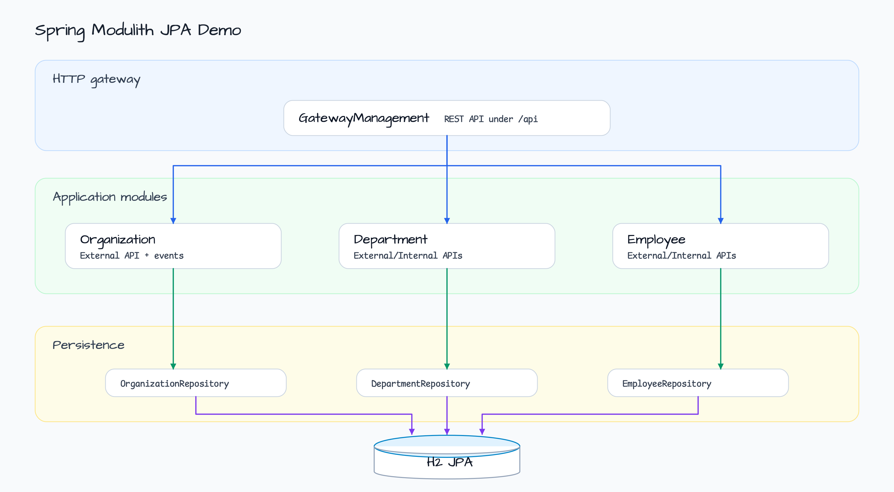
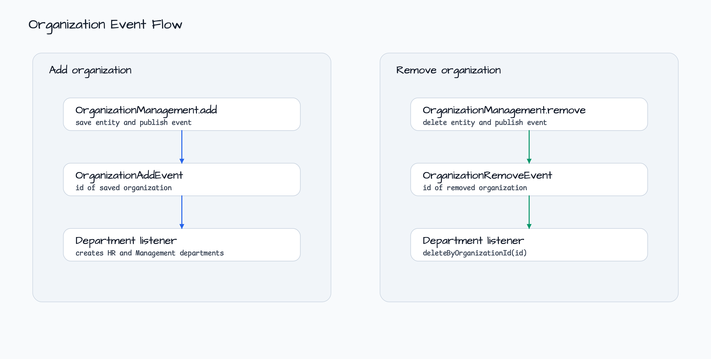

# Spring Modulith JPA Demo

[한국어](README.ko.md) | English

This module is a Spring Modulith service sample backed by Spring Data JPA and
H2. It splits the application into `organization`, `department`, `employee`, and
`gateway` modules, then verifies the module structure with Spring Modulith tests.

## Architecture



The gateway exposes REST endpoints and talks only to each module's external API.
Internal APIs are used between domain modules when a module needs read models
owned by another module.

## Organization Event Flow



Adding an organization saves the JPA entity and publishes `OrganizationAddEvent`.
Department listens with `@ApplicationModuleListener` and creates default
departments. Removing an organization publishes `OrganizationRemoveEvent`, which
department uses to delete departments for that organization.

## Modules

| Module | Public contract | Persistence | Responsibility |
|---|---|---|---|
| `organization` | `OrganizationExternalAPI` | `OrganizationRepository` | Add/remove organizations and assemble organization views. |
| `department` | `DepartmentExternalAPI`, `DepartmentInternalAPI` | `DepartmentRepository` | Manage departments and enrich them with employees. |
| `employee` | `EmployeeExternalAPI`, `EmployeeInternalAPI` | `EmployeeRepository` | Manage employees and provide organization/department lookups. |
| `gateway` | REST controller under `/api` | none | Exposes module APIs through HTTP. |

## REST API

| Method | Path | Result |
|---|---|---|
| `GET` | `/api/organizations/{id}/with-departments` | Organization with departments. |
| `GET` | `/api/organizations/{id}/with-departments-and-employees` | Organization view with nested module data. |
| `GET` | `/api/departments/{id}/with-employees` | Department with employees. |
| `POST` | `/api/organizations` | Add organization and publish organization-add event. |
| `POST` | `/api/departments` | Add department. |
| `POST` | `/api/employees` | Add employee. |

## Runtime

The demo uses in-memory H2 through Spring Data JPA. Actuator endpoints are
exposed for the sample, and tracing sampling is set to `1.0` in
`application.yml`.

## Build and Test

```bash
./gradlew :spring-modulith:jpa-demo:test
```
