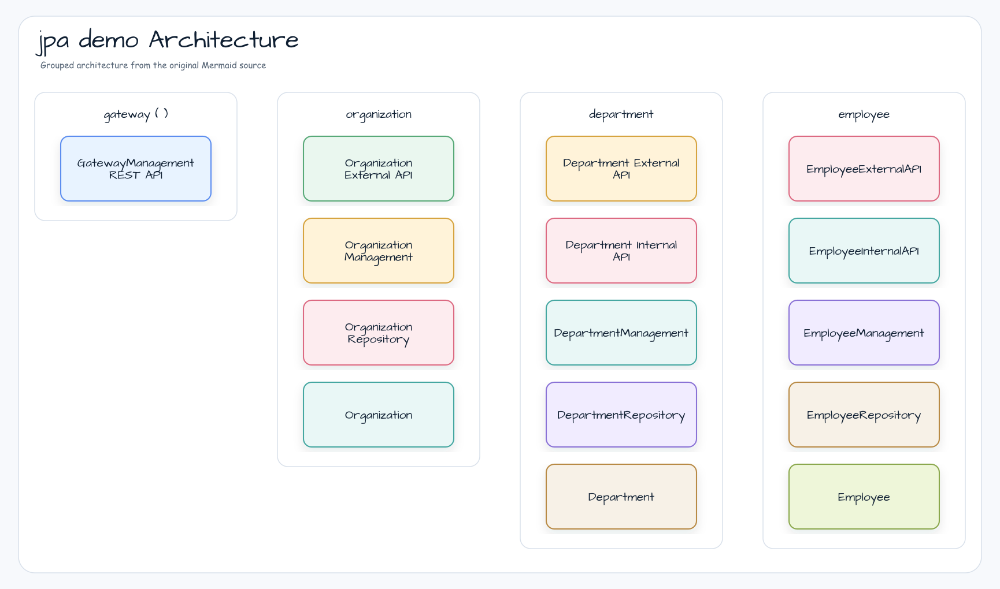
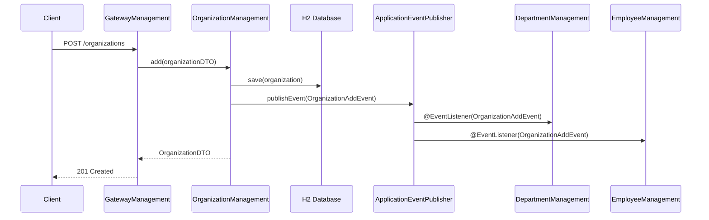

# Spring Modulith JPA Demo

Spring Modulith application with four logical modules — `organization`, `department`, `employee`, and `gateway` —
connected through internal module APIs and Spring application events, verified by Modulith's structural tests.

Based on [sample-spring-modulith](https://github.com/piomin/sample-spring-modulith).

## Module Dependency Structure



## Architecture

The application is divided into four logical modules:

| Module | Responsibility |
|---|---|
| `organization` | Manages `Organization` entity; publishes `OrganizationAddEvent` / `OrganizationRemoveEvent` |
| `department` | Manages `Department` entity; depends on `organization` via internal API |
| `employee` | Manages `Employee` entity; depends on `organization` via internal API |
| `gateway` | Exposes all modules over a single REST API (`/organizations/**`) |

```mermaid
graph TD
    GW[gateway\nGatewayManagement] --> ORG[organization\nOrganizationExternalAPI]
    ORG --> DEP[department\nDepartmentInternalAPI]
    ORG --> EMP[employee\nEmployeeInternalAPI]
    ORG -->|publishes| EV[OrganizationAddEvent\nOrganizationRemoveEvent]
    EV -->|@EventListener| DEP
    EV -->|@EventListener| EMP
```

## Used bluetape4k Features

| Module | Feature | Usage |
|---|---|---|
| `bluetape4k-logging` | `KLogging()` | Lazy-lambda structured logging in all management services |
| `bluetape4k-hibernate` | Hibernate extensions | JPA entity mapping helpers and type converters |
| `bluetape4k-idgenerators` | ID generation | Snowflake / TSID-based entity ID generation |
| `bluetape4k-spring-boot4-core` | Spring Boot 4 auto-config | Test utilities and application context helpers |
| `bluetape4k-testcontainers` | Testcontainers launcher | Infrastructure (Zipkin) container management in integration tests |

## bluetape4k Before / After

### `KLogging()` in service layer

```kotlin
// Before — SLF4J directly
private val log = LoggerFactory.getLogger(OrganizationManagement::class.java)
log.info("Adding organization: " + organizationDTO)

// After — KLogging() companion (lazy, zero-cost when info is disabled)
companion object : KLogging()
log.info { "Adding organization: $organizationDTO" }
```

### Event publishing with bluetape4k ID generators

```kotlin
// Before — manual UUID or database-sequence ID
data class OrganizationAddEvent(val id: Long, val source: Any? = null)

@Transactional
fun add(dto: OrganizationDTO): OrganizationDTO {
    val saved = repository.save(mapper.toEntity(dto))
    events.publishEvent(OrganizationAddEvent(saved.id!!, saved))
    return mapper.toDTO(saved)
}

// After — same pattern, but entity ID generated by bluetape4k-idgenerators (Snowflake)
// No manual sequence management; IDs are time-sortable and unique across nodes
```

### Module API boundary — External vs Internal

```kotlin
// Before — direct service injection across module boundary (tightly coupled)
@Service
class GatewayManagement(
    private val organizationManagement: OrganizationManagement,  // internal class
)

// After — inject only the ExternalAPI interface (module contract)
@Service
class GatewayManagement(
    private val organizationAPI: OrganizationExternalAPI,  // public contract only
)
```

## Event Flow



## Observability

The `jpa-demo` module includes Micrometer tracing with OpenTelemetry and Zipkin export:

```yaml
management:
  tracing:
    sampling:
      probability: 1.0
spring:
  modulith:
    republish-outstanding-events-on-restart: true
```

Zipkin is started automatically via Testcontainers in integration tests.

## Running

```bash
./gradlew :spring-modulith-jpa-demo:bootRun
```

REST API is available at `http://localhost:8080/organizations`.
OpenAPI docs: `http://localhost:8080/swagger-ui.html`

## Tests

```bash
./gradlew :spring-modulith-jpa-demo:test
```

Modulith structure verification:

```kotlin
@Test
fun `verify module structure`() {
    ApplicationModules.of(SpringModulith::class.java).verify()
}
```

## Operational Notes

- H2 in-memory database is used; swap for a persistent database in production.
- `blueprints4k-testcontainers` manages Zipkin via `GenericContainer`; ensure Docker is running for tests with tracing enabled.
- Module boundaries are enforced by `ApplicationModules.verify()`; cross-module internal type access will fail fast in tests.

## References

- [Spring Modulith Reference](https://docs.spring.io/spring-modulith/reference/index.html)
- [Guide to Modulith with Spring Boot](https://piotrminkowski.com/2023/10/13/guide-to-modulith-with-spring-boot/)
- [bluetape4k-idgenerators](https://github.com/bluetape4k/bluetape4k-projects)

## TODO

- [ ] Implement `spring-modulith-events-exposed` as an alternative to `spring-modulith-events-jpa`
  ([Issue #25](https://github.com/bluetape4k/bluetape4k-projects/issues/25))
