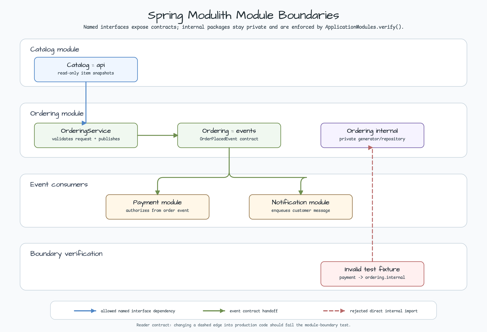
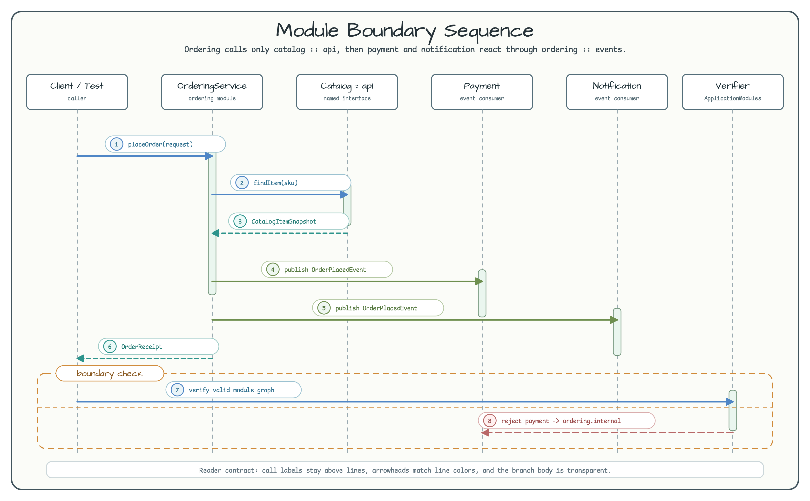

# Spring Modulith Module Boundaries

[English](README.md) | 한국어

이 예제는 Spring Modulith가 package 구조를 실행 가능한 architecture guard로 바꾸는 방식을 보여준다. 예제는 `catalog`, `ordering`, `payment`, `notification` 네 개의 작은 module로 구성된다.

핵심 규칙은 명확하다. `ordering`은 `catalog :: api`만 읽을 수 있고, `payment`와 `notification`은 `ordering :: events`만 소비할 수 있다. test-only invalid fixture는 `ordering.internal`로 직접 import하는 코드가 `ApplicationModules.verify()`에서 거부된다는 점을 증명한다.



SVG source: [spring-modulith-module-boundaries-readme-architecture-01.svg](../../docs/images/readme-diagrams/spring-modulith-module-boundaries-readme-architecture-01.svg)

## 무엇을 배우나

| 주제 | 읽을 코드 | 확인할 점 |
|---|---|---|
| Named interfaces | `catalog/api/ModuleMetadata.kt`, `ordering/events/ModuleMetadata.kt` | `@NamedInterface`가 다른 module에서 사용할 수 있는 package를 표시한다. |
| Allowed dependencies | `ordering/ModuleMetadata.kt`, `payment/ModuleMetadata.kt`, `notification/ModuleMetadata.kt` | `@ApplicationModule(allowedDependencies = [...])`로 dependency 방향을 실행 가능한 규칙으로 만든다. |
| Boundary verification | `ApplicationModuleBoundaryTest.kt` | 정상 graph는 통과하고 invalid fixture는 `Violations`로 실패한다. |
| Event handoff | `OrderingService.kt`, `PaymentEventHandler.kt`, `NotificationEventHandler.kt` | Payment와 notification은 ordering 내부를 호출하지 않고 `OrderPlacedEvent`에 반응한다. |
| Refactoring signal | `invalid/payment/PaymentBoundaryLeak.kt` | `ordering.internal` 직접 import는 구현 편의가 아니라 설계 냄새다. |

## Sequence

Sequence diagram은 허용된 catalog API lookup과 downstream module이 소비하는 event contract를 분리해서 보여준다.



SVG source: [spring-modulith-module-boundaries-readme-sequence-01.svg](../../docs/images/readme-diagrams/spring-modulith-module-boundaries-readme-sequence-01.svg)

## 예제 테스트 실행

```bash
./gradlew :spring-modulith-module-boundaries:test --console=plain --max-workers=1
```

테스트는 다음을 검증한다.

- production module graph가 Spring Modulith verification을 통과한다.
- test-only `payment -> ordering.internal` dependency가 `Violations`로 실패한다.
- 주문 생성 시 `OrderPlacedEvent`가 publish된다.
- payment와 notification은 그 event를 받아 각자 module-owned in-memory state를 갱신한다.
- 유효하지 않은 주문 입력은 downstream side effect를 publish하지 않는다.

## 설계 메모

`catalog.api`는 의도적으로 작게 유지한다. read-only item snapshot만 export해서 `ordering`이 catalog 내부 구현에 기대지 않고 요청을 검증할 수 있게 한다.

`ordering.events`가 event contract다. `payment`와 `notification`은 `OrderingService`를 호출하지 않고, `ordering.internal`을 import하지 않으며, ordering과 mutable state를 공유하지 않는다.

Invalid fixture는 흔한 refactoring 실수를 그대로 보여준다. downstream module이 "하나만 확인하려고" 다른 module의 internal repository에 접근하는 경우다. Boundary test는 이 dependency를 즉시 드러내고, 필요한 데이터를 exported API나 event contract로 옮기라는 명확한 수리 방향을 준다.

## 안전 규칙

Event는 module contract다. 안정적이고 작고 독자가 봐도 안전해야 한다. private object, secret, mutable aggregate 내부가 아니라 identifier와 단순한 business fact만 publish하자.
