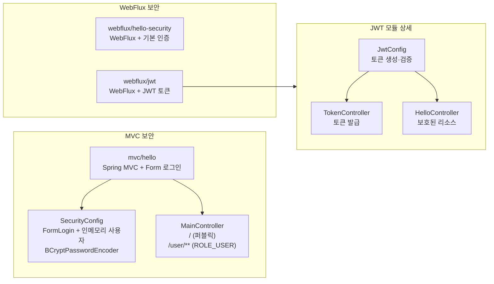
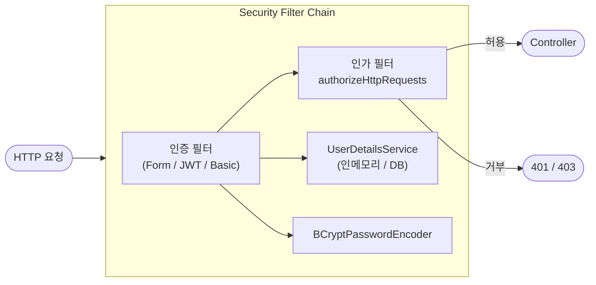

# Spring Security Workshop

Spring Security를 활용한 MVC·WebFlux 보안 예제 모음입니다.

## 서브모듈 구성

## Security Filter Chain 흐름

## 참고

### Documents

* [Spring Security Reference](https://docs.spring.io/spring-security/reference/)

### Examples

* [spring-security-samples](https://github.com/spring-projects/spring-security-samples)
* [Spring Security OAuth Resource Server demo](https://github.com/arthuroz/spring-security-multi-tenancy)
* [Java Spring Security Example](https://github.com/Yoh0xFF/java-spring-security-example)
