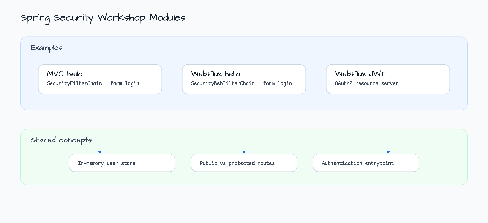
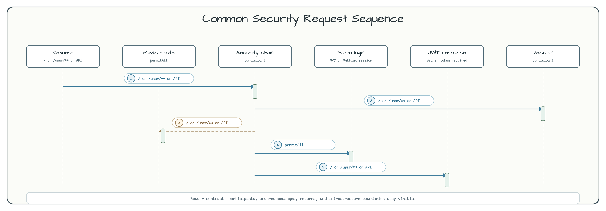

# Spring Security Workshop

[한국어](README.ko.md) | English

This directory groups three Spring Security examples: servlet MVC form login,
WebFlux form login, and WebFlux JWT resource server security. Use this README as
the map, then open each submodule for endpoint-level details.

## Architecture



All examples use an in-memory `user/password` account for tests and local runs.
The MVC and WebFlux form-login modules protect `/user/**` with `ROLE_USER`. The
JWT module protects all exchanges with OAuth2 resource server JWT support and
adds token issuing infrastructure.

## Modules

| Module | Stack | Security focus |
|---|---|---|
| [`mvc/hello`](mvc/hello) | Spring MVC | `SecurityFilterChain`, custom `/log-in`, in-memory user, protected `/user/index`. |
| [`webflux/hello-security`](webflux/hello-security) | Spring WebFlux | `SecurityWebFilterChain`, reactive user details, custom `/log-in`, protected `/user/index`. |
| [`webflux/jwt`](webflux/jwt) | Spring WebFlux + OAuth2 Resource Server | RSA-backed `JwtEncoder`, `ReactiveJwtDecoder`, bearer-token error handling, authenticated API calls. |

## Common Request Shape



The servlet and reactive stacks use different filter implementations, but the
reader-facing flow is the same: public routes pass, protected routes require a
matched authentication mechanism, and unauthorized requests are redirected or
rejected according to the module's security style.

## Build and Test

```bash
./gradlew :spring-security:mvc:hello:test
./gradlew :spring-security:webflux:hello-security:test
./gradlew :spring-security:webflux:jwt:test
```
