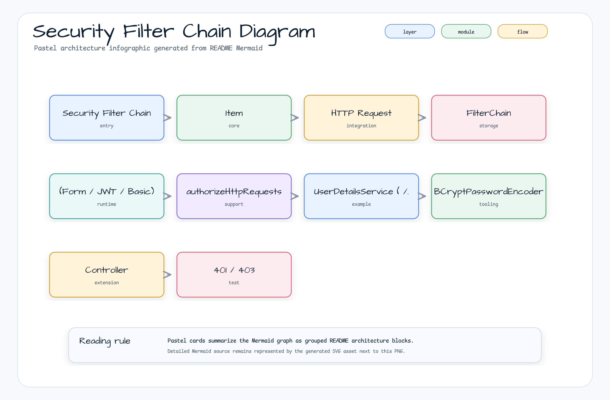

# Spring Security Workshop

[한국어](README.ko.md) | English

## Example Scenario

This example exercises **Spring Security Workshop** as a runnable Spring Security request protection workshop slice. It focuses on the path a developer would inspect first: configure the module, run the sample or tests, and observe the library or framework APIs that remove repetitive infrastructure code.

## Architecture Diagram

The module is organized around the sample entry point or test fixture, the bluetape4k extension layer, and the runtime dependency used by the example. Keep the package under `io.bluetape4k.workshop.springsecurity` as the source of truth when comparing this README with the code.

## Sequence Diagram

This is a collection of MVC and WebFlux security examples using Spring Security.

## Submodule Layout

## Security Filter Chain Flow

## References

### Documents

* [Spring Security Reference](https://docs.spring.io/spring-security/reference/)

### Examples

* [spring-security-samples](https://github.com/spring-projects/spring-security-samples)
* [Spring Security OAuth Resource Server demo](https://github.com/arthuroz/spring-security-multi-tenancy)
* [Java Spring Security Example](https://github.com/Yoh0xFF/java-spring-security-example)
