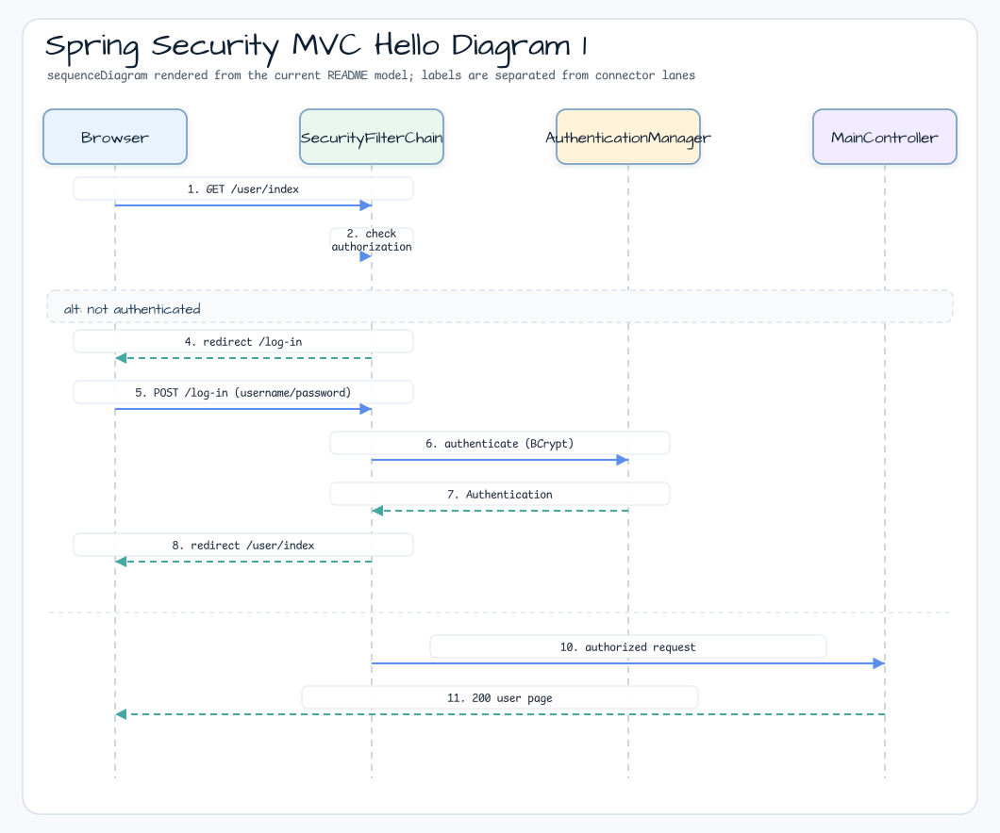
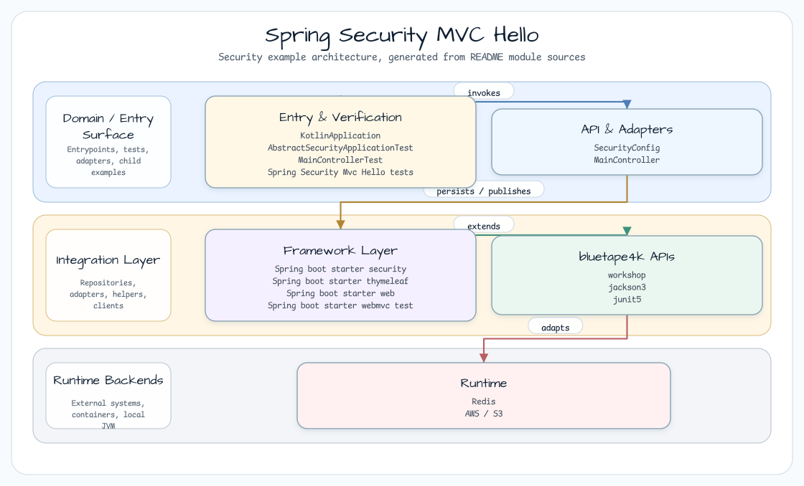

# Spring Security MVC Hello

[English](README.md) | 한국어

## 예제 시나리오

이 예제는 **Spring Security MVC Hello**를 실행 가능한 Spring Security 요청 보호 워크샵 조각으로 다룹니다. 개발자가 먼저 확인할 경로인 모듈 구성, 샘플 또는 테스트 실행, 반복적인 인프라 코드를 줄이는 라이브러리 또는 프레임워크 API 관찰에 초점을 맞춥니다.

## 시퀀스 다이어그램



커스텀 로그인 페이지, 인메모리 사용자, role로 보호되는 사용자 콘텐츠를 포함한 Spring MVC 보안 예제입니다.

## 아키텍처



## 이 모듈에서 확인할 내용

- `/`, `/user/index`, `/log-in` MVC controller mapping.
- Kotlin DSL로 구성한 `SecurityFilterChain`.
- `/`, `/css/**`, login page 공개 접근.
- `/user/**`의 `ROLE_USER` 보호.
- `BCryptPasswordEncoder`로 encoding된 in-memory user credential.

## 실행

```bash
./gradlew :spring-security-mvc-hello:bootRun
```

실행 후 `http://localhost:8080/`에 접속하고 다음 계정으로 로그인합니다.

- Username: `user`
- Password: `password`

## 사용하는 bluetape4k 기능

| 모듈 | 기능 | 사용 방식 |
|---|---|---|
| `bluetape4k-logging` | `KLogging()` | `SecurityConfig`의 lazy-lambda 메시지를 사용하는 companion-object logger |
| `bluetape4k-junit5` | `bluetape4k-junit5` test base | `AbstractSecurityApplicationTest`를 통한 JUnit 5 통합 |

## bluetape4k Before / After

### `KLogging()` vs plain SLF4J

```kotlin
// Before — SLF4J LoggerFactory
private val log = LoggerFactory.getLogger(SecurityConfig::class.java)
log.info("SecurityConfig initialized")

// After — KLogging() companion object (lazy lambda, zero-cost when disabled)
companion object : KLogging()
log.info { "SecurityConfig initialized" }
```

### Kotlin DSL Security configuration vs Java-style

```kotlin
// Before — Java-style builder chaining
http
    .authorizeHttpRequests { it.requestMatchers("/").permitAll() }
    .formLogin { it.loginPage("/log-in") }
    .build()

// After — Kotlin DSL (Spring Security invoke extension)
http {
    authorizeHttpRequests {
        authorize("/", permitAll)
        authorize("/css/**", permitAll)
        authorize("/user/**", hasAuthority("ROLE_USER"))
    }
    formLogin {
        loginPage = "/log-in"
    }
}
```

## Security Filter Chain

## 운영 노트

- In-memory user credential은 데모 용도입니다. 운영 환경에서는 실제 `UserDetailsService`로 교체합니다.
- `BCryptPasswordEncoder` strength 기본값은 10입니다. 운영 워크로드에서는 12 이상으로 높입니다.
- `application.yml`에서 Thymeleaf cache가 비활성화되어 있습니다(`spring.thymeleaf.cache: false`). 이는 로컬 개발 전용 설정입니다.

## 소스 맵

- `MainController.kt`는 MVC page를 매핑합니다.
- `SecurityConfig.kt`는 인가 규칙, form login, password encoding, in-memory user를 정의합니다.
- `application.yml`은 AOT를 활성화하고 로컬 개발용으로 Thymeleaf template cache를 비활성화합니다.
