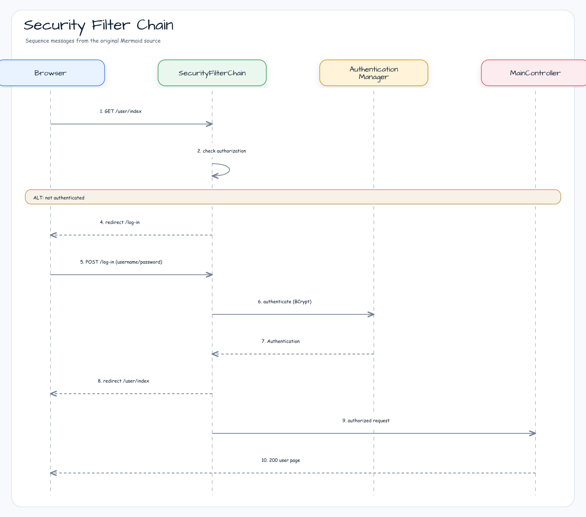
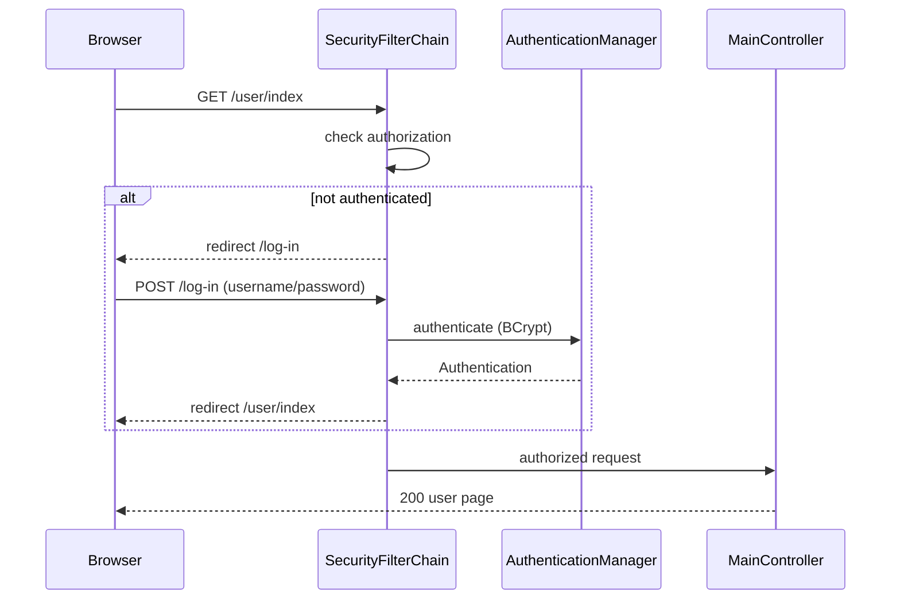

# Spring Security MVC Hello

[English](README.md) | [한국어](README.ko.md)

Spring MVC security example with a custom login page, an in-memory user, and role-protected user content.

## Architecture



## What This Module Shows

- MVC controller mappings for `/`, `/user/index`, and `/log-in`.
- `SecurityFilterChain` configured through the Kotlin DSL.
- Public access for `/`, `/css/**`, and the login page.
- `ROLE_USER` protection for `/user/**`.
- In-memory user credentials encoded with `BCryptPasswordEncoder`.

## Running

```bash
./gradlew :spring-security-mvc-hello:bootRun
```

Then open `http://localhost:8080/` and sign in with:

- Username: `user`
- Password: `password`

## Used bluetape4k Features

| Module | Feature | Usage |
|---|---|---|
| `bluetape4k-logging` | `KLogging()` | Companion-object logger with lazy-lambda messages in `SecurityConfig` |
| `bluetape4k-junit5` | `bluetape4k-junit5` test base | JUnit 5 integration via `AbstractSecurityApplicationTest` |

## bluetape4k Before / After

### `KLogging()` vs plain SLF4J

```kotlin
// Before — SLF4J LoggerFactory
private val log = LoggerFactory.getLogger(SecurityConfig::class.java)
log.info("SecurityConfig initialized")

// After — KLogging() companion object (lazy lambda, zero-cost when disabled)
companion object : KLogging()
log.info { "SecurityConfig initialized" }
```

### Kotlin DSL Security configuration vs Java-style

```kotlin
// Before — Java-style builder chaining
http
    .authorizeHttpRequests { it.requestMatchers("/").permitAll() }
    .formLogin { it.loginPage("/log-in") }
    .build()

// After — Kotlin DSL (Spring Security invoke extension)
http {
    authorizeHttpRequests {
        authorize("/", permitAll)
        authorize("/css/**", permitAll)
        authorize("/user/**", hasAuthority("ROLE_USER"))
    }
    formLogin {
        loginPage = "/log-in"
    }
}
```

## Security Filter Chain



## Operational Notes

- In-memory user credentials are for demo purposes only; replace with a real `UserDetailsService` in production.
- `BCryptPasswordEncoder` strength defaults to 10; increase to 12+ for production workloads.
- Thymeleaf cache is disabled (`spring.thymeleaf.cache: false`) in `application.yml` for local development only.

## Source Map

- `MainController.kt` maps the MVC pages.
- `SecurityConfig.kt` defines authorization rules, form login, password encoding, and the in-memory user.
- `application.yml` enables AOT and keeps Thymeleaf templates uncached for local development.
