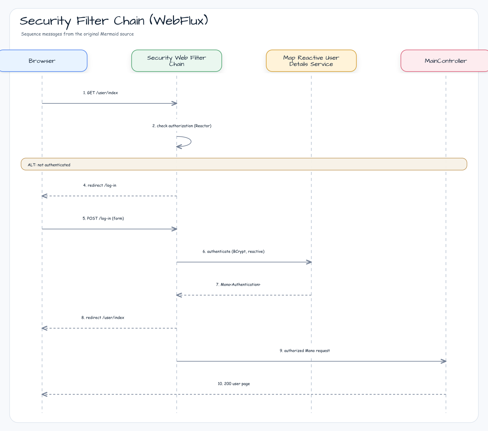
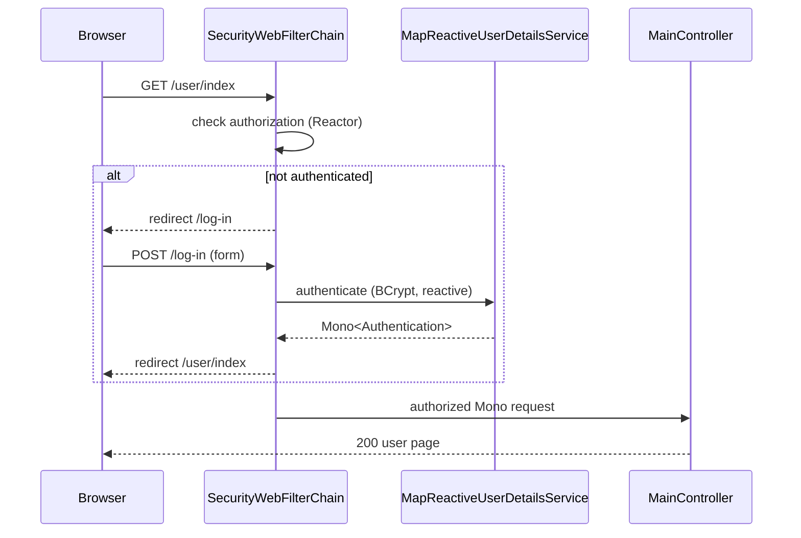

# Spring Security WebFlux Hello

[English](README.md) | [한국어](README.ko.md)

Reactive Spring Security example with WebFlux controllers, a custom login page, and an in-memory reactive user.

## Architecture



## What This Module Shows

- WebFlux controller mappings for `/`, `/user/index`, and `/log-in`.
- `SecurityWebFilterChain` configured through the reactive Kotlin DSL.
- Public access for `/`, `/css/**`, and `/log-in`.
- `ROLE_USER` protection for `/user/**`.
- `MapReactiveUserDetailsService` with a BCrypt-encoded in-memory user.

## Running

```bash
./gradlew :spring-security-webflux-hello-security:bootRun
```

Then open `http://localhost:8080/` and sign in with:

- Username: `user`
- Password: `password`

## Used bluetape4k Features

| Module | Feature | Usage |
|---|---|---|
| `bluetape4k-logging` | `KLoggingChannel()` | Coroutine-aware structured logging in `SecurityConfiguration` |
| `bluetape4k-coroutines` | Coroutine/Reactor bridge | Coroutines + Reactor integration for WebFlux security |
| `bluetape4k-junit5` | `runSuspendIO { }` | Suspend-based integration test runner |

## bluetape4k Before / After

### `KLoggingChannel()` vs plain logger in reactive code

```kotlin
// Before — SLF4J (no coroutine MDC propagation)
private val log = LoggerFactory.getLogger(SecurityConfiguration::class.java)

// After — KLoggingChannel (coroutine context-aware, MDC propagation in WebFlux)
companion object : KLoggingChannel()
log.info { "SecurityWebFilterChain configured" }
```

### Reactive Security DSL — Kotlin invoke extension

```kotlin
// Before — Java-style reactive security builder
http
    .authorizeExchange { spec ->
        spec.pathMatchers("/").permitAll()
            .pathMatchers("/user/**").hasAuthority("ROLE_USER")
    }
    .formLogin { spec -> spec.loginPage("/log-in") }
    .build()

// After — Kotlin DSL via ServerHttpSecurity.invoke
return http {
    authorizeExchange {
        authorize("/log-in", permitAll)
        authorize("/", permitAll)
        authorize("/css/**", permitAll)
        authorize("/user/**", hasAuthority("ROLE_USER"))
    }
    formLogin {
        loginPage = "/log-in"
    }
}
```

## Security Filter Chain (WebFlux)



## Operational Notes

- `MapReactiveUserDetailsService` holds users in memory; replace with a database-backed `ReactiveUserDetailsService` for production.
- `BCryptPasswordEncoder` is shared between `SecurityConfiguration` and `MapReactiveUserDetailsService` via Spring DI.
- Reactive security runs entirely on Reactor threads; never use blocking calls inside `SecurityWebFilterChain` lambdas.

## Source Map

- `KotlinWebfluxApplication.kt` starts the reactive Spring Boot application.
- `MainController.kt` maps the view routes.
- `SecurityConfiguration.kt` defines reactive authorization rules, form login, password encoding, and the in-memory user.
- `application.yml` sets port `8080`, enables AOT, and disables Thymeleaf cache for local development.
