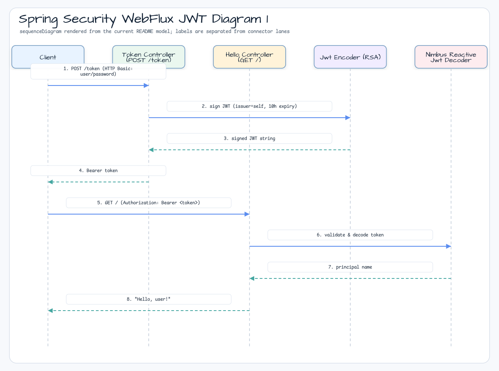

# Spring Security WebFlux JWT

[English](README.md) | 한국어

## 예제 시나리오

이 예제는 **Spring Security WebFlux JWT**를 실행 가능한 Spring Security 요청 보호 워크샵 조각으로 다룹니다. 개발자가 먼저 확인할 경로인 모듈 구성, 샘플 또는 테스트 실행, 반복적인 인프라 코드를 줄이는 라이브러리 또는 프레임워크 API 관찰에 초점을 맞춥니다.

## 시퀀스 다이어그램

핵심 시퀀스는 호출자 또는 테스트 픽스처 -> 워크샵 어댑터 -> bluetape4k 헬퍼/API -> 외부 런타임 또는 인메모리 백엔드 -> 검증/응답 순서입니다. 이 모듈에 전용 시퀀스 자산이 있으면 아래 이미지가 상호작용 순서를 보여주며, 그렇지 않으면 소스 테스트가 실행 가능한 시퀀스의 기준입니다.

Reactive JWT resource server 예제입니다. `/token`에서 RSA 서명 JWT를 발급하고 bearer-token 인증으로 greeting endpoint를 보호합니다.

## 아키텍처


## 이 모듈에서 확인할 내용

- `POST /token`은 인증된 사용자의 JWT를 생성합니다.
- `GET /`는 인증된 principal에서 `Hello, {user}!`를 반환합니다.
- RSA public/private key는 classpath resource에서 로드됩니다.
- WebFlux security는 HTTP Basic token 발급과 JWT resource server 검증을 결합합니다.
- 데모 사용자는 username `user`, password `password`, authority `app`를 가집니다.

## 실행

```bash
./gradlew :spring-security-webflux-jwt:bootRun
```

토큰을 요청한 뒤 보호된 endpoint를 호출합니다.

```bash
TOKEN=$(curl -u user:password -X POST http://localhost:8080/token)
curl -H "Authorization: Bearer ${TOKEN}" http://localhost:8080/
```

## 사용하는 bluetape4k 기능

| 모듈 | 기능 | 사용 방식 |
|---|---|---|
| `bluetape4k-logging` | `KLoggingChannel()` | `JwtConfig`와 controller의 coroutine-aware structured logging |
| `bluetape4k-coroutines` | Coroutine/Reactor bridge | WebFlux security pipeline에서 사용하는 coroutines |
| `bluetape4k-junit5` | `runSuspendIO { }` | Token issuance와 validation을 위한 suspend 기반 integration test |

## bluetape4k Before / After

### reactive JWT context의 `KLoggingChannel()`

```kotlin
// Before
private val log = LoggerFactory.getLogger(JwtConfig::class.java)

// After — coroutine-context-aware logger
companion object : KLoggingChannel()
log.debug { "Configuring JWT security filter chain" }
```

### OAuth2 Resource Server + HTTP Basic을 위한 Kotlin DSL

```kotlin
// Before — Java-style chaining
http
    .authorizeExchange { it.anyExchange().authenticated() }
    .oauth2ResourceServer { it.jwt(Customizer.withDefaults()) }
    .httpBasic(Customizer.withDefaults())
    .build()

// After — Kotlin DSL (ServerHttpSecurity.invoke)
return http.invoke {
    authorizeExchange {
        authorize(anyExchange, authenticated)
        authorize("/log-in", permitAll)
    }
    csrf { disable() }
    oauth2ResourceServer {
        jwt { }
    }
    httpBasic { }
    exceptionHandling {
        authenticationEntryPoint = BearerTokenServerAuthenticationEntryPoint()
        accessDeniedHandler = BearerTokenServerAccessDeniedHandler()
    }
}
```

## JWT Token Flow



## Key Pairs

RSA keypair는 `gen-keypair.sh`로 생성하고 `src/main/resources/`에 저장합니다.

```bash
./gen-keypair.sh
# Produces: app.key (private) and app.pub (public)
```

```yaml
jwt:
  private.key: classpath:certs/app.key
  public.key: classpath:certs/app.pub
```

## 운영 노트

- 운영 환경에서는 RSA private key를 source control에 commit하지 않습니다. secrets manager 또는 Vault에서 로드합니다.
- Token TTL은 `TokenController`에서 10시간으로 설정됩니다. 운영 환경에서는 15-60분으로 줄이고 refresh token을 구현합니다.
- `BearerTokenServerAuthenticationEntryPoint`는 401 응답에서 RFC 6750을 준수하는 `WWW-Authenticate` header를 반환합니다.
- `MapReactiveUserDetailsService`는 데모 용도입니다. 운영 환경에서는 database-backed service로 교체합니다.

## 소스 맵

- `JwtApplication.kt`는 reactive Spring Boot 애플리케이션을 시작합니다.
- `JwtConfig.kt`는 `SecurityWebFilterChain`, JWT encoder/decoder, RSA key binding, demo user를 정의합니다.
- `TokenController.kt`는 issuer `self`를 가진 10시간 유효 토큰을 서명합니다.
- `HelloController.kt`는 authenticated principal을 읽습니다.
- `application.yml`은 `jwt.private.key`와 `jwt.public.key`를 classpath PEM 파일로 지정합니다.
