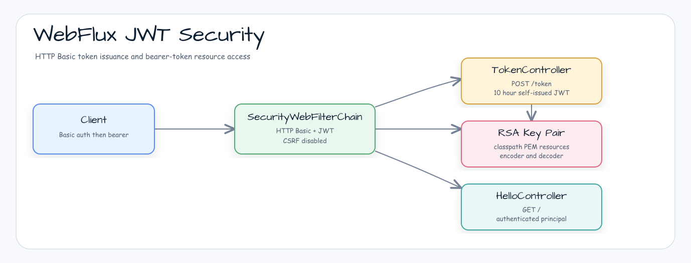

# Spring Security WebFlux JWT

[English](README.md) | 한국어

## 예제 시나리오

이 예제는 **Spring Security WebFlux JWT** 모듈을 실행 가능한 Spring Security 요청 보호 예제로 보여줍니다. 개발자가 먼저 확인할 경로인 모듈 설정, 샘플 또는 테스트 실행, 반복적인 인프라 코드를 줄이는 라이브러리 또는 프레임워크 API 사용 방식을 중심으로 설명합니다.

## 흐름 다이어그램

1. `spring-security-webflux-jwt` 예제에 필요한 로컬 런타임을 준비합니다.
2. 예제 시나리오를 담당하는 애플리케이션, 컨트롤러, 서비스 또는 테스트 픽스처를 실행합니다.
3. 반복적인 인프라 처리는 bluetape4k 유틸리티 또는 Spring/Kotlin 통합 기능에 위임합니다.
4. 샘플 출력, HTTP 응답, 저장소 상태, metric, trace 또는 테스트 기대값으로 결과를 검증합니다.

## 시퀀스 다이어그램

핵심 시퀀스는 호출자 또는 테스트 픽스처 -> 워크샵 어댑터 -> bluetape4k 헬퍼/API -> 외부 런타임 또는 인메모리 백엔드 -> 검증/응답 순서입니다. 전용 시퀀스 이미지가 있는 모듈은 아래 이미지가 상호작용 순서를 보여주며, 없는 경우 소스 테스트가 실행 가능한 시퀀스의 기준입니다.

Reactive JWT resource server 예제입니다. `/token`에서 RSA 서명 JWT를 발급하고, bearer token 인증으로 greeting endpoint를 보호합니다.

## 아키텍처



## 이 모듈에서 확인할 내용

- `POST /token`은 인증된 사용자에 대한 JWT를 생성합니다.
- `GET /`는 인증된 principal에서 `Hello, {user}!`를 반환합니다.
- RSA public/private key는 classpath resource에서 로드됩니다.
- WebFlux security는 HTTP Basic 기반 token 발급과 JWT resource server 검증을 함께 사용합니다.
- 데모 사용자는 username `user`, password `password`, authority `app`를 가집니다.

## 실행

```bash
./gradlew :spring-security-webflux-jwt:bootRun
```

토큰을 요청한 뒤 보호된 endpoint를 호출합니다.

```bash
TOKEN=$(curl -u user:password -X POST http://localhost:8080/token)
curl -H "Authorization: Bearer ${TOKEN}" http://localhost:8080/
```

## 소스 맵

- `JwtApplication.kt`는 reactive Spring Boot 애플리케이션을 시작합니다.
- `JwtConfig.kt`는 `SecurityWebFilterChain`, JWT encoder/decoder, RSA key binding, demo user를 정의합니다.
- `TokenController.kt`는 issuer `self`를 가진 10시간 유효 토큰을 서명합니다.
- `HelloController.kt`는 authenticated principal을 읽습니다.
- `application.yml`은 `jwt.private.key`와 `jwt.public.key`를 classpath PEM 파일로 지정합니다.
