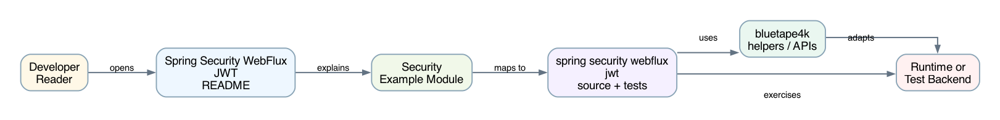
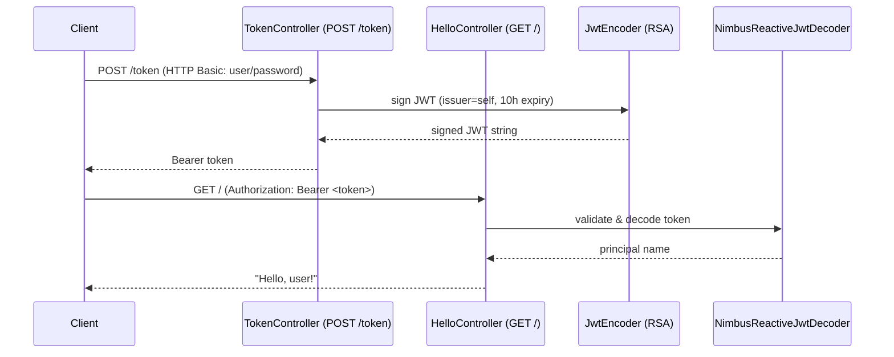

# Spring Security WebFlux JWT

[한국어](README.ko.md) | English

## Example Scenario

This example exercises **Spring Security WebFlux JWT** as a runnable Spring Security request protection workshop slice. It focuses on the path a developer would inspect first: configure the module, run the sample or tests, and observe the library or framework APIs that remove repetitive infrastructure code.

## Sequence Diagram

The core sequence is: caller or test fixture -> workshop adapter -> bluetape4k helper/API -> external runtime or in-memory backend -> assertion/response. When this module has a dedicated sequence asset, the image below shows that interaction order; otherwise the source tests are the authoritative executable sequence.

Reactive JWT resource server example. It issues RSA-signed JWTs from `/token` and protects the greeting endpoint with bearer-token authentication.

## Architecture




## What This Module Shows

- `POST /token` creates a JWT for the authenticated user.
- `GET /` returns `Hello, {user}!` from the authenticated principal.
- RSA public and private keys are loaded from classpath resources.
- WebFlux security combines HTTP Basic token issuance with JWT resource server validation.
- The demo user has username `user`, password `password`, and authority `app`.

## Running

```bash
./gradlew :spring-security-webflux-jwt:bootRun
```

Request a token, then call the protected endpoint:

```bash
TOKEN=$(curl -u user:password -X POST http://localhost:8080/token)
curl -H "Authorization: Bearer ${TOKEN}" http://localhost:8080/
```

## Used bluetape4k Features

| Module | Feature | Usage |
|---|---|---|
| `bluetape4k-logging` | `KLoggingChannel()` | Coroutine-aware structured logging in `JwtConfig` and controllers |
| `bluetape4k-coroutines` | Coroutine/Reactor bridge | Coroutines used in WebFlux security pipeline |
| `bluetape4k-junit5` | `runSuspendIO { }` | Suspend-based integration tests for token issuance and validation |

## bluetape4k Before / After

### `KLoggingChannel()` in reactive JWT context

```kotlin
// Before
private val log = LoggerFactory.getLogger(JwtConfig::class.java)

// After — coroutine-context-aware logger
companion object : KLoggingChannel()
log.debug { "Configuring JWT security filter chain" }
```

### Kotlin DSL for OAuth2 Resource Server + HTTP Basic

```kotlin
// Before — Java-style chaining
http
    .authorizeExchange { it.anyExchange().authenticated() }
    .oauth2ResourceServer { it.jwt(Customizer.withDefaults()) }
    .httpBasic(Customizer.withDefaults())
    .build()

// After — Kotlin DSL (ServerHttpSecurity.invoke)
return http.invoke {
    authorizeExchange {
        authorize(anyExchange, authenticated)
        authorize("/log-in", permitAll)
    }
    csrf { disable() }
    oauth2ResourceServer {
        jwt { }
    }
    httpBasic { }
    exceptionHandling {
        authenticationEntryPoint = BearerTokenServerAuthenticationEntryPoint()
        accessDeniedHandler = BearerTokenServerAccessDeniedHandler()
    }
}
```

## JWT Token Flow



## Key Pairs

RSA keypair is generated by `gen-keypair.sh` and stored in `src/main/resources/`:

```bash
./gen-keypair.sh
# Produces: app.key (private) and app.pub (public)
```

```yaml
jwt:
  private.key: classpath:certs/app.key
  public.key: classpath:certs/app.pub
```

## Operational Notes

- Never commit RSA private keys to source control in production; load from a secrets manager or Vault.
- Token TTL is set to 10 hours in `TokenController`; shorten for production (15-60 minutes) and implement refresh tokens.
- `BearerTokenServerAuthenticationEntryPoint` returns RFC 6750-compliant `WWW-Authenticate` headers on 401.
- `MapReactiveUserDetailsService` is for demo only; replace with a database-backed service in production.

## Source Map

- `JwtApplication.kt` starts the reactive Spring Boot application.
- `JwtConfig.kt` defines the `SecurityWebFilterChain`, JWT encoder/decoder, RSA key binding, and demo user.
- `TokenController.kt` signs a 10-hour token with issuer `self`.
- `HelloController.kt` reads the authenticated principal.
- `application.yml` points `jwt.private.key` and `jwt.public.key` at classpath PEM files.
