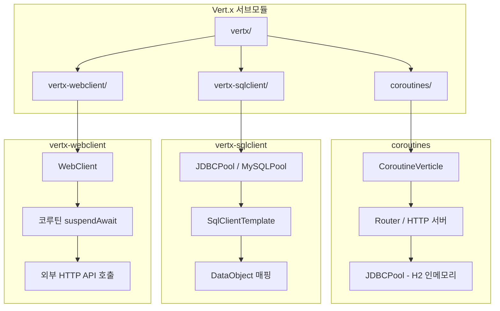

# Vert.x Demo

## 모듈 구조

```mermaid
flowchart TD
    subgraph Vert.x 서브모듈
        A[vertx/] --> B[coroutines/]
        A --> C[vertx-sqlclient/]
        A --> D[vertx-webclient/]
    end

    subgraph coroutines
        B --> B1[CoroutineVerticle]
        B1 --> B2[Router / HTTP 서버]
        B2 --> B3[JDBCPool - H2 인메모리]
    end

    subgraph vertx-sqlclient
        C --> C1[JDBCPool / MySQLPool]
        C1 --> C2[SqlClientTemplate]
        C2 --> C3[DataObject 매핑]
    end

    subgraph vertx-webclient
        D --> D1[WebClient]
        D1 --> D2[코루틴 suspendAwait]
        D2 --> D3[외부 HTTP API 호출]
    end
```

## 참고 자료

* [Vertx Documents](https://vertx.io/docs/)
* [Vertx Lang Kotlin Coroutines](https://vertx.io/docs/vertx-lang-kotlin-coroutines/kotlin/)
