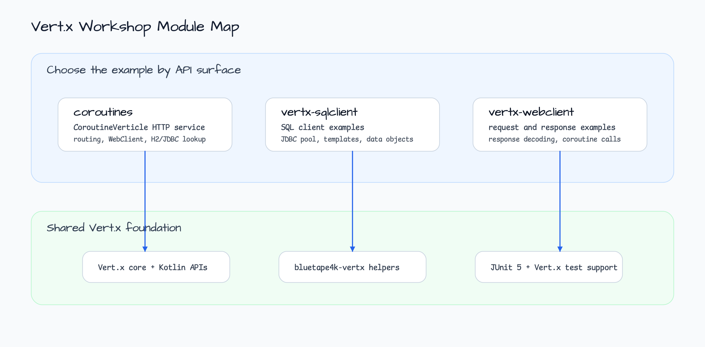

# Vert.x Workshop

[한국어](README.ko.md) | English

This directory groups the Vert.x examples used in the workshop. Start here when
you want to choose between coroutine verticles, SQL client usage, and WebClient
request/response examples.

## Module Map

## Modules

| Module | Reader question | Main focus |
|---|---|---|
| [`coroutines`](coroutines/README.md) | How does a coroutine verticle run an HTTP service? | `CoroutineVerticle`, routing, WebClient calls, H2/JDBC rating lookup |
| [`vertx-sqlclient`](vertx-sqlclient/README.md) | How do Vert.x SQL clients map rows and templates? | JDBC pool, SQL client templates, MySQL/PostgreSQL clients, data objects |
| [`vertx-webclient`](vertx-webclient/README.md) | How do WebClient request and response APIs behave? | request creation, response decoding, coroutine-style client calls |

## Common Stack

- Vert.x core and Kotlin coroutine bindings.
- `bluetape4k-vertx` helper APIs.
- `kotlinx-coroutines-reactor` for reactive/coroutine interop.
- JUnit 5 plus Vert.x test support for executable examples.

## References

- [Vert.x documentation](https://vertx.io/docs/)
- [Vert.x Kotlin coroutines](https://vertx.io/docs/vertx-lang-kotlin-coroutines/kotlin/)
