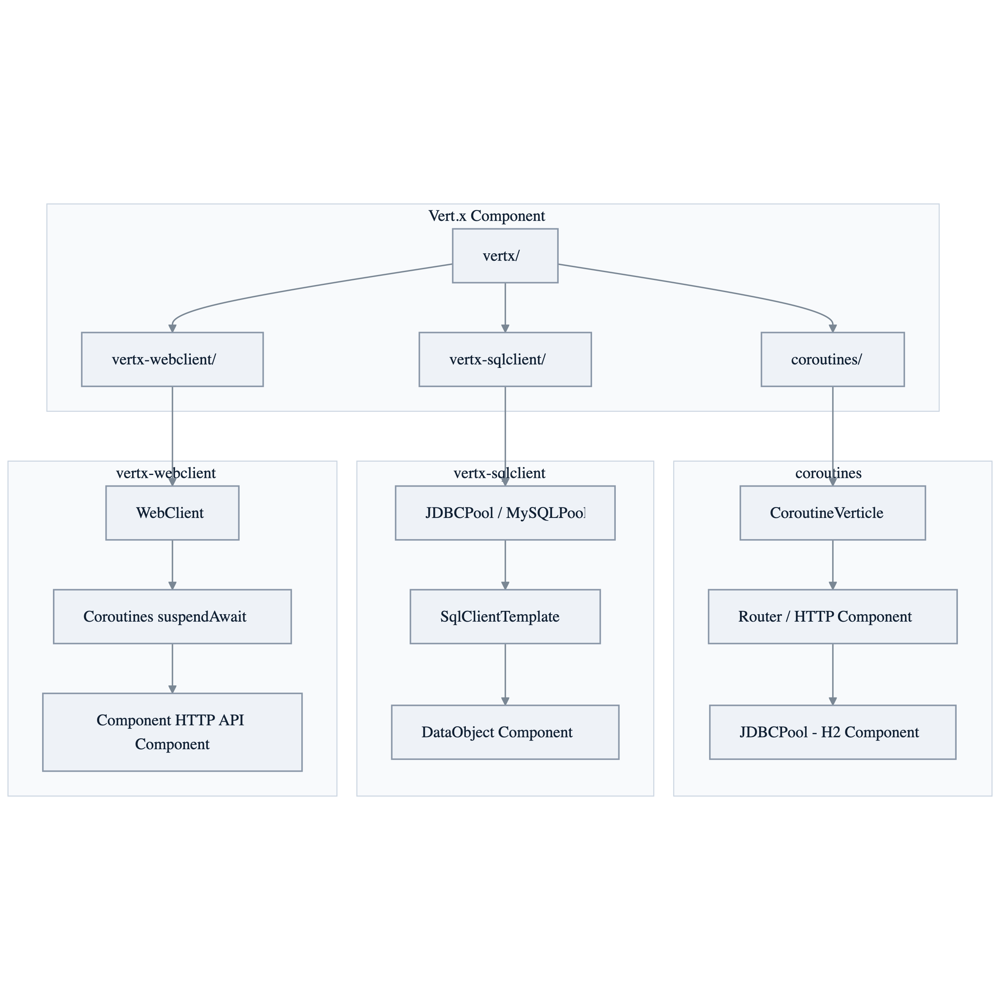

# Vert.x Demo

[한국어](README.ko.md) | English

## Example Scenario

This example exercises **Vert.x Demo** as a runnable Vert.x reactive service workshop slice. It focuses on the path a developer would inspect first: configure the module, run the sample or tests, and observe the library or framework APIs that remove repetitive infrastructure code.

## Architecture Diagram

The module is organized around the sample entry point or test fixture, the bluetape4k extension layer, and the runtime dependency used by the example. Keep the package under `io.bluetape4k.workshop.vertx` as the source of truth when comparing this README with the code.

## Sequence Diagram

## Module Structure

## References

* [Vertx Documents](https://vertx.io/docs/)
* [Vertx Lang Kotlin Coroutines](https://vertx.io/docs/vertx-lang-kotlin-coroutines/kotlin/)
