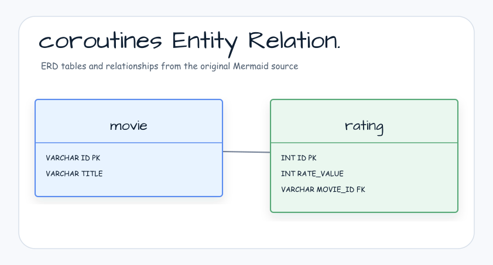

# Example for Vert.x with Kotlin Coroutines

[English](README.md) | 한국어

## 예제 시나리오

이 예제는 **Example for Vert.x with Kotlin Coroutines**를 실행 가능한 Vert.x reactive service 워크샵 조각으로 다룹니다. 개발자가 먼저 확인할 경로인 모듈 설정, 샘플 또는 테스트 실행, 반복적인 인프라 코드를 줄이는 라이브러리 또는 프레임워크 API 관찰에 초점을 맞춥니다.

## 아키텍처 다이어그램



이 모듈은 샘플 진입점 또는 테스트 픽스처, bluetape4k 확장 계층, 예제에서 사용하는 런타임 의존성을 중심으로 구성됩니다. README와 코드를 비교할 때는 `io.bluetape4k.workshop.vertx` 패키지를 기준으로 삼습니다.


## 흐름 다이어그램

1. `vertx-coroutines`에 필요한 로컬 런타임을 준비합니다.
2. 예제 시나리오를 담당하는 애플리케이션, 컨트롤러, 서비스 또는 테스트 픽스처를 실행합니다.
3. 반복적인 인프라 작업을 bluetape4k 유틸리티 또는 Spring/Kotlin 통합에 위임합니다.
4. 샘플 출력, HTTP 응답, 저장소 상태, metric, trace 또는 테스트 기대값으로 보이는 결과를 검증합니다.

## 시퀀스 다이어그램

핵심 시퀀스는 호출자 또는 테스트 픽스처 -> 워크샵 어댑터 -> bluetape4k 헬퍼/API -> 외부 런타임 또는 인메모리 백엔드 -> 검증/응답 순서입니다. 전용 시퀀스 자산이 있는 모듈은 아래 이미지가 상호작용 순서를 보여주며, 그렇지 않은 경우 소스 테스트가 실행 가능한 시퀀스의 기준입니다.


이 예제는 Kotlin Coroutines와 함께 Vert.x를 사용하는 방법을 보여줍니다.

## 처리 흐름


## Vert.x Coroutine 통합

`CoroutineVerticle`을 확장하면 Vert.x event loop 위에서 `suspend` 함수를 직접 호출할 수 있습니다.
비동기 DB query와 HTTP response를 callback nesting 없이 순차 코드 스타일로 처리합니다.

| Component | 설명 |
|-----------|------|
| `CoroutineVerticle` | router와 DB를 초기화하기 위해 `suspend fun start()`를 override합니다 |
| `suspendHandler { }` | Vert.x `Handler<RoutingContext>`를 `suspend` lambda로 감쌉니다(`bluetape4k-vertx`) |
| `coAwait()` | `Future<T>.coAwait()` — Vert.x Future를 coroutine suspension으로 변환합니다 |
| `JDBCPool` | connection pool size `maxSize=16`을 사용하는 H2 in-memory DB입니다 |
| `Router` | `GET /movie/:id`, `POST /rateMovie/:id`, `GET /getRating/:id` |

### Core Pattern: `suspendHandler`

```kotlin
// Route with a suspend function instead of the existing callback style
router.get("/movie/:id").suspendHandler { ctx ->
    val rows = pool
        .preparedQuery("SELECT TITLE FROM MOVIE WHERE ID=?")
        .execute(Tuple.of(ctx.pathParam("id")))
        .coAwait()          // Future -> suspend
    ctx.response().end(Json.obj { ... }.encode())
}
```

## 데이터 모델


## 제공 API Endpoint

| Method | Path | 설명 |
|--------|------|------|
| `GET` | `/movie/:id` | 영화 title을 조회합니다(JSON response) |
| `POST` | `/rateMovie/:id?getRating=N` | 영화 rating을 등록합니다 |
| `GET` | `/getRating/:id` | 영화 평균 rating을 조회합니다 |

## 사용한 bluetape4k 기능

| 기능 | Artifact | 코드 위치 | 이점 |
|---|---|---|---|
| `suspendHandler { }` | `bluetape4k-vertx` | `MainVerticle.kt` | Vert.x `Handler<RoutingContext>`를 suspend lambda로 감싸 nested callback 없이 순차 코드를 작성할 수 있습니다 |
| `withSuspendTestContext` | `bluetape4k-vertx` | 모든 테스트 | coroutine block 안에서 Vert.x `VertxTestContext`를 안전하게 사용하기 위한 test helper입니다 |
| `runSuspendTest { }` | `bluetape4k-junit5` | 모든 테스트 | JUnit 5에서 suspend test를 실행하는 extension function입니다 |
| `KLoggingChannel` | `bluetape4k-logging` | 모든 companion object | coroutine context가 포함된 structured logging입니다 |
| `bluetape4k-assertions` | `bluetape4k-core` | 모든 테스트 | `shouldBeEqualTo`, `shouldNotBeEmpty` 같은 읽기 쉬운 assertion입니다 |

## bluetape4k Before / After

### `suspendHandler { }` vs Callback-Based Routing

```kotlin
// Before - traditional Vert.x callback style
router.get("/movie/:id").handler { ctx ->
    pool.preparedQuery("SELECT TITLE FROM MOVIE WHERE ID=?")
        .execute(Tuple.of(ctx.pathParam("id"))) { ar ->
            if (ar.succeeded()) {
                val rows = ar.result()
                ctx.response().end(/* serialize result */)
            } else {
                ctx.fail(ar.cause())
            }
        }
}

// After - bluetape4k suspendHandler (sequential processing with a suspend function)
router.get("/movie/:id").suspendHandler { ctx ->
    val rows = pool
        .preparedQuery("SELECT TITLE FROM MOVIE WHERE ID=?")
        .execute(Tuple.of(ctx.pathParam("id")))
        .coAwait()          // Future -> suspend
    ctx.response().end(Json.obj { ... }.encode())
}
```

### `withSuspendTestContext` vs 수동 VertxTestContext 처리

```kotlin
// Before - manual VertxTestContext completion/failure handling
@Test
fun `test route`(vertx: Vertx, testContext: VertxTestContext) {
    vertx.deployVerticle(MainVerticle()) { ar ->
        if (ar.succeeded()) {
            // Write test logic with nested callbacks
            testContext.completeNow()
        } else {
            testContext.failNow(ar.cause())
        }
    }
}

// After - bluetape4k withSuspendTestContext (automatic coroutine block completion)
@Test
fun `test route`(vertx: Vertx, testContext: VertxTestContext) = runSuspendTest {
    vertx.withSuspendTestContext(testContext) {
        vertx.deployVerticle(MainVerticle()).coAwait()
        // Write tests as sequential code; exceptions automatically call testContext.failNow()
    }
}
```

## 취소, 구조화된 동시성, Context 전파

### `CoroutineVerticle` Scope와 Undeploy

`CoroutineVerticle`은 `CoroutineScope`를 구현합니다.
`Verticle`이 undeploy되면 해당 scope가 취소되므로 `start()` 안에서 시작된 모든 child coroutine이 즉시 취소됩니다. 이로써 structured concurrency가 보장됩니다.

```kotlin
class MainVerticle: CoroutineVerticle() {
    override suspend fun start() {
        // When this scope (CoroutineVerticle) is cancelled,
        // all launch { ... } child coroutines are also cancelled
        launch {
            // Background work, such as periodic cache refresh
        }
        // Register Router ...
    }
}
// vertx.undeploy(deploymentId) -> MainVerticle scope cancelled -> launch block cancelled
```

### `coAwait()` 취소 동작

`Future<T>.coAwait()`는 coroutine이 취소되면 Vert.x `Future`를 즉시 취소합니다.
DB query를 기다리는 동안 HTTP connection이 닫히더라도 connection은 정상적으로 pool에 반환됩니다.

```kotlin
router.get("/movie/:id").suspendHandler { ctx ->
    // If ctx.request() is aborted while this suspend block is running,
    // pool.preparedQuery(...).execute(...).coAwait() throws CancellationException
    // -> JDBCPool connection is returned automatically
    val rows = pool.preparedQuery("SELECT TITLE FROM MOVIE WHERE ID=?")
        .execute(Tuple.of(ctx.pathParam("id")))
        .coAwait()
    ctx.response().end(Json.obj { }.encode())
}
```

### `vertx.dispatcher()` Context 전파

`CoroutineVerticle` 내부의 `coroutineContext`에는 `vertx.dispatcher()`가 포함되므로 coroutine은 Vert.x event-loop thread에서 실행됩니다.
`withContext(vertx.dispatcher())`를 명시적으로 사용하면 event loop 바깥 context에서도 Vert.x API를 안전하게 호출할 수 있습니다.

```kotlin
// When a Vert.x API call is needed from another dispatcher
suspend fun queryAndRespond(ctx: RoutingContext) {
    val result = withContext(Dispatchers.IO) {
        // Process blocking I/O
        blockingComputation()
    }
    // Return to the Vert.x event loop and respond
    withContext(vertx.dispatcher()) {
        ctx.response().end(result)
    }
}
```

## 빌드와 테스트

```bash
./gradlew :vertx-coroutines:test
```
