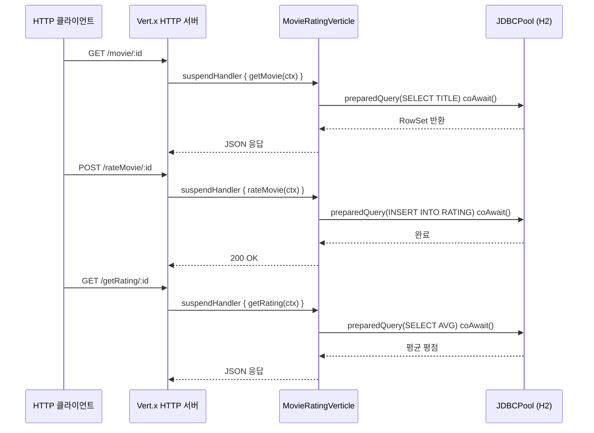
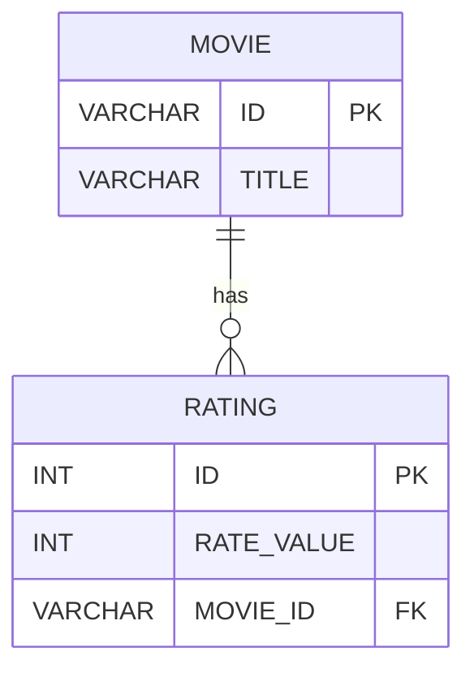

# Example for Vert.x with Kotlin Coroutines

Vert.x 를 Kotlin Coroutines 와 함께 사용하는 예제입니다.

## 처리 흐름



## Vert.x 코루틴 통합 설명

`CoroutineVerticle`을 상속하면 Vert.x 이벤트 루프 위에서 `suspend` 함수를 직접 사용할 수 있습니다.
콜백 지옥 없이 순차적인 코드 스타일로 비동기 DB 쿼리와 HTTP 응답을 처리합니다.

| 구성 요소 | 설명 |
|-----------|------|
| `CoroutineVerticle` | `suspend fun start()` 를 오버라이드해 라우터·DB 초기화 |
| `suspendHandler { }` | Vert.x `Handler<RoutingContext>` 를 `suspend` 람다로 래핑 (`bluetape4k-vertx`) |
| `coAwait()` | `Future<T>.coAwait()` — Vert.x Future 를 코루틴 일시 중단으로 변환 |
| `JDBCPool` | H2 인메모리 DB, 커넥션 풀 크기 `maxSize=16` |
| `Router` | `GET /movie/:id`, `POST /rateMovie/:id`, `GET /getRating/:id` |

### 핵심 패턴: `suspendHandler`

```kotlin
// 기존 콜백 방식 대신 suspend 함수로 라우팅
router.get("/movie/:id").suspendHandler { ctx ->
    val rows = pool
        .preparedQuery("SELECT TITLE FROM MOVIE WHERE ID=?")
        .execute(Tuple.of(ctx.pathParam("id")))
        .coAwait()          // Future → suspend
    ctx.response().end(Json.obj { ... }.encode())
}
```

## 데이터 모델



## 제공 API 엔드포인트

| 메서드 | 경로 | 설명 |
|--------|------|------|
| `GET` | `/movie/:id` | 영화 제목 조회 (JSON 반환) |
| `POST` | `/rateMovie/:id?getRating=N` | 영화 평점 등록 |
| `GET` | `/getRating/:id` | 영화 평균 평점 조회 |

## 빌드 및 테스트

```bash
./gradlew :vertx-coroutines:test
```
