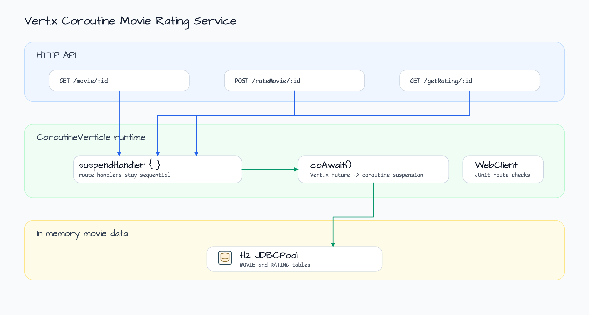
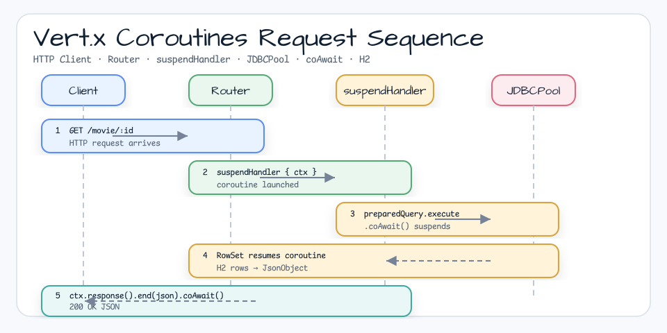
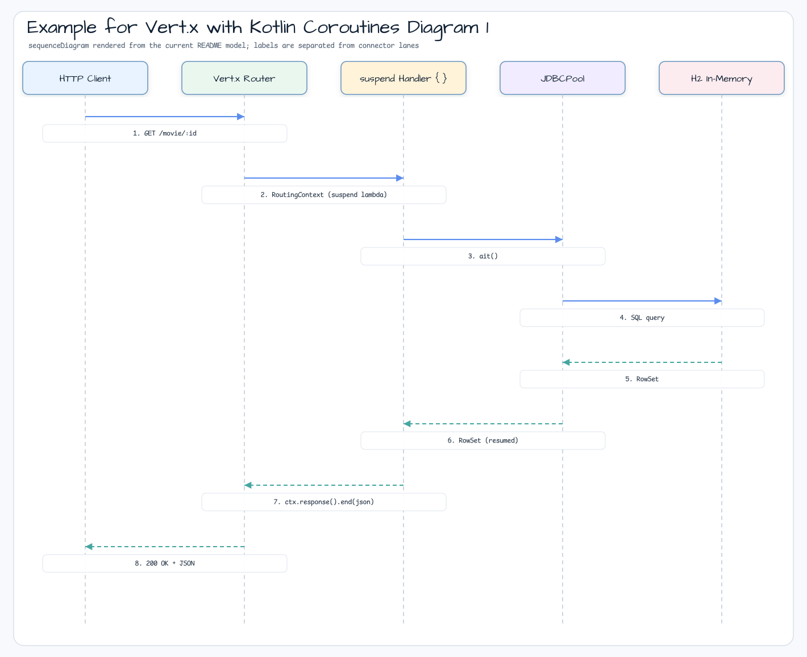

# Example for Vert.x with Kotlin Coroutines

[한국어](README.ko.md) | English

## Example Scenario

This example exercises **Example for Vert.x with Kotlin Coroutines** as a runnable Vert.x reactive service workshop slice. It focuses on the path a developer would inspect first: configure the module, run the sample or tests, and observe the library or framework APIs that remove repetitive infrastructure code.

## Architecture Diagram



The module is organized around the sample entry point or test fixture, the bluetape4k extension layer, and the runtime dependency used by the example. Keep the package under `io.bluetape4k.workshop.vertx` as the source of truth when comparing this README with the code.

## Sequence Diagram



This example shows how to use Vert.x with Kotlin Coroutines.

## Processing Flow



## Vert.x Coroutine Integration

Extending `CoroutineVerticle` lets you call `suspend` functions directly on top of the Vert.x event loop.
It handles asynchronous DB queries and HTTP responses in a sequential code style without callback nesting.

| Component | Description |
|-----------|------|
| `CoroutineVerticle` | Overrides `suspend fun start()` to initialize the router and DB |
| `suspendHandler { }` | Wraps a Vert.x `Handler<RoutingContext>` as a `suspend` lambda (`bluetape4k-vertx`) |
| `coAwait()` | `Future<T>.coAwait()` — converts a Vert.x Future into a coroutine suspension |
| `JDBCPool` | H2 in-memory DB with connection pool size `maxSize=16` |
| `Router` | `GET /movie/:id`, `POST /rateMovie/:id`, `GET /getRating/:id` |

### Core Pattern: `suspendHandler`

```kotlin
// Route with a suspend function instead of the existing callback style
router.get("/movie/:id").suspendHandler { ctx ->
    val rows = pool
        .preparedQuery("SELECT TITLE FROM MOVIE WHERE ID=?")
        .execute(Tuple.of(ctx.pathParam("id")))
        .coAwait()          // Future -> suspend
    ctx.response().end(Json.obj { ... }.encode())
}
```

## Data Model

## Provided API Endpoints

| Method | Path | Description |
|--------|------|------|
| `GET` | `/movie/:id` | Retrieves a movie title (JSON response) |
| `POST` | `/rateMovie/:id?getRating=N` | Registers a movie rating |
| `GET` | `/getRating/:id` | Retrieves the movie's average rating |

## Used bluetape4k Features

| Feature | Artifact | Code Location | Benefit |
|---|---|---|---|
| `suspendHandler { }` | `bluetape4k-vertx` | `MainVerticle.kt` | Wraps a Vert.x `Handler<RoutingContext>` as a suspend lambda, enabling sequential code without nested callbacks |
| `withSuspendTestContext` | `bluetape4k-vertx` | All tests | Test helper for safely using Vert.x `VertxTestContext` inside coroutine blocks |
| `runSuspendTest { }` | `bluetape4k-junit5` | All tests | Extension function for running suspend tests in JUnit 5 |
| `KLoggingChannel` | `bluetape4k-logging` | All companion objects | Structured logging with coroutine context |
| `bluetape4k-assertions` | `bluetape4k-core` | All tests | Readable assertions such as `shouldBeEqualTo` and `shouldNotBeEmpty` |

## bluetape4k Before / After

### `suspendHandler { }` vs Callback-Based Routing

```kotlin
// Before - traditional Vert.x callback style
router.get("/movie/:id").handler { ctx ->
    pool.preparedQuery("SELECT TITLE FROM MOVIE WHERE ID=?")
        .execute(Tuple.of(ctx.pathParam("id"))) { ar ->
            if (ar.succeeded()) {
                val rows = ar.result()
                ctx.response().end(/* serialize result */)
            } else {
                ctx.fail(ar.cause())
            }
        }
}

// After - bluetape4k suspendHandler (sequential processing with a suspend function)
router.get("/movie/:id").suspendHandler { ctx ->
    val rows = pool
        .preparedQuery("SELECT TITLE FROM MOVIE WHERE ID=?")
        .execute(Tuple.of(ctx.pathParam("id")))
        .coAwait()          // Future -> suspend
    ctx.response().end(Json.obj { ... }.encode())
}
```

### `withSuspendTestContext` vs Manual VertxTestContext Handling

```kotlin
// Before - manual VertxTestContext completion/failure handling
@Test
fun `test route`(vertx: Vertx, testContext: VertxTestContext) {
    vertx.deployVerticle(MainVerticle()) { ar ->
        if (ar.succeeded()) {
            // Write test logic with nested callbacks
            testContext.completeNow()
        } else {
            testContext.failNow(ar.cause())
        }
    }
}

// After - bluetape4k withSuspendTestContext (automatic coroutine block completion)
@Test
fun `test route`(vertx: Vertx, testContext: VertxTestContext) = runSuspendTest {
    vertx.withSuspendTestContext(testContext) {
        vertx.deployVerticle(MainVerticle()).coAwait()
        // Write tests as sequential code; exceptions automatically call testContext.failNow()
    }
}
```

## Cancellation, Structured Concurrency, and Context Propagation

### `CoroutineVerticle` Scope and Undeploy

`CoroutineVerticle` implements `CoroutineScope`.
When the `Verticle` is undeployed, that scope is cancelled, so every child coroutine started inside `start()`
is cancelled immediately. This guarantees structured concurrency.

```kotlin
class MainVerticle: CoroutineVerticle() {
    override suspend fun start() {
        // When this scope (CoroutineVerticle) is cancelled,
        // all launch { ... } child coroutines are also cancelled
        launch {
            // Background work, such as periodic cache refresh
        }
        // Register Router ...
    }
}
// vertx.undeploy(deploymentId) -> MainVerticle scope cancelled -> launch block cancelled
```

### `coAwait()` Cancellation Behavior

`Future<T>.coAwait()` immediately cancels the Vert.x `Future` when the coroutine is cancelled.
Even if an HTTP connection closes while waiting for a DB query, the connection is returned normally to the pool.

```kotlin
router.get("/movie/:id").suspendHandler { ctx ->
    // If ctx.request() is aborted while this suspend block is running,
    // pool.preparedQuery(...).execute(...).coAwait() throws CancellationException
    // -> JDBCPool connection is returned automatically
    val rows = pool.preparedQuery("SELECT TITLE FROM MOVIE WHERE ID=?")
        .execute(Tuple.of(ctx.pathParam("id")))
        .coAwait()
    ctx.response().end(Json.obj { }.encode())
}
```

### `vertx.dispatcher()` Context Propagation

Inside `CoroutineVerticle`, `coroutineContext` includes `vertx.dispatcher()`,
so coroutines run on the Vert.x event-loop thread.
Using `withContext(vertx.dispatcher())` explicitly lets you safely call Vert.x APIs
from a context outside the event loop.

```kotlin
// When a Vert.x API call is needed from another dispatcher
suspend fun queryAndRespond(ctx: RoutingContext) {
    val result = withContext(Dispatchers.IO) {
        // Process blocking I/O
        blockingComputation()
    }
    // Return to the Vert.x event loop and respond
    withContext(vertx.dispatcher()) {
        ctx.response().end(result)
    }
}
```

## Build and Test

```bash
./gradlew :vertx-coroutines:test
```
