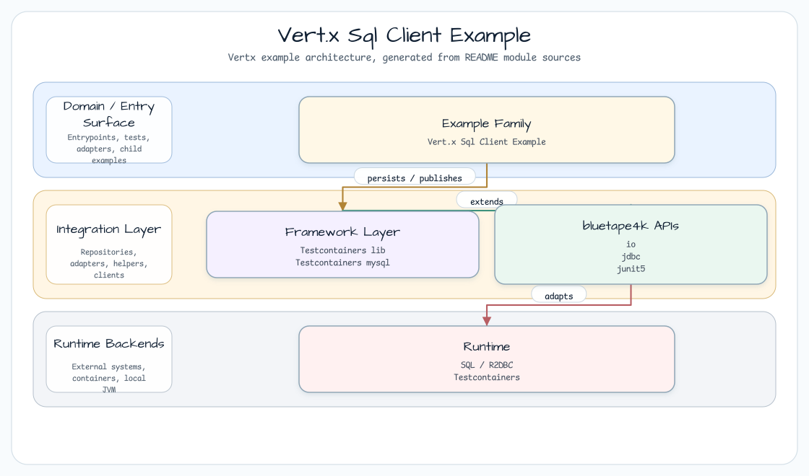
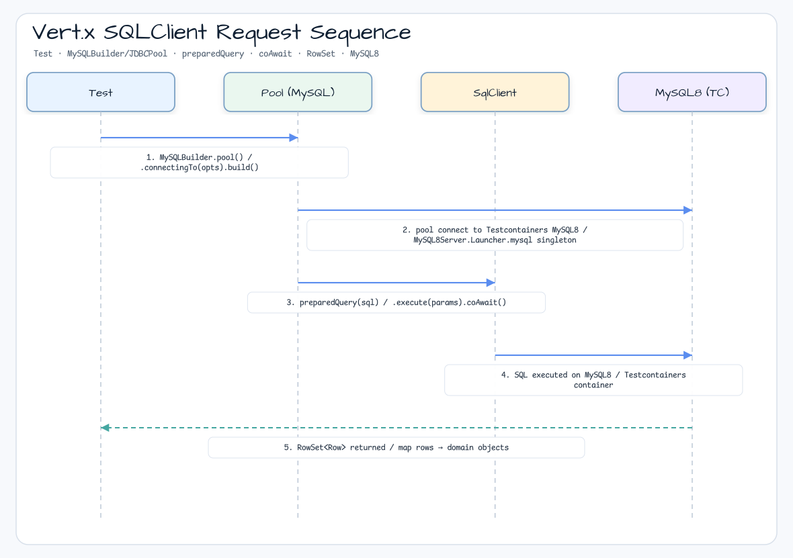
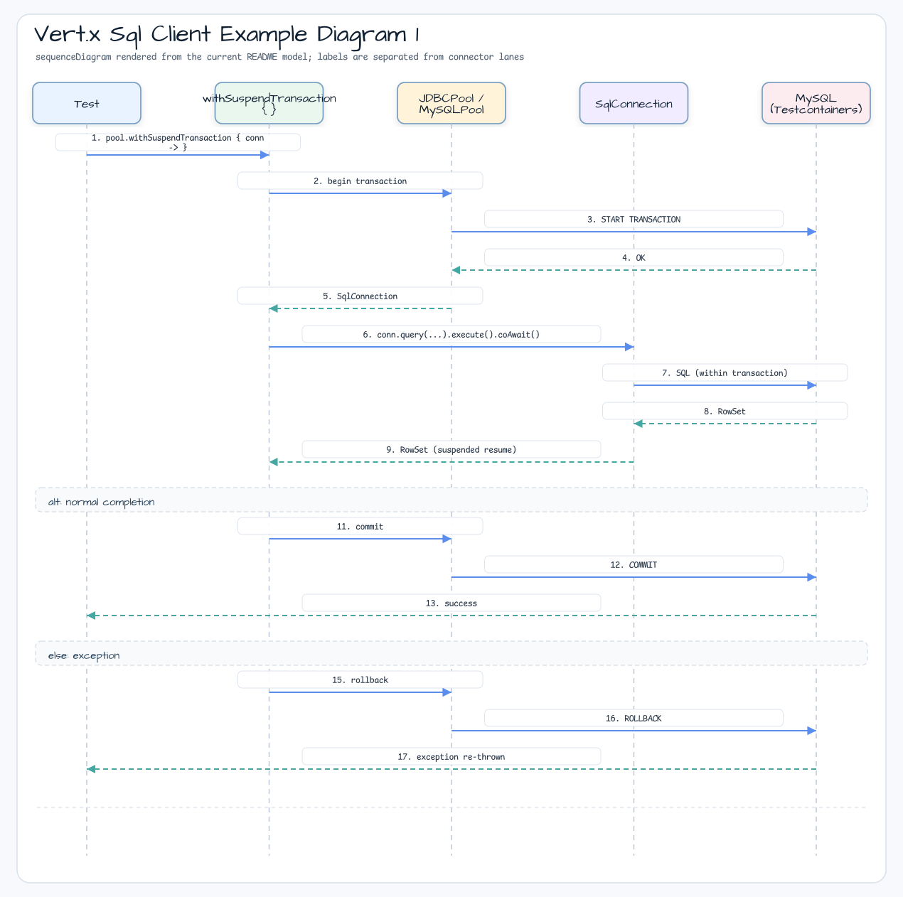

# Vert.x Sql Client Example

[English](README.md) | 한국어

## 예제 시나리오

이 예제는 **Vert.x Sql Client Example**을 실행 가능한 Vert.x reactive service 워크샵 조각으로 다룹니다. 개발자가 먼저 확인할 경로인 모듈 설정, 샘플 또는 테스트 실행, 반복적인 인프라 코드를 줄이는 라이브러리 또는 프레임워크 API 관찰에 초점을 맞춥니다.

## 아키텍처 다이어그램



이 모듈은 샘플 진입점 또는 테스트 픽스처, bluetape4k 확장 계층, 예제에서 사용하는 런타임 의존성을 중심으로 구성됩니다. README와 코드를 비교할 때는 `io.bluetape4k.workshop.vertx` 패키지를 기준으로 삼습니다.

## 시퀀스 다이어그램



## Reactive SQL 처리 흐름



이 예제는 [Vert.x Sql Client](https://vertx.io/docs/vertx-sql-client/java/)와
[MyBatis Dynamic SQL](https://mybatis.org/mybatis-dynamic-sql/docs/introduction.html)을 사용해 database에 asynchronous, non-blocking 방식으로 접근합니다.

이 접근 방식은 MyBatis SQL Mapper 기능과 Vert.x Sql Client를 결합합니다.

## Vert.x data object로 mapping

Vert.x SqlClient `RowMapper`를 사용하지 않고 row를 DTO로 직접 mapping할 수 있습니다.
`dataobject` 폴더의 `UserDataObject` 구현을 참고하세요.

1. 의존성으로 `io.vertx:vertx-codegen:4.3.1:processor`를 추가합니다.

```
compileOnly(Libs.vertx_codegen)
kapt(Libs.vertx_codegen)
kaptTest(Libs.vertx_codegen)
```

2. 모듈에 `package-info.java`를 추가합니다.

[package-info.java](src/main/java/io/bluetape4k/workshop/sqlclient/package-info.java)

```java
@ModuleGen(name = "vertx-sqlclient-demo", groupPackage = "io.bluetape4k.workshop.sqlclient")
package io.bluetape4k.workshop.sqlclient;

import io.vertx.codegen.annotations.ModuleGen;
```

Reference:
[Mapping with Vert.x data objects](https://vertx.io/docs/vertx-sql-client-templates/java/#_mapping_with_vert_x_data_objects)

## 사용한 bluetape4k 기능

| 기능 | Artifact | 코드 위치 | 이점 |
|---|---|---|---|
| `withSuspendTransaction { }` | `bluetape4k-vertx` | `JDBCPoolExamples.kt`, `AbstractSqlClientTest` | `Pool`에서 transaction을 열고 suspend block을 실행한 뒤 자동으로 commit 또는 rollback합니다 |
| `testWithSuspendTransaction` | `bluetape4k-vertx` | 모든 테스트 | `VertxTestContext`와 transaction을 결합한 test helper입니다. 자동 transaction rollback으로 test를 격리합니다 |
| `tupleMapperOfRecord` | `bluetape4k-vertx` | `SqlClientTemplateExamples.kt` | Kotlin data class / record를 Vert.x `TupleMapper` instance로 변환하는 utility입니다 |
| `MySQL8Server.Launcher` | `bluetape4k-testcontainers` | `AbstractSqlClientTest` | Testcontainers MySQL 8 singleton server입니다. 모듈의 모든 테스트가 하나의 container를 재사용합니다 |
| `runSuspendIO { }` | `bluetape4k-junit5` | 모든 테스트 | `runBlocking(Dispatchers.IO)` pattern을 JUnit 5 extension으로 제공합니다 |
| `KLoggingChannel` | `bluetape4k-logging` | 모든 companion object | coroutine context가 포함된 structured logging입니다 |
| `requireNotBlank` | `bluetape4k-core` | Input validation | `require(value.isNotBlank())` pattern을 extension function으로 제공합니다 |
| `bluetape4k-assertions` | `bluetape4k-core` | 모든 테스트 | `shouldBeEqualTo`, `shouldHaveSize` 같은 읽기 쉬운 assertion입니다 |

## bluetape4k Before / After

### `withSuspendTransaction { }` vs Future Chaining

```kotlin
// Before - Vert.x Future + callback chaining
pool.withTransaction { conn ->
    conn.query("SELECT * from test").execute()
        .flatMap { rows ->
            // Process result
            Future.succeededFuture(rows)
        }
}.onSuccess { result ->
    // Handle success
}.onFailure { err ->
    // Handle failure
}

// After - bluetape4k withSuspendTransaction (sequential processing with a suspend block)
pool.withSuspendTransaction { conn: SqlConnection ->
    val rows = conn.query("SELECT * from test").execute().coAwait()
    // Process result; automatically rolls back on exception
}
```

### `testWithSuspendTransaction` vs 수동 Test Isolation

```kotlin
// Before - data must be cleaned up manually after the test
@Test
fun `test insert`(vertx: Vertx, testContext: VertxTestContext) {
    runBlocking(vertx.dispatcher()) {
        pool.withSuspendTransaction { conn ->
            conn.query("INSERT INTO test VALUES (3, 'Test')").execute().coAwait()
            // Data remains after the test and can affect other tests
        }
        testContext.completeNow()
    }
}

// After - bluetape4k testWithSuspendTransaction (automatic rollback + testContext handling)
@Test
fun `test insert`(vertx: Vertx, testContext: VertxTestContext) = runSuspendIO {
    vertx.testWithSuspendTransaction(testContext, pool) {
        pool.query("INSERT INTO test VALUES (3, 'Test')").execute().coAwait()
        // Automatically rolls back after test completion, ensuring isolation between tests
    }
}
```

### `MySQL8Server.Launcher` Testcontainers Singleton

```kotlin
// Before - create a container for each test or class
class MyTest {
    companion object {
        @JvmField
        @Container
        val mysql = MySQLContainer("mysql:8.0")  // starts a new container each time
    }
}

// After - bluetape4k singleton launcher (reuses one container across the JVM)
abstract class AbstractSqlClientTest {
    companion object: KLoggingChannel() {
        val mysql = MySQL8Server.Launcher.mysql  // returns the already-started instance
    }
}
```

## 취소, 구조화된 동시성, Context 전파

### `withSuspendTransaction { }` 취소와 자동 Rollback

transaction block이 실행 중일 때 coroutine이 취소되면 `withSuspendTransaction`은 rollback을 수행합니다.
예를 들어 parent scope가 timeout으로 취소되거나 HTTP client 연결이 끊겨도 transaction rollback 후 DB connection은 정상적으로 pool로 반환됩니다.

```kotlin
// Cancellation due to timeout -> automatic rollback
withTimeout(200) {
    pool.withSuspendTransaction { conn ->
        conn.query("INSERT INTO items VALUES (...)").execute().coAwait()
        delay(500)  // exceeds timeout -> CancellationException
        // Exception before block exit -> automatic ROLLBACK
    }
}
// INSERT does not remain in the DB
```

### `testWithSuspendTransaction` Test Isolation 보장

테스트 간 state contamination을 막기 위해 `testWithSuspendTransaction`은 block 완료 여부와 관계없이 항상 rollback합니다.
이로써 각 테스트에 독립적인 초기 상태가 보장됩니다.

```kotlin
@Test
fun `insert data test`(vertx: Vertx, testContext: VertxTestContext) = runSuspendIO {
    vertx.testWithSuspendTransaction(testContext, pool) {
        val rows = pool.preparedQuery("INSERT INTO users VALUES (?, ?)")
            .execute(Tuple.of(1, "Alice"))
            .coAwait()
        rows.rowCount() shouldBeEqualTo 1
        // Automatically rolls back after the block completes -> no effect on the next test
    }
}
```

### Vert.x `Pool` Backpressure

`MySQLPool` / `JDBCPool`은 최대 connection 수를 제한합니다.
pool에 사용 가능한 connection이 없으면 coroutine `coAwait()`는 non-blocking waiting(backpressure)을 수행합니다.
thread를 block하지 않기 때문에 하나의 event-loop thread가 수백 개의 동시 요청을 처리할 수 있습니다.

## 빌드와 테스트

```bash
./gradlew :vertx-vertx-sqlclient:test
```
