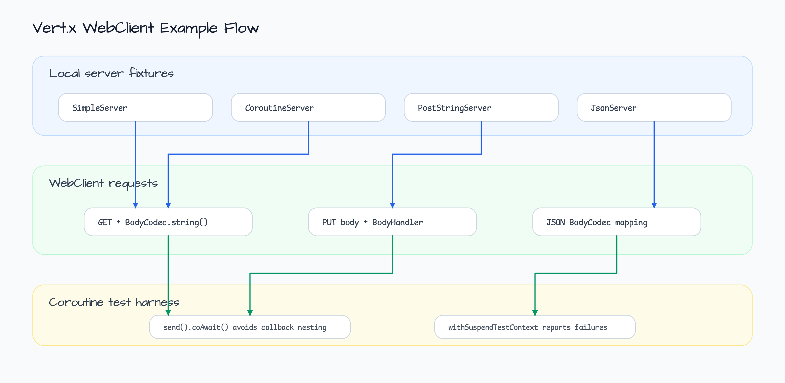

# Vert.x WebClient

[English](README.md) | 한국어

이 모듈은 실행 가능한 Vert.x WebClient 예제 묶음입니다. 각 테스트는 작은 local
Vert.x server를 시작하고, WebClient request를 보내고, `coAwait()`로 response를
기다린 뒤 decoded body를 검증합니다.

## 아키텍처



## Example Files

| File | Request shape | Response focus |
|---|---|---|
| `SimpleExamples` | `AbstractVerticle` server에 `GET /` | `BodyCodec.string()`이 `Hello World!`를 반환 |
| `CoroutineExamples` | `CoroutineVerticle` server에 `GET /` | `coAwait()`로 순차 Kotlin처럼 읽히는 request |
| `RequestExamples` | string buffer를 담아 `PUT /simple` | `BodyHandler`가 request body를 읽고 `OK` 반환 |
| `ResponseExamples` | JSON server에 `PUT /` | `BodyCodec.jsonObject()`와 `BodyCodec.json(User::class.java)` |

## Core Pattern

```kotlin
val response = WebClient.create(vertx)
    .get(port, "localhost", "/")
    .`as`(BodyCodec.string())
    .send()
    .coAwait()
```

예제는 `withSuspendTestContext`를 사용하므로 coroutine assertion 실패가 테스트를
멈춰 세우지 않고 Vert.x test context에 전달됩니다.

## 테스트

```bash
./gradlew :vertx-vertx-webclient:test
```
