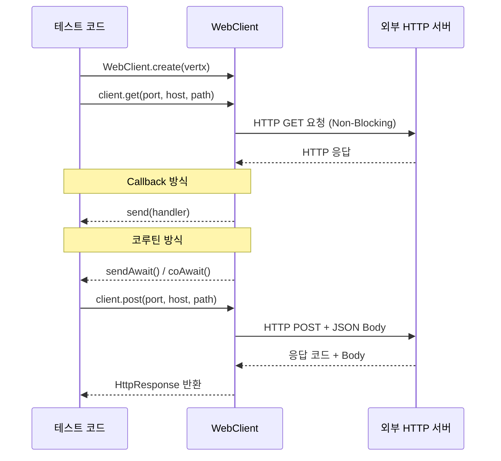

# Vert.x WebClient Examples

[Vert.x WebClient](https://vertx.io/docs/vertx-web-client/java/) 는 Async/Non-Blocking 방식의 WebClient 입니다.
Spring의 WebClient와 비슷한 기능을 제공하지만, Reactor 를 사용하지 않고, Coroutines를 사용하여 좀 더 쉽게 구현할 수 있습니다.

## HTTP 요청 처리 흐름



## 주요 기능

| 기능 | 설명 |
|------|------|
| HTTP GET | `client.get(port, host, path).send().coAwait()` — Non-Blocking GET 요청 |
| HTTP PUT/POST | `client.put(...).sendBuffer(body).coAwait()` — 바디 포함 요청 |
| BodyCodec 지원 | `BodyCodec.string()`, `BodyCodec.jsonObject()`, `BodyCodec.json(Class)` — 응답 자동 역직렬화 |
| 코루틴 통합 | `coAwait()` 확장 함수로 콜백 없이 `suspend` 함수처럼 사용 |
| CoroutineVerticle | `CoroutineVerticle`을 상속하면 `start()` 함수를 `suspend`로 선언 가능 |
| JSON 응답 매핑 | `BodyCodec.json(User::class.java)` — Jackson으로 응답 바디를 도메인 객체로 자동 변환 |

## 예제 파일 구성

| 파일 | 설명 |
|------|------|
| `SimpleExamples.kt` | `AbstractVerticle` 기반 기본 HTTP 서버 + WebClient GET 요청 |
| `CoroutineExamples.kt` | `CoroutineVerticle` 기반 코루틴 서버 + `coAwait()` 사용 |
| `RequestExamples.kt` | `Router` + `BodyHandler` 등록 후 PUT 요청으로 문자열 바디 전송 |
| `ResponseExamples.kt` | JSON 응답을 `JsonObject` 및 커스텀 클래스로 역직렬화 |

## 사용 예제

### 기본 GET 요청 (콜백 없이 코루틴 사용)

```kotlin
val client = WebClient.create(vertx)
val response = client
    .get(8080, "localhost", "/")
    .`as`(BodyCodec.string())
    .send()
    .coAwait()                       // suspend — 콜백 불필요

println(response.body())             // "Hello World!"
```

### PUT 요청으로 바디 전송

```kotlin
val body = Buffer.buffer("Hello World!")
val response = client
    .put(9989, "localhost", "/simple")
    .`as`(BodyCodec.string())
    .sendBuffer(body)
    .coAwait()

response.statusCode() // 200
response.body()       // "OK"
```

### JSON 응답을 도메인 객체로 역직렬화

```kotlin
data class User(val firstname: String, val lastname: String, val male: Boolean)

val response = client
    .put(9999, "localhost", "/")
    .`as`(BodyCodec.json(User::class.java))   // Jackson 자동 매핑
    .send()
    .coAwait()

val user: User = response.body()
```

### CoroutineVerticle로 서버 구현

```kotlin
class CoroutineServer : CoroutineVerticle() {
    override suspend fun start() {                 // suspend 함수로 선언 가능
        vertx.createHttpServer()
            .requestHandler { req -> req.response().end("Hello Coroutines!") }
            .listen(9988)
            .coAwait()
    }
}

// 배포
vertx.deployVerticle(CoroutineServer()).coAwait()
```

## 코루틴 통합 방식 비교

| 방식 | API | 특징 |
|------|-----|------|
| 콜백 | `send { ar -> ... }` | 전통적 Vert.x 방식, 중첩 가능성 높음 |
| `coAwait()` | `send().coAwait()` | Kotlin 코루틴, 동기 코드처럼 읽힘 |
| `CoroutineVerticle` | `override suspend fun start()` | Verticle 전체를 코루틴으로 작성 |
