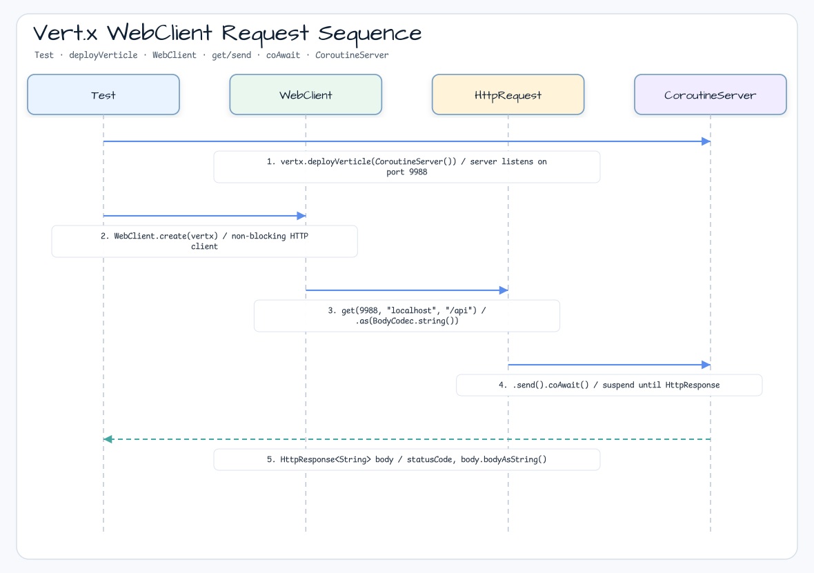
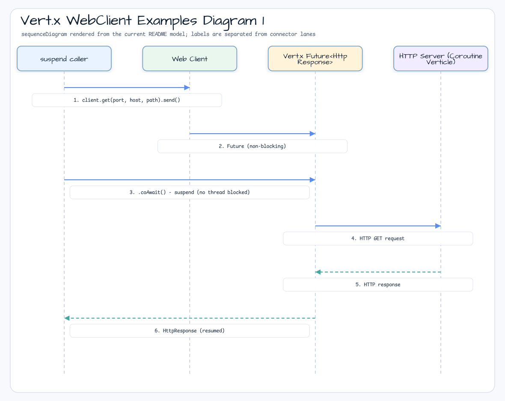

# Vert.x WebClient Examples

[한국어](README.ko.md) | English

## Example Scenario

This example exercises **Vert.x WebClient Examples** as a runnable Vert.x reactive service workshop slice. It focuses on the path a developer would inspect first: configure the module, run the sample or tests, and observe the library or framework APIs that remove repetitive infrastructure code.

## Architecture Diagram


The module is organized around the sample entry point or test fixture, the bluetape4k extension layer, and the runtime dependency used by the example. Keep the package under `io.bluetape4k.workshop.vertx` as the source of truth when comparing this README with the code.

## Flow Diagram

1. Prepare the local runtime required by `vertx-vertx-webclient`.
2. Execute the application, controller, service, or test fixture that owns the example scenario.
3. Delegate repetitive infrastructure work to bluetape4k utilities or Spring/Kotlin integrations.
4. Assert the visible result through the sample output, HTTP response, repository state, metric, trace, or test expectation.

## Sequence Diagram

The core sequence is: caller or test fixture -> workshop adapter -> bluetape4k helper/API -> external runtime or in-memory backend -> assertion/response. When this module has a dedicated sequence asset, the image below shows that interaction order; otherwise the source tests are the authoritative executable sequence.



[Vert.x WebClient](https://vertx.io/docs/vertx-web-client/java/) is an asynchronous, non-blocking WebClient.
It provides capabilities similar to Spring's WebClient, but it can be implemented more easily with Coroutines instead of Reactor.

## HTTP Request Processing Flow




## Key Features

| Feature | Description |
|------|------|
| HTTP GET | `client.get(port, host, path).send().coAwait()` — non-blocking GET request |
| HTTP PUT/POST | `client.put(...).sendBuffer(body).coAwait()` — request with a body |
| BodyCodec support | `BodyCodec.string()`, `BodyCodec.jsonObject()`, `BodyCodec.json(Class)` — automatic response deserialization |
| Coroutine integration | Uses the `coAwait()` extension function like a `suspend` function without callbacks |
| CoroutineVerticle | Extending `CoroutineVerticle` allows `start()` to be declared as `suspend` |
| JSON response mapping | `BodyCodec.json(User::class.java)` — automatically converts the response body to a domain object with Jackson |

## Example File Layout

| File | Description |
|------|------|
| `SimpleExamples.kt` | Basic HTTP server based on `AbstractVerticle` + WebClient GET request |
| `CoroutineExamples.kt` | Coroutine server based on `CoroutineVerticle` + `coAwait()` usage |
| `RequestExamples.kt` | Registers `Router` + `BodyHandler`, then sends a string body with a PUT request |
| `ResponseExamples.kt` | Deserializes JSON responses into `JsonObject` and custom classes |

## Usage Examples

### Basic GET Request (Coroutines Without Callbacks)

```kotlin
val client = WebClient.create(vertx)
val response = client
    .get(8080, "localhost", "/")
    .`as`(BodyCodec.string())
    .send()
    .coAwait()                       // suspend - no callback required

println(response.body())             // "Hello World!"
```

### Send a Body with a PUT Request

```kotlin
val body = Buffer.buffer("Hello World!")
val response = client
    .put(9989, "localhost", "/simple")
    .`as`(BodyCodec.string())
    .sendBuffer(body)
    .coAwait()

response.statusCode() // 200
response.body()       // "OK"
```

### Deserialize a JSON Response to a Domain Object

```kotlin
data class User(val firstname: String, val lastname: String, val male: Boolean)

val response = client
    .put(9999, "localhost", "/")
    .`as`(BodyCodec.json(User::class.java))   // automatic Jackson mapping
    .send()
    .coAwait()

val user: User = response.body()
```

### Implement a Server with CoroutineVerticle

```kotlin
class CoroutineServer : CoroutineVerticle() {
    override suspend fun start() {                 // can be declared as a suspend function
        vertx.createHttpServer()
            .requestHandler { req -> req.response().end("Hello Coroutines!") }
            .listen(9988)
            .coAwait()
    }
}

// Deploy
vertx.deployVerticle(CoroutineServer()).coAwait()
```

## Coroutine Integration Approach Comparison

| Approach | API | Characteristics |
|------|-----|------|
| Callback | `send { ar -> ... }` | Traditional Vert.x style, often prone to nesting |
| `coAwait()` | `send().coAwait()` | Kotlin coroutine style that reads like synchronous code |
| `CoroutineVerticle` | `override suspend fun start()` | Writes the entire Verticle as coroutine code |

## Used bluetape4k Features

| Feature | Artifact | Code Location | Benefit |
|---|---|---|---|
| `suspendHandler { }` | `bluetape4k-vertx` | `RequestExamples.kt`, `ResponseExamples.kt` | Wraps a Vert.x `Handler<RoutingContext>` as a suspend lambda |
| `withSuspendTestContext` | `bluetape4k-vertx` | All tests | Test helper for safely using Vert.x `VertxTestContext` inside coroutine blocks |
| `Jackson` (jackson3) | `bluetape4k-jackson3` | `ResponseExamples.kt` | Provides a Jackson 3.x `ObjectMapper` singleton; shared instance for serialization/deserialization |
| `runSuspendTest { }` | `bluetape4k-junit5` | All tests | Extension function for running suspend tests in JUnit 5 |
| `KLoggingChannel` | `bluetape4k-logging` | All companion objects | Structured logging with coroutine context |
| `bluetape4k-assertions` | `bluetape4k-core` | All tests | Readable assertions such as `shouldBeEqualTo` and `shouldNotBeNull` |

## bluetape4k Before / After

### `suspendHandler { }` vs Callback Routing

```kotlin
// Before - traditional Vert.x router handler (callback)
router.put("/request").handler(BodyHandler.create()).handler { ctx ->
    val body = ctx.body().asString()
    // Business logic
    ctx.response().end("OK")
}

// After - bluetape4k suspendHandler (written as a suspend function)
router.put("/request").handler(BodyHandler.create()).suspendHandler { ctx ->
    val body = ctx.body().asString()
    // Can call suspend functions, such as DB queries or external API calls
    ctx.response().end("OK")
}
```

### `Jackson` Singleton vs Direct ObjectMapper Creation

```kotlin
// Before - create ObjectMapper every time or declare it directly in a companion object
companion object {
    private val objectMapper = ObjectMapper().apply {
        registerModule(JavaTimeModule())
        registerModule(KotlinModule.Builder().build())
    }
}

// After - bluetape4k Jackson singleton (shares a preconfigured ObjectMapper)
import io.bluetape4k.jackson3.Jackson

val json = Jackson.defaultJsonMapper.writeValueAsString(user)
val user = Jackson.defaultJsonMapper.readValue(json, User::class.java)
```

## Cancellation, Structured Concurrency, and Context Propagation

### `coAwait()` Cancellation and HTTP Request Abortion

`Future<T>.coAwait()` aborts the in-progress HTTP request when it receives a coroutine cancellation signal.
Socket resources are returned immediately when the client is cancelled by timeout or the parent scope is cancelled.

```kotlin
// Apply a timeout to the HTTP request with withTimeout
withTimeout(500) {
    val response = client
        .get(port, "localhost", "/slow-endpoint")
        .send()
        .coAwait()   // CancellationException when exceeding 500ms
                     // -> HTTP request aborted, socket returned
    response.body()
}
```

### `CoroutineVerticle` Undeploy and WebClient Cleanup

Undeploying `CoroutineVerticle` cancels its `CoroutineScope`.
All child coroutines started from `start()` (for example, `launch { ... }`) are cancelled,
so even in-progress WebClient requests are stopped normally when the scope is cancelled.

```kotlin
class CoroutineServer: CoroutineVerticle() {
    private lateinit var client: WebClient

    override suspend fun start() {
        client = WebClient.create(vertx)
        vertx.createHttpServer()
            .requestHandler { ... }
            .listen(9988)
            .coAwait()
    }

    override suspend fun stop() {
        client.close()   // explicitly clean up WebClient on undeploy
    }
}
```

### Context Propagation Inside `suspendHandler`

Inside the `suspendHandler { ctx -> }` block, `coroutineContext` includes the Vert.x event-loop
`vertx.dispatcher()`. This guarantees that Vert.x API calls, such as `EventBus` or `FileSystem`,
run on the correct thread.

```kotlin
router.get("/proxy").suspendHandler { ctx ->
    // Runs in the Vert.x dispatcher context
    val upstream = client.get(8081, "backend", "/data")
        .send()
        .coAwait()
    ctx.response().end(upstream.body())   // respond on the same event-loop thread
}
```

## Build and Test

```bash
./gradlew :vertx-vertx-webclient:test
```
