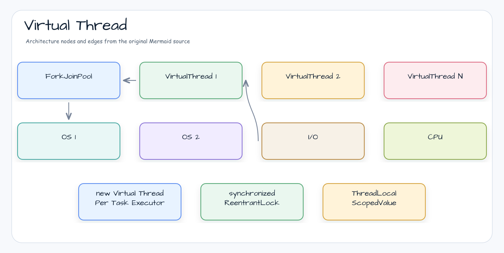
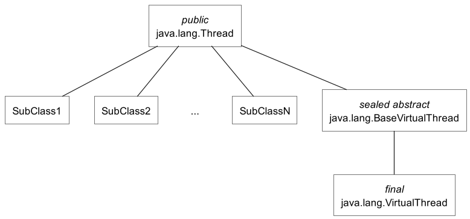

# Concurrent programming in Java with virtual threads

[English](README.md) | 한국어

## 예제 시나리오

이 예제는 **Concurrent programming in Java with virtual threads**를 실행 가능한 virtual-thread execution 워크샵 조각으로 다룹니다. 개발자가 먼저 확인할 경로인 모듈 설정, 샘플 또는 테스트 실행, 반복적인 인프라 코드를 줄이는 라이브러리 또는 프레임워크 API 관찰에 초점을 맞춥니다.

## 아키텍처 다이어그램


이 모듈은 샘플 진입점 또는 테스트 픽스처, bluetape4k 확장 계층, 예제에서 사용하는 런타임 의존성을 중심으로 구성됩니다. README와 코드를 비교할 때는 `io.bluetape4k.workshop.virtualthreads` 패키지를 기준으로 삼습니다.



## 흐름 다이어그램

1. `virtualthreads-rules`에 필요한 로컬 런타임을 준비합니다.
2. 예제 시나리오를 담당하는 애플리케이션, 컨트롤러, 서비스 또는 테스트 픽스처를 실행합니다.
3. 반복적인 인프라 작업을 bluetape4k 유틸리티 또는 Spring/Kotlin 통합에 위임합니다.
4. 샘플 출력, HTTP 응답, 저장소 상태, metric, trace 또는 테스트 기대값으로 보이는 결과를 검증합니다.


## 시퀀스 다이어그램

핵심 시퀀스는 호출자 또는 테스트 픽스처 -> 워크샵 어댑터 -> bluetape4k 헬퍼/API -> 외부 런타임 또는 인메모리 백엔드 -> 검증/응답 순서입니다. 전용 시퀀스 자산이 있는 모듈은 아래 이미지가 상호작용 순서를 보여주며, 그렇지 않은 경우 소스 테스트가 실행 가능한 시퀀스의 기준입니다.

## Virtual Thread 개념 구조


## 소개

Java _virtual threads_는 동시성 애플리케이션의 처리량을 높이기 위해 설계된 경량 스레드입니다. 기존 Java thread는 운영체제(OS) thread에 기반했으며, 현대적인 동시성 요구를 충족하기에는 한계가 있었습니다. 오늘날 서버는 수백만 개의 동시 요청을 처리해야 하지만, OS와 JVM은 몇천 개를 넘는 thread를 효율적으로 다루기 어렵습니다.

현재 프로그래머는 thread를 동시성 단위로 사용하고 thread-per-request 모델에서 동기식 blocking code를 작성할 수 있습니다. 이런 애플리케이션은 개발하기 쉽지만 OS thread 수가 제한되어 확장성이 떨어집니다. 또는 thread를 block하지 않고 재사용하는 다른 asynchronous/reactive 모델을 사용할 수 있습니다. 이런 애플리케이션은 확장성은 훨씬 좋지만 구현, debug, 이해가 훨씬 어렵습니다.

Project Loom 안에서 개발된 virtual threads는 이 딜레마를 해결할 수 있습니다. JVM이 관리하는 새로운 _virtual threads_를 OS가 관리하는 기존 _platform threads_와 함께 사용할 수 있습니다. Virtual threads는 kernel thread보다 메모리 사용량이 훨씬 가볍고, blocking과 context-switching overhead가 무시할 수 있을 정도로 작습니다. 프로그래머는 수백만 개의 virtual thread를 만들고, 훨씬 단순한 동기식 blocking code로 비슷한 확장성을 얻을 수 있습니다.

<sup>이 글의 모든 정보는 OpenJDK 21 기준입니다.</sup>

## 왜 virtual threads인가?

### 동시성과 병렬성

virtual threads가 무엇인지 설명하기 전에, 이것이 동시성 애플리케이션의 처리량을 어떻게 높이는지 설명해야 합니다. 먼저 동시성이 무엇이고 병렬성과 어떻게 다른지 짚어볼 필요가 있습니다.

_Parallelism_은 하나의 작업을 내부적으로 협력하는 하위 작업으로 나누고 여러 computing resource에 schedule해 가속하는 기법입니다. 병렬 애플리케이션에서는 _latency_(작업 처리에 걸리는 시간)에 가장 관심이 있습니다. 전문 image processor가 병렬 애플리케이션의 예입니다.

반대로 _Concurrency_는 외부에서 들어오는 여러 동시 작업을 여러 computing resource에 schedule하는 기법입니다. 동시성 애플리케이션에서는 _throughput_(단위 시간당 처리되는 작업 수)에 가장 관심이 있습니다. 서버가 동시성 애플리케이션의 예입니다.

### Little's Law

수학 이론에서 [Little's Law](https://www.google.com/search?q=Little%27s+Law)는 동시 시스템의 동작을 설명하는 정리입니다. _system_은 작업(customer, transaction, request)이 들어와 내부에서 시간을 보낸 뒤 나가는 임의의 경계를 뜻합니다. 이 정리는 작업이 무한 queue에 쌓이지 않고 같은 rate로 들어오고 나가는 _stable_ system에 적용됩니다. 또한 작업은 중단되지 않고 서로 간섭하지 않아야 합니다. 정리의 모든 변수는 확률적 변동이 무의미한 임의 기간의 장기 평균입니다.


이 정리는 이런 시스템에서 동시에 처리되는 작업 수 _L_(_capacity_)이 arrival rate _λ_(_throughput_)와 작업이 시스템에 머무는 시간 _W_(_latency_)의 곱과 같다고 말합니다.

L = λW

Little's Law는 임의 경계를 가진 모든 시스템에 적용되므로, 해당 시스템의 모든 subsystem에도 적용됩니다.

### 서버는 동시 시스템

Little's Law는 서버에도 적용됩니다. 서버는 요청을 처리하는 동시 시스템이며 여러 subsystem(CPU, memory, disc, network)을 포함합니다. 각 요청의 duration은 서버가 요청을 처리하는 방식에 따라 달라집니다. 프로그래머는 duration을 줄이려 할 수 있지만 결국 한계에 도달합니다. 잘 설계된 서버에서는 요청이 서로 간섭하지 않으므로 latency는 동시 요청 수에 거의 영향을 받지 않습니다. 각 요청의 latency는 서버의 고유 속성에 따라 결정되며 상수로 볼 수 있습니다. 따라서 서버 throughput은 주로 capacity의 함수입니다.

대부분의 서버에서 요청은 I/O-bound 작업을 실행합니다. 이런 서버는 CPU subsystem utilization 문제가 자주 발생합니다. OS가 더 이상 active thread를 지원하지 못하지만 CPU는 100% 사용되지 않을 때 이런 일이 생깁니다. CPU subsystem으로 이동하면 동시성 단위도 request에서 thread로 바뀝니다. 여기서는 thread-per-request 모델로 설계된 서버를 고려합니다.

이런 요청의 thread는 CPU를 짧게 사용하고 대부분의 시간을 blocking OS operation 완료를 기다리며 보냅니다. 대기 중인 thread가 block되면 scheduler는 CPU core를 전환해 다른 thread를 실행할 수 있습니다. 단순화하면 thread가 실행 시간의 1/N만 CPU를 사용한다면 단일 CPU core는 동시에 N개의 thread를 처리할 수 있습니다.

예를 들어 CPU가 24 core이고 총 request latency가 W=100 ms라고 합시다. 요청이 W<sub>CPU</sub>=10 ms를 사용한다면 CPU를 완전히 활용하려면 240 thread가 필요합니다. 요청이 훨씬 적은 computing resource를 필요로 하고 W<sub>CPU</sub>=0.1 ms만 사용한다면 CPU를 완전히 활용하려면 이미 24000 thread가 필요합니다. 하지만 mainstream OS는 주로 stack이 너무 크기 때문에 그 정도 active thread를 지원할 수 없습니다. 소비자급 컴퓨터는 요즘에도 active thread 5000개를 넘기기 어렵습니다. 따라서 I/O-bound request를 실행할 때 서버 computing resource는 자주 underutilized됩니다.

### User-mode threads가 해법

Loom Project 팀이 선택한 해법은 Go에서 쓰는 것과 유사한 user-mode thread를 구현하는 것입니다. 이 lightweight thread는 _virtual memory_에 비유해 _virtual threads_라고 이름 붙였습니다. 이 이름은 virtual threads가 computing resource를 효율적으로 활용하는 많고 저렴한 thread-like entity임을 암시합니다. Virtual threads는 OS kernel 대신 JVM이 구현하며, OS보다 더 작은 granularity로 stack을 관리합니다. 그래서 프로그래머는 최대 몇천 개의 thread 대신 단일 process 안에서 수백만 개의 thread를 가질 수 있습니다. 이 해법은 높은 throughput을 얻기 위해 Little's Law가 요구하는 뛰어난 concurrent capacity를 제공합니다.

## Platform threads와 virtual threads

OS에서 thread는 process에 속한 독립 실행 단위입니다. 각 thread는 실행 instruction counter와 call stack을 가지지만 같은 process 안의 다른 thread와 heap을 공유합니다. JVM에서 thread는 OS thread의 thin wrapper인 `Thread` class instance입니다. Thread에는 platform thread와 virtual thread 두 종류가 있습니다.

### Platform threads

_Platform threads_는 kernel-mode OS thread에 일대일로 mapping되는 kernel-mode thread입니다. OS는 OS thread, 따라서 platform thread를 schedule합니다. OS는 thread creation time, context switching time, platform thread 수에 영향을 줍니다. Platform thread는 보통 process _stack segment_에 page granularity로 할당된 큰 fixed-size stack을 가집니다. Linux x64에서 실행되는 JVM의 default stack size는 1 MB이므로 OS thread 1000개는 1 GB stack memory가 필요합니다. 따라서 사용할 수 있는 platform thread 수는 OS thread 수로 제한됩니다.

> Platform threads는 모든 유형의 작업 실행에 적합하지만, 오래 block되는 작업에 사용하면 제한된 resource를 낭비합니다.

### Virtual threads

_Virtual threads_는 kernel-mode OS thread에 many-to-many로 mapping되는 user-mode thread입니다. Virtual threads는 OS가 아니라 JVM이 schedule합니다. Virtual thread는 일반 Java object이므로 thread creation time과 context switching time이 무시할 만큼 작습니다. Virtual thread stack은 platform thread보다 훨씬 작고 dynamic size입니다. Virtual thread가 inactive일 때 stack은 JVM heap에 저장됩니다. 따라서 virtual thread 수는 OS 제한에 의존하지 않습니다.

> Virtual threads는 대부분의 시간을 blocked 상태로 보내는 작업 실행에 적합하며, long-running CPU-intensive operation 용도는 아닙니다.

Platform thread와 virtual thread의 정량적 차이 요약:

<table>
  <tr>
   <td>Parameter
   </td>
   <td>Platform threads
   </td>
   <td>Virtual threads
   </td>
  </tr>
  <tr>
   <td>stack size
   </td>
   <td>1 MB
   </td>
   <td>resizable
   </td>
  </tr>
  <tr>
   <td>startup time
   </td>
   <td>> 1000 µs
   </td>
   <td>1-10 µs
   </td>
  </tr>
  <tr>
   <td>context switching time
   </td>
   <td>1-10 µs
   </td>
   <td>~ 0.2 µs
   </td>
  </tr>
  <tr>
   <td>number
   </td>
   <td>&lt; 5000
   </td>
   <td>millions
   </td>
  </tr>
</table>

Virtual thread 구현은 continuation과 scheduler 두 부분으로 구성됩니다.

Continuation은 스스로 suspend했다가 나중에 resume될 수 있는 sequential code입니다. Continuation이 suspend되면 content를 저장하고 control을 외부로 넘깁니다. Continuation이 resume되면 control은 이전 context와 함께 마지막 suspending point로 돌아갑니다.

기본적으로 virtual threads는 work-stealing `ForkJoinPool` scheduler를 사용합니다. Scheduler는 pluggable이며 `Executor` interface를 구현하는 다른 scheduler를 대신 사용할 수 있습니다. Scheduler는 continuation을 schedule한다는 사실을 알 필요도 없습니다. Scheduler 관점에서는 `Runnable` interface를 구현한 ordinary task입니다. Scheduler는 _carrier threads_로 쓰이는 여러 platform thread pool 위에서 virtual threads를 실행합니다. 기본 초기 수는 사용 가능한 CPU core 수와 같고, 최대 수는 256입니다.

<sub>system property -Djdk.defaultScheduler.parallelism=N으로 애플리케이션을 실행하면 carrier thread 수가 바뀝니다.</sub>

Virtual thread가 blocking I/O method를 호출하면 scheduler는 다음 동작을 수행합니다.

* carrier thread에서 virtual thread를 _unmount_합니다
* continuation을 suspend하고 content를 저장합니다
* OS kernel에서 non-blocking I/O operation을 시작합니다
* scheduler는 같은 carrier thread에서 다른 virtual thread를 실행할 수 있습니다

OS kernel에서 I/O operation이 완료되면 scheduler는 반대 동작을 수행합니다.

* continuation content를 복원하고 resume합니다
* carrier thread가 사용 가능해질 때까지 기다립니다
* virtual thread를 carrier thread에 _mount_합니다

이 동작을 제공하기 위해 Java standard library의 blocking operation 대부분, 주로 I/O와 _java.util.concurrent_ package의 synchronization construct가 refactor되었습니다. 하지만 일부 operation은 아직 이 기능을 지원하지 않고 carrier thread를 _capture_합니다. 이 동작은 현재 OS 또는 JDK 제한 때문에 발생할 수 있습니다. OS thread capture는 scheduler에 carrier thread를 일시적으로 추가해 보상합니다.

Virtual thread가 carrier에 _pinned_된 경우 일부 blocking operation 중에는 unmount될 수 없습니다. 이는 virtual thread가 _synchronized_ block/method, _native method_, _foreign function_을 실행할 때 발생합니다. Pinning 중에는 scheduler가 carrier thread를 추가로 만들지 않으므로 빈번하고 긴 pinning은 scalability를 떨어뜨릴 수 있습니다.

## Virtual threads 사용법

Virtual threads는 `Thread` class의 subclass인 nonpublic `VirtualThread` class의 instance입니다.



`Thread` class에는 thread 생성과 시작을 위한 public constructor와 inner `Thread.Builder` interface가 있습니다. 이전 호환성을 위해 현재 `Thread` class의 모든 public constructor는 platform thread만 만들 수 있습니다. Virtual threads는 public constructor가 없는 class instance이므로 virtual thread를 만드는 유일한 방법은 builder를 사용하는 것입니다. Platform thread를 만들기 위한 유사한 builder도 있습니다.

`Thread` class에는 virtual threads를 다루는 새 method가 있습니다.

<table>
  <tr>
   <td>Modifier and type
   </td>
   <td>Method
   </td>
   <td>Description
   </td>
  </tr>
  <tr>
   <td><em>final boolean</em>
   </td>
   <td><em>isVirtual()</em>
   </td>
   <td>이 thread가 virtual thread이면 <em>true</em>를 반환합니다.
   </td>
  </tr>
  <tr>
   <td><em>static Thread.Builder.OfVirtual</em>
   </td>
   <td><em>ofVirtual()</em>
   </td>
   <td>virtual <em>Thread</em> 또는 virtual thread를 만드는 <em>ThreadFactory</em>를 생성하는 builder를 반환합니다.
   </td>
  </tr>
  <tr>
   <td><em>static Thread</em>
   </td>
   <td><em>startVirtualThread(Runnable)</em>
   </td>
   <td>task를 실행할 virtual thread를 만들고 실행하도록 schedule합니다.
   </td>
  </tr>
</table>

Virtual threads를 사용하는 방법은 네 가지입니다.

* thread builder
* static factory method
* thread factory
* executor service

Virtual thread builder를 사용하면 이름, _inheritable-thread-local variables_ inheritance flag, uncaught exception handler, `Runnable` task 등 사용 가능한 모든 parameter로 virtual thread를 만들 수 있습니다. Virtual thread는 _daemon_ thread이며 priority를 변경할 수 없습니다.

```java
Thread.Builder builder = Thread.ofVirtual()
        .name("virtual thread")
        .inheritInheritableThreadLocals(false)
        .uncaughtExceptionHandler((t, e) -> System.out.printf("thread %s failed with exception %s", t, e));

assertEquals("java.lang.ThreadBuilders$VirtualThreadBuilder",builder.getClass().

getName());

Thread thread = builder.unstarted(() -> System.out.println("run"));

assertEquals("java.lang.VirtualThread",thread.getClass().

getName());

assertEquals("virtual thread",thread.getName());

assertTrue(thread.isDaemon());

assertEquals(5,thread.getPriority());
```

<sub>Platform thread builder에서는 thread group, <em>daemon</em> flag, priority, stack size 같은 추가 parameter를 지정할 수 있습니다. </sub>

Static factory method를 사용하면 `Runnable` task만 지정해 default parameter를 가진 virtual thread를 만들 수 있습니다. 기본적으로 virtual thread name은 비어 있습니다.

```java
Thread thread = Thread.ofVirtual().start(() -> System.out.println("run"));
thread.join();

assertEquals("java.lang.VirtualThread",thread.getClass().getName());

assertTrue(thread.isVirtual());

assertEquals("",thread.getName());
```

Thread factory를 사용하면 `ThreadFactory.newThread(Runnable)` method에 `Runnable` task를 지정해 virtual thread를 만들 수 있습니다. Virtual thread의 parameter는 이 thread factory가 생성된 thread builder의 current state로 지정됩니다. Thread factory는 thread-safe이지만 thread builder는 그렇지 않습니다.

```java
Thread.Builder builder = Thread.ofVirtual()
        .name("virtual thread");

ThreadFactory factory = builder.factory();

assertEquals("java.lang.ThreadBuilders$VirtualThreadFactory",factory.getClass().

getName());
Thread thread = factory.newThread(() -> System.out.println("run"));

assertEquals("java.lang.VirtualThread",thread.getClass().

getName());

assertTrue(thread.isVirtual());

assertEquals("virtual thread",thread.getName());

assertEquals(Thread.State.NEW, thread.getState());
```

Executor service를 사용하면 `ExecutorService` interface의 unbounded, thread-per-task instance에서 `Runnable`과 `Callable` task를 실행할 수 있습니다.

```java
try(ExecutorService executorService = Executors.newVirtualThreadPerTaskExecutor()){

assertEquals("java.util.concurrent.ThreadPerTaskExecutor",executorService.getClass().

getName());

Future<?> future = executorService.submit(() -> System.out.println("run"));
   future.

get();
}
```

## Virtual threads를 올바르게 사용하는 방법

Project Loom 팀은 virtual thread class를 기존 `Thread` class의 sibling class로 만들지 subclass로 만들지 선택해야 했습니다. 두 번째 option을 선택했기 때문에 기존 code는 거의 변경 없이 virtual threads를 사용할 수 있습니다. 하지만 이 trade-off의 결과로 platform threads에서 널리 쓰던 일부 기능은 virtual threads에 쓸모없거나 해로울 수 있습니다. 알려진 함정을 알고 피하는 책임은 이제 programmer에게 있습니다.

### CPU-bound task에는 virtual threads를 사용하지 마세요

Platform thread용 OS scheduler는 _preemptive<sup>*</sup>_입니다. OS scheduler는 _time slices_를 사용해 platform thread를 suspend하고 resume합니다. 따라서 CPU-bound task를 실행하는 여러 platform thread는 아무도 명시적으로 yield하지 않아도 결국 progress를 보입니다.

Virtual threads 설계가 _preemptive_ scheduler 사용을 금지하는 것은 아닙니다. 하지만 기본 work-stealing scheduler는 _non-preemptive_이며 _non-cooperative_입니다. Project Loom 팀이 유용한 실제 scenario를 찾지 못했기 때문입니다. 그래서 현재 virtual threads는 I/O나 Java standard library가 지원하는 다른 operation에서 block될 때만 suspend될 수 있습니다. CPU-bound task로 virtual thread를 시작하면 해당 thread는 task가 끝날 때까지 carrier thread를 독점하고, 다른 virtual thread는 _starvation_을 겪을 수 있습니다.

<sub>*see "Modern Operating Systems", 4th edition by Andrew S. Tanenbaum and Herbert Bos, 2015.</sub>

### Thread-per-request 모델에서 blocking synchronous code를 작성하세요

Platform thread를 block하는 것은 제한된 computing resource를 낭비하므로 비쌉니다. 모든 computing resource를 완전히 활용하려면 thread-per-request 모델을 포기해야 합니다. 보통 asynchronous pipeline 모델을 사용하며, 이 모델에서는 서로 다른 stage의 task가 서로 다른 thread에서 실행됩니다. 이런 asynchronous solution은 thread를 block하지 않고 재사용하므로 더 scalable한 concurrent application을 작성할 수 있습니다.

단점은 이런 애플리케이션이 훨씬 개발하기 어렵다는 점입니다. 전체 Java platform은 thread를 동시성 단위로 사용하도록 설계되어 있습니다. Java programming language에서 control flow(branch, cycle, method call, _try/catch/finally_)는 thread 안에서 실행됩니다. Exception은 thread 안에서 error가 발생한 위치를 보여주는 stack trace를 가집니다. Java tools(debugger, profiler)는 thread를 execution context로 사용합니다. Thread-per-request 모델에서 asynchronous model로 전환하면 programmer는 이 모든 장점을 잃습니다.

반대로 virtual thread를 block하는 것은 저렴하며, 사실 이것이 virtual thread의 핵심 설계 기능입니다. Blocked virtual thread가 operation 완료를 기다리는 동안 carrier thread와 underlying OS thread는 대부분의 경우 실제로 block되지 않습니다. 이를 통해 programmer는 Java platform과 가장 조화로운 thread-per-request 모델에서 단순하면서도 scalable한 concurrent application을 작성할 수 있습니다.

[code examples](https://github.com/aliakh/demo-java-virtual-threads/blob/main/src/test/java/virtual_threads/part2/readme.md#write-blocking-synchronous-code-in-the-thread-per-task-style)

### Virtual threads를 pool로 관리하지 마세요

Platform thread 생성은 OS thread 생성이 필요하므로 꽤 오래 걸립니다. Thread pool은 여러 task 실행 사이에서 thread를 재사용해 이 시간을 줄이도록 설계되었습니다. Thread pool은 worker thread pool을 포함하며, `Runnable`과 `Callable` task는 queue를 통해 제출됩니다.

Platform thread 생성과 달리 virtual thread 생성은 빠릅니다. 따라서 virtual thread pool을 만들 필요가 없습니다. Network call처럼 작은 작업에도 task마다 새 virtual thread를 만들어야 합니다. 애플리케이션에 `ExecutorService` instance가 필요하다면 `Executors.newVirtualThreadPerTaskExecutor()` static factory method가 반환하는 virtual thread 전용 구현을 사용해야 합니다. 이 executor는 thread pool을 사용하지 않고 제출된 task마다 새 virtual thread를 만듭니다. 또한 executor 자체도 lightweight이므로 _try-with-resources_ block 안의 어떤 code에서도 만들고 닫을 수 있습니다.

[code examples](https://github.com/aliakh/demo-java-virtual-threads/blob/main/src/test/java/virtual_threads/part2/readme.md#do-not-pool-virtual-threads)

### Concurrency 제한에는 fixed thread pool 대신 semaphore를 사용하세요

Thread pool의 주된 목적은 여러 task 실행 사이에서 thread를 재사용하는 것입니다. Task가 thread pool에 제출되면 queue에 삽입됩니다. Worker thread가 queue에서 task를 꺼내 실행합니다. _fixed number_의 worker thread를 가진 thread pool을 사용하는 추가 목적은 특정 operation의 concurrency를 제한하는 것일 수 있습니다. 이런 thread pool은 external resource가 미리 정한 수보다 많은 concurrent request를 처리할 수 없을 때 사용할 수 있습니다.

하지만 virtual thread를 재사용할 필요가 없으므로 virtual thread에는 thread pool을 사용할 필요도 없습니다. 대신 같은 수의 permit을 가진 `Semaphore`로 concurrency를 제한해야 합니다. Thread pool에 task [queue](https://github.com/openjdk/jdk21/blob/master/src/java.base/share/classes/java/util/concurrent/ThreadPoolExecutor.java#L454)가 있듯이, semaphore에는 synchronizer에서 blocked된 thread의 [queue](https://github.com/openjdk/jdk21/blob/master/src/java.base/share/classes/java/util/concurrent/locks/AbstractQueuedSynchronizer.java#L319)가 있습니다.

[code examples](https://github.com/aliakh/demo-java-virtual-threads/blob/main/src/test/java/virtual_threads/part2/readme.md#use-semaphores-instead-of-fixed-thread-pools-to-limit-concurrency)

### Thread-local variable은 신중히 사용하거나 scoped values로 전환하세요

Virtual thread의 scalability를 더 잘 얻으려면 _thread-local variables_와 _inheritable-thread-local variables_ 사용을 재검토해야 합니다. Thread-local variable은 각 thread에 variable의 자체 copy를 제공하고, inheritable-thread-local variable은 parent thread에서 child thread로 이 variable을 추가로 copy합니다. Thread-local variable은 보통 생성 비용이 큰 mutable object를 cache하는 데 사용됩니다. 또한 intermediate method sequence를 통해 thread-bound parameter와 return value를 암묵적으로 전달하는 데도 사용됩니다.

Virtual threads는 Project Loom 팀의 많은 검토 끝에 platform thread와 같은 방식으로 thread-local behavior를 지원합니다. 하지만 virtual thread는 훨씬 많을 수 있으므로 thread-local variable의 다음 특성이 더 큰 부정적 영향을 줄 수 있습니다.

* _unconstrained mutability_ (thread-local variable의 _get_ method를 호출할 수 있는 어떤 code도, thread-local variable 안의 object가 immutable이어도 그 variable의 _set_ method를 호출할 수 있습니다)
* _unbounded lifetime_ (thread-local variable copy가 _set_ method로 설정되면 thread 수명 동안, 또는 thread code가 _remove_ method를 호출할 때까지 값이 유지됩니다)
* _expensive inheritance_ (각 child thread는 parent thread의 _inheritable-thread-local variables_를 재사용하지 않고 copy합니다)

때로는 _scoped values_가 thread-local variable보다 나은 대안이 될 수 있습니다. Thread-local variable과 달리 scoped value는 한 번만 쓰이고, 제한된 context 안에서만 사용할 수 있으며, _structured concurrency_ scope에서 상속됩니다.

[code examples](https://github.com/aliakh/demo-java-virtual-threads/blob/main/src/test/java/virtual_threads/part2/readme.md#use-thread-local-variables-carefully-or-switch-to-scoped-values)

### Synchronized block과 method는 신중히 사용하거나 reentrant lock으로 전환하세요

Virtual threads를 사용한 scalability를 높이려면 빈번하고 오래 지속되는 _pinning_(예: I/O operation)을 피하도록 _synchronized_ block과 method를 재검토해야 합니다. 이런 operation이 짧거나(in-memory operation 등) 드물다면 pinning은 문제가 되지 않습니다. 대안으로 _synchronized_ block 또는 method를 상호 배타적 access를 보장하는 `ReentrantLock`으로 바꿀 수 있습니다.

<sub>system property <em>-Djdk.tracePinnedThreads=full</em>로 애플리케이션을 실행하면 thread가 pinned 상태에서 block될 때 native frame과 monitor를 가진 frame을 강조한 complete stack trace를 출력하고, system property <em>-Djdk.tracePinnedThreads=short</em>로 실행하면 문제가 되는 stack frame만 출력합니다.</sub>

[code examples](https://github.com/aliakh/demo-java-virtual-threads/blob/main/src/test/java/virtual_threads/part2/readme.md#use-synchronized-blocks-and-methods-carefully-or-switch-to-reentrant-locks)

## 결론

Virtual threads는 programmer가 잘 알려진 `Thread` class로 수백만 개의 동시성 단위를 만들 수 있는 high-throughput concurrent application 개발을 위해 설계되었습니다. Virtual threads는 I/O-intensive operation이 있는 애플리케이션에서 platform thread를 대체하기 위한 것입니다.

Virtual threads를 기존 `Thread` class의 subclass로 구현한 것은 trade-off였습니다. 장점은 대부분의 기존 concurrent code가 최소 변경으로 virtual threads를 사용할 수 있다는 점입니다. 단점은 일부 Java concurrency construct가 virtual threads에는 이롭지 않다는 점입니다. 이제 virtual threads를 올바르게 사용하는 것은 programmer의 책임입니다. 이는 주로 thread pool, thread-local variable, `synchronized` block/method에 관한 것입니다. Thread pool 대신 task마다 새 virtual thread를 만들어야 합니다. Thread-local variable은 주의해서 사용하고 가능하다면 scoped value로 대체해야 합니다. 애플리케이션의 길고 자주 사용되는 method에서 _pinning_을 피하도록 `synchronized`를 재검토해야 합니다. 마지막으로 애플리케이션에서 사용하는 third-party library는 해당 owner가 virtual threads와 호환되도록 refactor해야 합니다.

전체 code example은 [GitHub repository](https://github.com/aliakh/demo-java-virtual-threads)에 있습니다.
