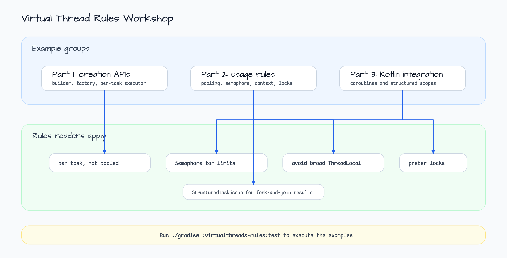

# Virtual Thread Rules

[English](README.md) | 한국어

이 모듈은 Java virtual thread와 bluetape4k virtual-thread helper를 실행 가능한
예제로 정리합니다. 테스트는 virtual thread 생성법, blocking code를 동기 코드로
유지해도 되는 경우, 그리고 platform-thread 습관 중 virtual-thread code에 그대로
옮기면 안 되는 지점을 보여줍니다.

## 아키텍처



## Example Groups

| Group | Files | Reader question |
|---|---|---|
| Part 1: creation APIs | `Example1` to `Example5` | Builder, factory, per-task executor로 virtual thread를 어떻게 생성하나? |
| Part 2: usage rules | `Rule2` to `Rule6` | Pooling, fixed pool, `ThreadLocal`, `synchronized`를 언제 피해야 하나? |
| Part 3: Kotlin integration | `CoroutineWithVirtualThread`, `StructuredConcurrencyExamples` | Virtual thread가 coroutine dispatcher와 structured task scope와 어떻게 맞물리나? |

## Key Rules

- Virtual thread를 pooling하지 말고 `Executors.newVirtualThreadPerTaskExecutor()`를 사용합니다.
- 동시성 제한은 fixed virtual-thread pool 대신 `Semaphore`로 표현합니다.
- 넓은 `ThreadLocal` 상속보다 scoped value 또는 명시적 context를 선호합니다.
- Virtual-thread-aware code에서는 `synchronized`보다 `ReentrantLock`/`withLock`을 선호합니다.
- 여러 forked subtask의 결과를 합쳐야 하면 structured task scope를 사용합니다.

## 테스트

```bash
./gradlew :virtualthreads-rules:test
```
