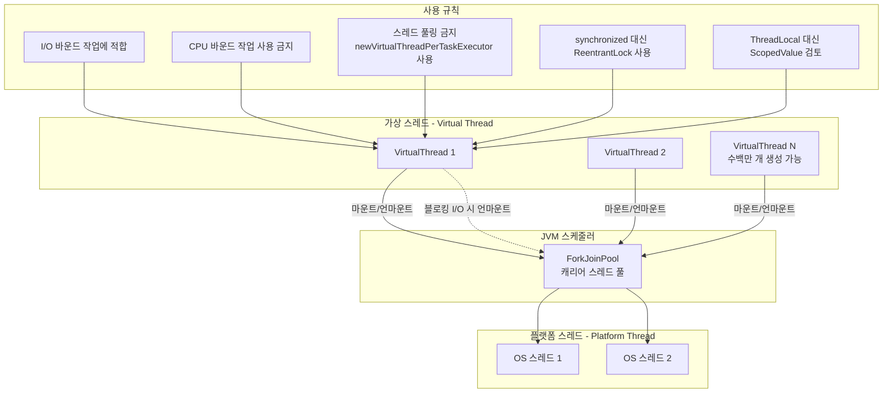

# Java에서 가상 스레드를 사용한 동시성 프로그래밍

## Virtual Thread 개념 구조



## 소개

Java 가상 스레드는 동시 애플리케이션의 처리량을 높이기 위해 설계된 경량 스레드입니다.

기존의 Java 스레드는 운영 체제(OS) 스레드에 기반하고 있어 최신 동시성 요구 사항을 충족하기에는 불충분한 것으로 판명되었습니다.
오늘날 서버는 수백만 건의 동시 요청을 처리해야 하지만, OS와 JVM은 수천 개 이상의 스레드를 효율적으로 처리할 수 없습니다.

현재 프로그래머는 스레드를 동시성 단위로 사용하거나 요청당 스레드 모델에서 동기식 차단 코드를 작성할 수 있습니다.
이러한 애플리케이션은 개발하기는 쉽지만 OS 스레드 수가 제한되어 있기 때문에 확장성이 떨어집니다.
또는 프로그래머는 스레드를 차단하지 않고 재사용하는 다른 비동기/리액티브 모델을 사용할 수 있습니다.
이러한 애플리케이션은 확장성이 훨씬 뛰어나지만 구현, 디버깅, 이해하기가 훨씬 더 어렵습니다.

Project Loom 내부에서 개발된 가상 스레드는 이러한 딜레마를 해결할 수 있습니다.
JVM에서 관리하는 새로운 가상 스레드를 OS에서 관리하는 기존 플랫폼 스레드와 함께 사용할 수 있습니다.
가상 스레드는 커널 스레드보다 메모리 사용량이 훨씬 가볍고, 차단 및 컨텍스트 전환 오버헤드도 무시할 수 있을 정도로 적습니다.
프로그래머는 훨씬 간단한 동기식 차단 코드를 사용하여 수백만 개의 가상 스레드를 생성하고 유사한 확장성을 달성할 수 있습니다.

이 글의 모든 정보는 OpenJDK 21에 해당합니다.

## 왜 가상 스레드인가?

### 동시성과 병렬 처리

가상 스레드가 무엇인지 설명하기 전에 가상 스레드가 동시 애플리케이션의 처리량을 어떻게 증가시킬 수 있는지 설명해야 합니다.
우선 동시성이란 무엇이며 병렬 처리와 어떻게 다른지 설명할 필요가 있습니다.

_병렬 처리_ 는 단일 작업을 내부적으로 여러 컴퓨팅 리소스에서 예약된 협력 하위 작업으로 분할하여 가속화하는 기술입니다.
병렬 애플리케이션에서는 지연 시간(시간 단위의 작업 처리 기간)에 가장 관심이 많습니다. 병렬 애플리케이션의 예로 특수 이미지 프로세서를 들 수 있습니다.

이와 대조적으로 _동시성_ 은 외부에서 들어오는 여러 개의 동시 작업을 여러 컴퓨팅 리소스에서 예약하는 기술입니다.
동시 애플리케이션에서는 처리량(시간 단위당 처리되는 작업 수)에 가장 관심이 많습니다.
동시 애플리케이션의 예로 서버를 들 수 있습니다.

### Little's Law

수학 이론에서 [리틀의 법칙](https://www.google.com/search?q=Little%27s+Law)은 동시 시스템의 동작을 설명하는 정리입니다.
시스템이란 작업(고객, 트랜잭션 또는 요청)이 도착하여 그 안에서 시간을 보낸 후 나가는 임의의 경계를 의미합니다.
이 정리는 작업이 무한 대기열에 쌓이는 것이 아니라 동일한 속도로 들어오고 나가는 안정적인 시스템에 적용됩니다.
또한 작업은 중단되지 않고 서로 간섭하지 않아야 합니다. (정리의 모든 변수는 임의의 기간 동안의 장기 평균을 의미하며, 그 안에서 확률적 변화는 무관합니다).


이 정리는 이러한 시스템에서 동시에 처리되는 작업의 수 _L_(_용량_)은 다음과 같다는 것을 나타냅니다.
도착률 _λ_(_처리량_)에 작업이 시스템에서 소요되는 시간 _W_(_지연 시간_)를 곱한 값과 같습니다:

L = λW

리틀의 법칙은 임의의 경계를 가진 모든 시스템에 적용되므로 해당 시스템의 모든 하위 시스템에도 적용됩니다.

### 서버는 동시 시스템

리틀의 법칙은 서버에도 적용됩니다. 서버는 요청을 처리하는 동시 시스템으로 여러 개의
하위 시스템(CPU, 메모리, 디스크, 네트워크)을 포함합니다. 각 요청의 지속 시간은 서버가 요청을 처리하는 방식에 따라 달라집니다.
프로그래머는 기간을 줄이려고 노력할 수 있지만 결국 한계에 도달하게 됩니다. 잘 설계된 서버에서는 요청이 서로 간섭하지 않으므로
지연 시간은 동시 요청 수에 거의 영향을 받지 않습니다. 각 요청의 지연 시간은 서버의 고유 속성에 따라 달라지며 일정한 것으로 간주할 수 있습니다.
따라서 서버의 처리량은 주로 용량의 함수입니다.

대부분의 서버에서 요청은 I/O 바운드 작업을 실행합니다. 이러한 서버는 CPU 사용률에 문제가 있는 경우가 많습니다.
이는 OS가 더 이상 더 많은 활성 스레드를 지원할 수 없지만 CPU가 100% 사용되지 않을 때 발생합니다.
CPU 하위 시스템으로 이동하면 동시성 단위도 요청에서 스레드로 이동합니다. (요청당 스레드 모델을 기반으로 설계된 서버의 경우).

이러한 요청에서 스레드는 CPU를 짧은 시간 동안 사용하고 대부분의 시간을 차단된 OS 작업이 완료되기를 기다리는 데 사용합니다.
대기 중인 스레드가 차단되면, 스케줄러는 CPU 코어를 전환하여 다른 스레드를 실행할 수 있습니다.
단순화하면, 스레드가 실행 시간의 1/N만큼만 CPU를 사용한다면, 단일 CPU 코어는 동시에 N개의 스레드를 처리할 수 있습니다.

예를 들어, CPU에는 24개의 코어가 있고 총 요청 지연 시간은 W=100ms입니다.
요청이 W<sub>CPU</sub>=10ms를 소비한다면, CPU를 완전히 활용하기 위해서는 240개의 스레드가 필요합니다.
요청이 훨씬 적은 계산 자원을 필요로 하고 W<sub>CPU</sub>=0.1ms를 소비한다면, CPU를 완전히 활용하기 위해서는 이미 24000개의 스레드가 필요합니다.

그러나 주류 OS는 주로 스택이 너무 크기 때문에 이러한 수의 활성 스레드를 지원할 수 없습니다.
(현재의 소비자용 컴퓨터는 거의 5000개 이상의 활성 스레드를 지원하지 않습니다.)
따라서 서버의 계산 자원은 I/O 바운드 요청을 실행할 때 종종 활용되지 않습니다.

### 사용자 모드 스레드가 해결책

Loom 프로젝트 팀이 선택한 해결책은 Go에서 사용되는 것과 유사한 사용자 모드 스레드를 구현하는 것입니다.
이 경량 스레드를 _가상 메모리_ 에 비유하여 _가상 스레드_ 라고 명명했습니다.
이 이름은 가상 스레드가 계산 리소스를 효율적으로 활용하는 수많은 저렴한 스레드 유사 엔티티임을 의미합니다.

가상 스레드는 (OS 커널 대신) JVM에 의해 구현되며, 스택을 OS보다 낮은 단위로 관리합니다.
따라서 프로그래머는 기껏해야 몇 천 개의 스레드 대신 단일 프로세스에서 수백만 개의 스레드를 사용할 수 있습니다.
이 솔루션은 리틀의 법칙에 따라 높은 처리량을 달성하기 위해 필요한 뛰어난 동시 처리 능력을 제공합니다.

## 플랫폼 스레드와 가상 스레드

OS에서 스레드는 프로세스에 속하는 독립적인 실행 단위입니다.
각 스레드에는 실행 명령어 카운터와 호출 스택을 가지고 있지만 같은 프로세스에 있는 다른 스레드와 힙을 공유합니다.
JVM에서 스레드는 `Thread` 클래스의 인스턴스이며, 이는 OS 스레드를 위한 얇은 래퍼입니다.
스레드에는 플랫폼 스레드와 가상 스레드의 두 가지 종류가 있습니다.

### 플랫폼 스레드

_플랫폼 스레드_ 는 커널 모드 OS 스레드에 일대일로 매핑된 커널 모드 스레드입니다.
OS는 OS 스레드와 플랫폼 스레드를 스케줄합니다. OS는 스레드 생성 시간과 컨텍스트 전환 시간뿐만 아니라 플랫폼 스레드의 수에 영향을 미칩니다.
플랫폼 스레드는 일반적으로 프로세스 _스택 세그먼트_ 에 할당된 고정된 크기의 큰 스택이 페이지 단위로 할당됩니다.
(Linux x64에서 실행되는 JVM의 경우 기본 스택 크기는 1MB이므로 OS 스레드 1000개에는 1GB의 스택 메모리가 필요합니다).
따라서 사용 가능한 플랫폼 스레드 수는 OS 스레드 수로 제한됩니다.

> 플랫폼 스레드는 모든 유형의 작업을 실행하는 데 적합하지만, 장시간 차단(Blocking)하는 작업에 사용하면 제한된 리소스를 낭비하게 됩니다.

### 가상 스레드

_가상 스레드_ 는 커널 모드 OS 스레드에 다대다로 매핑된 사용자 모드 스레드입니다.
가상 스레드는 OS가 아닌 JVM에 의해 스케줄링됩니다.
가상 스레드는 일반 Java 객체이므로 스레드 생성 시간 및 컨텍스트 전환 시간은 무시할 수 있습니다.
가상 스레드의 스택은 플랫폼 스레드보다 훨씬 작으며 동적으로 크기가 조절됩니다.
(가상 스레드가 비활성 상태일 때는 스택이 JVM 힙에 저장됩니다).
따라서 가상 스레드의 수는 OS의 제한에 좌우되지 않습니다.

> 가상 스레드는 대부분의 시간을 차단된(blocked) 상태로 보내는 작업을 실행하는 데 적합하며 장시간 실행되는 CPU 집약적인 작업에는 적합하지 않습니다.

플랫폼 스레드와 가상 스레드의 양적 차이 요약:

<table>
  <tr>
   <td>파라미터</td>
   <td>플랫폼 스레드</td>
   <td>가상 스레드</td>
  </tr>
  <tr>
   <td>스택 크기</td>
   <td>1 MB</td>
   <td>가변 크기</td>
  </tr>
  <tr>
   <td>시작 시간</td>
   <td>&gt; 1000 µs</td>
   <td>1-10 µs</td>
  </tr>
  <tr>
   <td>컨텍스트 전환 시간</td>
   <td>1-10 µs</td>
   <td>~ 0.2 µs</td>
  </tr>
  <tr>
   <td>최대 수</td>
   <td>&lt; 5000</td>
   <td>수백만 개</td>
  </tr>
</table>

가상 스레드의 구현은 연속성(Continuation)과 스케줄러의 두 부분으로 구성됩니다.

_Continuation_ 은 자체적으로 일시 중단되었다가 나중에 다시 재개할 수 있는 순차 코드입니다.
_Continuation_ 이 일시 중단되면 컨텍스트를 저장하고 제어권을 외부로 전달합니다.
_Continuation_ 이 재개되면 제어는 이전 컨텍스트의 마지막 일시 중단 지점으로 돌아갑니다.

기본적으로 가상 스레드는 작업 훔치기 `ForkJoinPool` 스케줄러를 사용합니다.
이 스케줄러는 플러그 가능하며, `Executor` 인터페이스를 구현하는 다른 스케줄러를 대신 사용할 수 있습니다.
스케줄러는 Continuation을 스케줄링하고 있다는 사실조차 알 필요가 없습니다.
스케줄러의 관점에서 볼 때, 이들은 `Runnable` 인터페이스를 구현하는 일반 작업입니다.
스케줄러는 _캐리어 스레드_ 로 사용되는 여러 플랫폼 스레드 풀에서 가상 스레드를 실행합니다.
기본적으로, 이들의 초기 수는 사용 가능한 CPU 코어 수와 같으며 최대 수는 256입니다.

<sub>시스템 속성 `-Djdk.defaultScheduler.parallelism=N` 으로 애플리케이션을 실행하면 캐리어 스레드 수가 변경됩니다.</sub>

가상 스레드가 Blocking I/O 메서드를 호출하면 스케줄러는 다음 작업을 수행합니다:

* 캐리어 스레드에서 가상 스레드를 _언마운트_ 합니다.
* Continuation을 일시 중지하고 컨텍스트를 저장합니다.
* OS 커널에서 Non-Blocking I/O 작업을 시작합니다.
* 스케줄러는 동일한 캐리어 스레드에서 다른 가상 스레드를 실행할 수 있습니다.

OS 커널에서 I/O 작업이 완료되면 스케줄러는 반대 작업을 수행합니다:

* Continuation의 실행 정보를 복원하고 다시 실행을 시작합니다.
* 캐리어 스레드가 가용할 때까지 대기합니다.
* 가상 스레드를 캐리어 스레드에 마운트합니다.

이 동작을 제공하기 위해 Java 표준 라이브러리의 대부분의 차단 작업(주로 I/O 및 `java.util.concurrent` 패키지의 동기화 구조체)이 리팩터링되었습니다.
그러나 일부 작업은 아직 지원하지 않고 대신 캐리어 스레드를 _캡처_ 합니다.
이 동작은 OS 또는 JDK의 현재 제한 사항 때문에 발생할 수 있습니다.
OS 스레드 캡처는 일시적으로 캐리어 스레드를 스케줄러에 추가하여 보완됩니다.

가상 스레드가 캐리어에 _고정(pinned)_ 되어 있는 경우 일부 차단 작업 중에는 언마운트할 수 없습니다.
이는 가상 스레드가 _synchronized_ 블록/메서드, _네이티브 메서드_, 또는 _외부 함수_ 를 실행할 때 발생합니다.
고정하는 동안 스케줄러는 추가 캐리어 스레드를 생성하지 않으므로 고정이 빈번하고 길면 확장성이 저하될 수 있습니다.

## 가상 스레드 사용법

가상 스레드는 `Thread` 클래스의 서브클래스인 private `VirtualThread` 클래스의 인스턴스입니다.


`Thread` 클래스에는 스레드 생성 및 시작을 위한 공용 생성자와 내부 `Thread.Builder` 인터페이스가 있습니다.
이전 버전과의 호환성을 위해 현재 `Thread` 클래스의 모든 공용 생성자는 플랫폼 스레드만 생성할 수 있습니다.
가상 스레드는 공용 생성자가 없는 클래스의 인스턴스이므로 가상 스레드를 생성하는 유일한 방법은 빌더를 사용하는 것입니다.
(플랫폼 스레드 생성을 위한 유사한 빌더가 존재합니다).

`Thread` 클래스에는 가상 스레드를 처리하는 새로운 메서드가 있습니다:

<table>
  <tr>
   <td>수정자 및 반환 타입</td>
   <td>메서드</td>
   <td>설명</td>
  </tr>
  <tr>
   <td><em>final boolean</em></td>
   <td><em>isVirtual()</em></td>
   <td>이 스레드가 가상 스레드이면 <em>true</em>를 반환합니다.</td>
  </tr>
  <tr>
   <td><em>static Thread.Builder.OfVirtual</em></td>
   <td><em>ofVirtual()</em></td>
   <td>가상 스레드 또는 가상 스레드를 생성하는 <em>ThreadFactory</em>를 만들기 위한 빌더를 반환합니다.</td>
  </tr>
  <tr>
   <td><em>static Thread</em></td>
   <td><em>startVirtualThread(Runnable)</em></td>
   <td>작업을 실행하기 위한 가상 스레드를 생성하고 실행을 스케줄합니다.</td>
  </tr>
</table>

가상 스레드를 사용하는 4가지 방법은 다음과 같습니다:

* 스레드 빌더 (Thread Builder)
* 정적 팩토리 메서드 (Static Factory Method)
* 스레드 팩토리 (Thread Factory)
* 실행자 서비스 (Executor Service)

가상 스레드 빌더를 사용하면 사용 가능한 모든 매개변수인 이름, _상속 가능한 스레드-로컬 변수_ 상속 플래그, 잡히지 않은 예외 처리기, `Runnable` 태스크로 가상 스레드를 생성할 수 있습니다.
(참고로 가상 스레드는 _데몬_ 스레드이며 우선순위는 변경할 수 없습니다.)

```kotlin
val builder = Thread.ofVirtual()
    .name("virtual thread")
    .inheritInheritableThreadLocals(false)
    .uncaughtExceptionHandler { t, e -> println("thread $t failed with exception $e") }

builder.javaClass.name shouldBeEqualTo "java.lang.ThreadBuilders\$VirtualThreadBuilder"

val thread = builder.unstarted { println("run") }
thread.javaClass.name shouldBeEqualTo "java.lang.VirtualThread"
thread.name shouldBeEqualTo "virtual thread"
thread.isDaemon shouldBeEqualTo true
thread.priority shouldBeEqualTo 5
```

<sub>플랫폼 스레드 빌더에서 스레드 그룹, 데몬 플래그, 우선순위, 스택 크기 등의 추가 매개변수를 지정할 수 있습니다.</sub>

정적 팩토리 메서드를 사용하면 기본 매개변수가 있는 가상 스레드를 만들 수 있으며, `Runnable` 태스크만 지정하면 됩니다.
(기본적으로 가상 스레드 이름은 비어 있습니다).

```kotlin
val thread = Thread.ofVirtual().start { println("run") }
thread.join()

thread.javaClass.name shouldBeEqualTo "java.lang.VirtualThread"
thread.isVirtual.shouldBeTrue()
thread.name.shouldBeEmpty()
```

스레드 팩토리를 사용하면 `ThreadFactory.newThread(Runnable)` 메서드에 `Runnable` 태스크를 지정하여 가상 스레드를 생성할 수 있습니다.
가상 스레드의 매개변수는 이 스레드 팩토리가 생성된 스레드 빌더의 현재 상태에 따라 지정됩니다.
(스레드 팩토리는 스레드에 안전하지만 스레드 빌더는 그렇지 않습니다).

```kotlin
val builder = Thread.ofVirtual().name("virtual thread")
val factory = builder.factory()
factory.javaClass.name shouldBeEqualTo "java.lang.ThreadBuilders\$VirtualThreadFactory"

val thread = factory.newThread { println("run") }
thread.javaClass.name shouldBeEqualTo "java.lang.VirtualThread"
thread.isVirtual.shouldBeTrue()
thread.name shouldBeEqualTo "virtual thread"
thread.state shouldBeEqualTo Thread.State.NEW
```

실행자 서비스를 사용하면 `ExecutorService` 인터페이스의 무한, 태스크당 스레드 인스턴스에서 `Runnable` 및 `Callable` 태스크를 실행할 수 있습니다.

```kotlin
Executors.newVirtualThreadPerTaskExecutor().use { executorService ->
    executorService.javaClass.name shouldBeEqualTo "java.util.concurrent.ThreadPerTaskExecutor"

    val future = executorService.submit { println("run") }
    future.get()
}
```

## 가상 스레드를 올바르게 사용하는 방법

Project Loom 팀은 가상 스레드 클래스를 형제 클래스로 만들지, 아니면 기존 `Thread` 클래스의 서브클래스로 만들지 선택해야 했습니다.
두 번째 옵션을 선택했고, 이제 기존 코드에서 가상 스레드를 거의 변경하지 않고 사용할 수 있습니다.
그러나 이러한 절충의 결과로 플랫폼 스레드에 널리 사용되던 일부 기능이 가상 스레드에서는 쓸모없거나 심지어 해로울 수도 있습니다.
이제 알려진 함정을 알고 피해야 할 책임은 프로그래머에게 있습니다.

### CPU 바운드 작업에는 가상 스레드를 사용하지 마세요

플랫폼 스레드용 OS 스케줄러는 _선점형<sup>*</sup>_ 입니다.
OS 스케줄러는 _타임 슬라이스_ 를 사용하여 플랫폼 스레드를 일시 중단하고 재개합니다.
따라서 CPU 바운드 작업을 실행하는 여러 플랫폼 스레드는 그 중 어느 것도 명시적으로 양보하지 않더라도 결국 진행됩니다.

가상 스레드의 설계에서 _선점형_ 스케줄러를 사용하는 것을 금지하는 것은 없습니다.
그러나 기본 작업 훔치기 스케줄러는 _비선점형_ 이며 _비협력적_ 입니다
(Project Loom 팀이 실제로 유용한 시나리오를 찾지 못했기 때문입니다).
따라서 현재 가상 스레드는 I/O 또는 Java 표준 라이브러리에서 지원하는 다른 작업에서 차단된 경우에만 일시 중단될 수 있습니다.
CPU 바운드 작업으로 가상 스레드를 시작하면 해당 스레드는 작업이 완료될 때까지 캐리어 스레드를 독점하며, 다른 가상 스레드는 _기아 상태(starvation)_ 를 경험할 수 있습니다.

<sub>*참고: "Modern Operating Systems", 4판, Andrew S. Tanenbaum and Herbert Bos, 2015.</sub>

### 요청당 스레드 모델에서 동기식 차단 코드를 작성하세요

플랫폼 스레드를 차단하는 것은 제한된 컴퓨팅 리소스를 낭비하기 때문에 비용이 많이 듭니다.
모든 계산 리소스를 완전히 활용하려면 요청당 스레드 모델을 포기해야 합니다.
일반적으로 비동기 파이프라인 모델을 대신 사용하며, 여기서 다른 단계의 태스크는 다른 스레드에서 실행됩니다.
이러한 비동기 솔루션은 스레드를 차단하지 않고 재사용하여 프로그래머가 더 확장 가능한 동시 애플리케이션을 작성할 수 있게 합니다.

단점으로는 이러한 애플리케이션이 개발하기 훨씬 더 어렵습니다.
전체 Java 플랫폼은 스레드를 동시성 단위로 사용하도록 설계되어 있습니다.
Java 프로그래밍 언어에서 제어 흐름(분기, 사이클, 메서드 호출, _try/catch/finally_)은 스레드에서 실행됩니다.
예외에는 스레드에서 오류가 발생한 위치를 보여주는 스택 추적이 있습니다.
Java 도구(디버거, 프로파일러)는 스레드를 실행 컨텍스트로 사용합니다.
프로그래머는 요청당 스레드 모델에서 비동기 모델로 전환할 때 이러한 모든 이점을 잃게 됩니다.

반면, 가상 스레드를 차단하는 것은 저렴하며 사실상 그것이 주요 설계 기능입니다.
차단된 가상 스레드가 작업이 완료되기를 기다리는 동안 캐리어 스레드와 기본 OS 스레드는 실제로 차단되지 않습니다 (대부분의 경우).
이를 통해 프로그래머는 Java 플랫폼과 조화롭게 어울리는 유일한 스타일인 요청당 스레드 모델로 단순하고 확장 가능한 동시 애플리케이션을 모두 작성할 수 있습니다.

[코드 예제](https://github.com/aliakh/demo-java-virtual-threads/blob/main/src/test/java/virtual_threads/part2/readme.md#write-blocking-synchronous-code-in-the-thread-per-task-style)

### 가상 스레드를 풀링하지 마세요

플랫폼 스레드를 생성하는 것은 OS 스레드 생성이 필요하기 때문에 상당히 긴 프로세스입니다.
스레드 풀은 여러 태스크 실행 사이에 스레드를 재사용하여 이 시간을 줄이기 위해 설계되었습니다.
`Runnable` 및 `Callable` 태스크가 큐를 통해 제출되는 워커 스레드 풀을 포함합니다.

플랫폼 스레드 생성과 달리 가상 스레드 생성은 빠른 프로세스입니다.
따라서 가상 스레드 풀을 생성할 필요가 없습니다.
네트워크 호출처럼 작은 것이라도 각 태스크에 대해 새로운 가상 스레드를 생성해야 합니다.
애플리케이션에 `ExecutorService` 인스턴스가 필요한 경우, `Executors.newVirtualThreadPerTaskExecutor()` 정적 팩토리 메서드에서 반환되는 가상 스레드용 특별 구현을 사용해야 합니다.
이 실행자는 스레드 풀을 사용하지 않고 각 제출된 태스크에 대해 새로운 가상 스레드를 생성합니다.
또한 이 실행자 자체는 경량이므로 _try-with-resources_ 블록 내의 모든 코드에서 생성하고 닫을 수 있습니다.

[코드 예제](https://github.com/aliakh/demo-java-virtual-threads/blob/main/src/test/java/virtual_threads/part2/readme.md#do-not-pool-virtual-threads)

### 동시성 제한을 위해 고정된 스레드 풀 대신 세마포어를 사용하세요

스레드 풀의 주요 목적은 여러 태스크 실행 사이에 스레드를 재사용하는 것입니다.
태스크가 스레드 풀에 제출되면 큐에 삽입됩니다.
태스크는 실행을 위해 워커 스레드에 의해 큐에서 검색됩니다.
_고정된 수_ 의 워커 스레드가 있는 스레드 풀을 사용하는 추가 목적은 특정 작업의 동시성을 제한하는 것일 수 있습니다.
이러한 스레드 풀은 외부 리소스가 사전 정의된 수 이상의 동시 요청을 처리할 수 없을 때 사용할 수 있습니다.

그러나 가상 스레드를 재사용할 필요가 없으므로 스레드 풀을 사용할 필요도 없습니다.
대신 동시성을 제한하기 위해 동일한 수의 허가를 가진 `Semaphore`를 사용해야 합니다.
스레드 풀에 태스크 [큐](https://github.com/openjdk/jdk21/blob/master/src/java.base/share/classes/java/util/concurrent/ThreadPoolExecutor.java#L454)가 있듯이,
세마포어에는 동기화 장치에서 차단된 스레드의 [큐](https://github.com/openjdk/jdk21/blob/master/src/java.base/share/classes/java/util/concurrent/locks/AbstractQueuedSynchronizer.java#L319)가 있습니다.

[코드 예제](https://github.com/aliakh/demo-java-virtual-threads/blob/main/src/test/java/virtual_threads/part2/readme.md#use-semaphores-instead-of-fixed-thread-pools-to-limit-concurrency)

### 스레드 로컬 변수를 신중하게 사용하거나 범위 값으로 전환하세요

가상 스레드의 더 나은 확장성을 달성하려면 _스레드 로컬 변수_ 와 _상속 가능한 스레드 로컬 변수_ 사용을 재고해야 합니다.
스레드 로컬 변수는 각 스레드에 변수의 자체 복사본을 제공하며, 상속 가능한 스레드 로컬 변수는 추가로 이러한 변수를 부모 스레드에서 자식 스레드로 복사합니다.
스레드 로컬 변수는 일반적으로 생성 비용이 많이 드는 가변 객체를 캐시하는 데 사용됩니다.
또한 중간 메서드 시퀀스를 통해 스레드에 바인딩된 매개변수와 반환 값을 암묵적으로 전달하는 데도 사용됩니다.

가상 스레드는 (Project Loom 팀의 충분한 고려 끝에) 플랫폼 스레드와 동일한 방식으로 스레드 로컬 동작을 지원합니다.
하지만 가상 스레드는 훨씬 더 많을 수 있으므로, 스레드 로컬 변수의 다음 기능들이 더 큰 부정적인 영향을 미칠 수 있습니다:

* _제한 없는 변경 가능성_ (스레드 로컬 변수의 _get_ 메서드를 호출할 수 있는 모든 코드는 스레드 로컬 변수의 객체가 불변이더라도 _set_ 메서드를 호출할 수 있음)
* _무제한 수명_ (스레드 로컬 변수의 복사본이 _set_ 메서드를 통해 설정되면 스레드의 수명 동안 또는 스레드의 코드가 _remove_ 메서드를 호출할 때까지 값이 유지됨)
* _비용이 많이 드는 상속_ (각 자식 스레드는 부모 스레드의 _상속 가능한 스레드 로컬 변수_ 를 재사용하지 않고 복사함)

때로는 _범위 값(scoped values)_ 이 스레드 로컬 변수에 더 나은 대안이 될 수 있습니다.
스레드 로컬 변수와 달리, 범위 값은 한 번 작성되고, 제한된 컨텍스트에서만 사용 가능하며, _구조화된 동시성_ 범위에서 상속됩니다.

[코드 예제](https://github.com/aliakh/demo-java-virtual-threads/blob/main/src/test/java/virtual_threads/part2/readme.md#use-thread-local-variables-carefully-or-switch-to-scoped-values)

### synchronized 블록과 메서드를 신중하게 사용하거나 재진입 락으로 전환하세요

가상 스레드를 사용하는 확장성을 향상시키려면 빈번하고 장기적인 _고정(pinning)_ 을 피하기 위해 _synchronized_ 블록과 메서드를 개정해야 합니다
(I/O 작업과 같은 경우). 고정은 이러한 작업이 단기(인메모리 작업과 같은 경우) 또는 드물게 발생하는 경우에는 문제가 되지 않습니다.
또는 _synchronized_ 블록 또는 메서드를 상호 배타적 액세스를 보장하는 `ReentrantLock`으로 교체할 수 있습니다.

<sub>시스템 속성 <em>-Djdk.tracePinnedThreads=full</em>로 애플리케이션을 실행하면 스레드가 고정된 상태에서 차단될 때 완전한 스택 추적을 출력하며
(네이티브 프레임 및 모니터를 보유한 프레임 강조 표시), 시스템 속성 <em>-Djdk.tracePinnedThreads=short</em>로 실행하면 문제가 있는 스택 프레임만 출력합니다.</sub>

[코드 예제](https://github.com/aliakh/demo-java-virtual-threads/blob/main/src/test/java/virtual_threads/part2/readme.md#use-synchronized-blocks-and-methods-carefully-or-switch-to-reentrant-locks)

## 결론

가상 스레드는 프로그래머가 잘 알려진 `Thread` 클래스로 수백만 개의 동시성 단위를 생성할 수 있는 고처리량 동시 애플리케이션 개발을 위해 설계되었습니다.
가상 스레드는 I/O 집약적인 작업이 있는 애플리케이션에서 플랫폼 스레드를 대체하기 위한 것입니다.

기존 `Thread` 클래스의 서브클래스로 가상 스레드를 구현하는 것은 절충이었습니다.
이점으로는 대부분의 기존 동시 코드가 최소한의 변경으로 가상 스레드를 사용할 수 있습니다.
단점으로는 일부 Java 동시성 구조가 가상 스레드에 도움이 되지 않습니다.
이제 가상 스레드를 올바르게 사용하는 것은 프로그래머의 책임입니다.
이는 주로 스레드 풀, 스레드 로컬 변수, `synchronized` 블록/메서드에 관한 것입니다.
스레드 풀 대신 각 태스크에 대해 새로운 가상 스레드를 생성해야 합니다.
스레드 로컬 변수는 신중하게 사용하고 가능하면 범위 값으로 교체해야 합니다.
애플리케이션에서 자주 사용되는 장시간 메서드에서 _고정_ 을 피하기 위해 `synchronized`를 재검토해야 합니다.
마지막으로 애플리케이션에서 사용하는 서드파티 라이브러리는 가상 스레드와 호환되도록 해당 소유자에 의해 리팩터링되어야 합니다.

완전한 코드 예제는 [GitHub 리포지토리](https://github.com/aliakh/demo-java-virtual-threads)에서 확인할 수 있습니다.

## 참고 자료

- [Java의 미래, Virtual Thread](https://techblog.woowahan.com/15398/)
- [기존 자바 스레드 모델의 한계와 자바 21의 가상 스레드 도입](https://mangkyu.tistory.com/309)
- [Kotlin Coroutines vs Java Virtual Threads (번역)](https://velog.io/@stella6767/Kotlin-%EC%BD%94%EB%A3%A8%ED%8B%B4-%EB%8C%80-%EC%9E%90%EB%B0%94-%EA%B0%80%EC%83%81-%EC%8A%A4%EB%A0%88%EB%93%9C-%EB%B2%88%EC%97%AD)
- [Coroutines and Loom behind the scenes](https://drive.google.com/file/d/19b60APXdo6tKT9b_o9MtO1M0mv51ZRBA/view)
